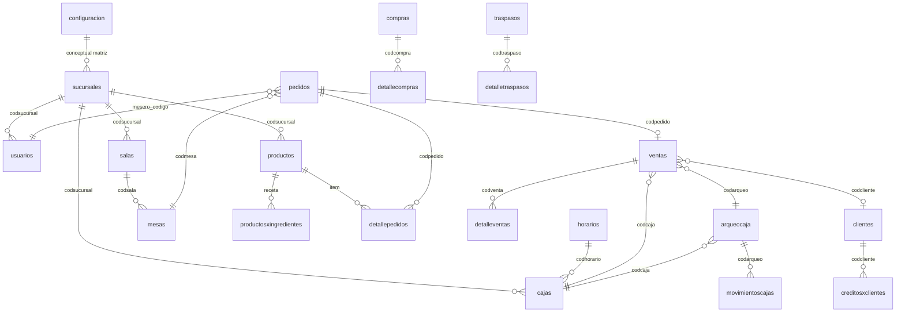

# CURRENT_SYSTEM_AUDIT.md

**Proyecto:** NIGHTPOS SaaS  
**Fase:** 1 — Análisis completo y preparación de arquitectura  
**Fecha de auditoría:** 2026-06-02  
**Alcance:** Sistema heredado `restaurant_bolivia-1` (solo lectura) + documentación objetivo en raíz del repositorio  
**Regla aplicada:** El heredado no fue modificado; sirve únicamente como referencia funcional.

---

## 1. Resumen ejecutivo

El sistema **Restaurant Bolivia** (`restaurant_bolivia-1`) es un monolito PHP procedural/OOP sin framework moderno. Concentra presentación, SQL, reglas de negocio, sesión y reportes en archivos `.php` por pantalla y en `class/class.php` (~47.000+ líneas). La base MySQL del dump `softrestaurant_bolivia_backup_10-05-2024.sql` define **44 tablas** operativas.

El producto objetivo **NIGHTPOS SaaS** (documentado en README, SAAS_ARCHITECTURE, MIGRATION_PLAN, etc.) migra este dominio a:

- **Backend:** Laravel 12, PHP 8.3+, hexagonal, DDD, JWT, multi-tenant (`tenant_id` + `branch_id`).
- **Frontend:** Vue 3, Composition API, Pinia, Vue Router, Axios, plantilla Materialize Admin.

**Estado actual del repositorio NIGHTPOS (implementación):**

| Componente | Estado |
| ---------- | ------ |
| Documentación de migración | Completa (11 archivos obligatorios) |
| `restaurant_bolivia-1/` | Intacto; 133 pantallas PHP raíz + SQL |
| `backend/` | Laravel scaffold (app mínima: User, Controller, Provider) |
| `frontend/` | Plantilla Materialize/demo; sin módulos operativos de negocio |

La migración debe ser **incremental por módulos**; no existe aún arquitectura hexagonal ni API `/api/v1` en código.

---

## 2. Módulos encontrados (sistema heredado)

Agrupación por pantallas PHP y funciones en `class/class.php`.

### 2.1 Seguridad y administración

| Módulo | Pantallas / archivos | Funciones críticas (class.php) |
| ------ | -------------------- | ------------------------------ |
| Autenticación | `index.php`, `logout.php`, `lockscreen.php`, `password.php`, `bloqueo.php` | `Logueo`, `RecuperarPassword`, `ActualizarPassword`, `ExpiraSession` |
| Usuarios | `usuarios.php`, `perfil.php` | `RegistrarUsuarios`, `ListarUsuarios`, `ActualizarUsuarios`, `StatusUsuarios`, `EliminarUsuarios` |
| Auditoría | `logs.php` | `ListarLogs`, `BusquedaLogs` |
| Configuración empresa | `configuracion.php` | `ConfiguracionPorId`, `ActualizarConfiguracion` |
| Respaldo | `backup.php`, `restore.php` | Operaciones de BD |

### 2.2 Empresa, sucursal y catálogos maestros

| Módulo | Pantallas | Notas |
| ------ | --------- | ----- |
| Sucursales | `sucursales.php` | Multi-casa; flags `comanda_cocina`, `comanda_bar`, `comanda_reposteria` |
| Horarios / cajas | `horarios.php`, `cajas.php` | Turnos ligados a caja (`codhorario`) |
| Geografía | `provincias.php`, `departamentos.php` | Clientes y sucursales |
| Documentos / moneda | `documentos.php`, `monedas.php`, `cambios.php`, `medios.php` | Tipos documento, `tiposmoneda`, `tiposcambio` |
| Impuestos | `impuestos.php` | Por sucursal |
| Categorías / medidas / salsas | `categorias.php`, `medidas.php`, `salsas.php` | Catálogo |

### 2.3 Clientes, proveedores y crédito

| Módulo | Pantallas |
| ------ | --------- |
| Clientes | `clientes.php` |
| Créditos | `creditos.php`, `creditosxclientes.php`, `creditosxfechas.php`, `detallescreditosxclientes.php` |
| Abonos crédito en caja | `abonoscreditosxcajas.php` |
| Proveedores | `proveedores.php` |
| Cuentas por pagar | `cuentasxpagar.php` (pantalla; sin tabla dedicada en dump) |
| Cotizaciones | `cotizaciones.php`, `forcotizacion.php`, `detalles_cotizaciones.php`, reportes asociados |

### 2.4 Productos, ingredientes y combos

| Módulo | Pantallas |
| ------ | --------- |
| Productos | `productos.php`, `forproducto.php`, `carritoproducto.php`, `productosxmoneda.php` |
| Ingredientes | `ingredientes.php`, `foringrediente.php`, `carritoingrediente.php`, `foragregaingredientes.php` |
| Combos | `combos.php`, `forcombo.php`, `foragregaproductos.php` |
| Recetas | `productosxingredientes` (tabla) |
| Valorización | `valorizado_productos.php`, `valorizado_ingredientes.php`, `valorizado_combos.php` (+ variantes por fecha) |

### 2.5 Ambientes y mesas

| Módulo | Pantallas |
| ------ | --------- |
| Salas | `salas.php` |
| Mesas | `mesas.php`, `salas_mesas.php`, `detalles_mesas.php` |

### 2.6 Pedidos / comandas y despacho

| Módulo | Pantallas |
| ------ | --------- |
| Pedidos | `pedidos.php`, `forpedido.php`, `carritopedido.php`, `detalles_pedido.php` |
| Comandas operativas | `comanda_bar.php`, `comanda_cocina.php`, `comanda_reposteria.php` |
| Notificaciones | `notificaciones.php` |
| Reportes pedidos | `pedidosxcajas.php`, `pedidosxfechas.php`, `pedidosxfechasentrega.php` |

### 2.7 Ventas y cobro

| Módulo | Pantallas | Funciones críticas |
| ------ | --------- | ------------------ |
| Ventas | `ventas.php`, `forventa.php`, `carritoventa.php` | `ListarVentas`, búsquedas por fecha/caja/cliente/tipo |
| Cobro mesa | `detalles_mesas.php` (flujo UI) | `CobrarMesa`, `CobrarCuentaSeparada` |
| Pago pedidos | — | `RegistrarPagoPedidos` |
| Notas crédito | `notas.php`, `fornota.php`, reportes `notas*` | Anulaciones / NC |
| Condiciones pago | `condiciones_pagos.php`, `ventasxcondiciones.php` | |
| Comisiones | `comisionxventas.php` | `BuscarComisionxVentas` (campo `usuarios.comision`) |

### 2.8 Delivery (prioridad baja para boliche)

| Pantallas |
| --------- |
| `delivery.php`, `detalles_delivery.php`, `delivery_pendientes.php`, `delivery_pagados.php`, `deliveryxfechas.php` |
| Función: `RegistrarDelivery` |

### 2.9 Caja y arqueo

| Módulo | Pantallas | Funciones críticas |
| ------ | --------- | ------------------ |
| Arqueo | `arqueos.php`, `forcierre.php`, `arqueosxfechas.php` | `RegistrarArqueoCaja`, `CerrarArqueoCaja`, `ListarArqueoCaja` |
| Movimientos | `movimientos.php`, `movimientosxfechas.php` | Ingresos/egresos por arqueo |
| Informes caja | `informecajasxfechas.php`, `ventasxcajas.php`, `detallesventasxcajas.php`, `notasxcajas.php` | |

### 2.10 Inventario, compras y traspasos

| Módulo | Pantallas |
| ------ | --------- |
| Kardex | `kardex_productos.php`, `kardex_ingredientes.php`, `kardex_combos.php` |
| Compras | `compras.php`, `forcompra.php`, `carritocompra.php`, reportes |
| Traspasos | `traspasos.php`, `fortraspaso.php`, `carritotraspaso.php`, reportes detalle |

### 2.11 Reportes y exportación

| Tipo | Archivos |
| ---- | -------- |
| PDF | `reportepdf.php` (FPDF) |
| Excel | `reporteexcel.php` |
| Gráficos | `graficos.php`, `panel.php` |
| Ventas / ganancias | `ventasxfechas.php`, `gananciasventasxfechas.php`, `productosvendidos.php`, `ingredientesvendidos.php`, `combosvendidos.php`, etc. |
| Consultas AJAX | `consultas.php`, `data.php`, `search.php` |

**Total:** 133 archivos `.php` en raíz del heredado (excl. `class/`, `assets/`, `fpdf/`).

---

## 3. Tablas encontradas (44)

Fuente: `restaurant_bolivia-1/bd-sql/softrestaurant_bolivia_backup_10-05-2024.sql`.

| # | Tabla | Grupo |
|---|-------|-------|
| 1 | `abonoscreditos` | Crédito / caja |
| 2 | `arqueocaja` | Caja |
| 3 | `cajas` | Caja |
| 4 | `categorias` | Catálogo |
| 5 | `clientes` | CRM |
| 6 | `combos` | Productos |
| 7 | `combosxproductos` | Productos |
| 8 | `compras` | Compras |
| 9 | `configuracion` | Empresa (1 fila tipo “matriz”) |
| 10 | `cotizaciones` | Cotizaciones |
| 11 | `creditosxclientes` | Crédito |
| 12 | `departamentos` | Geografía |
| 13 | `detallecompras` | Compras |
| 14 | `detallecotizaciones` | Cotizaciones |
| 15 | `detallenotas` | Notas crédito |
| 16 | `detallepedidos` | Pedidos |
| 17 | `detalletraspasos` | Traspasos |
| 18 | `detalleventas` | Ventas |
| 19 | `documentos` | Catálogo |
| 20 | `horarios` | Caja / turno |
| 21 | `impuestos` | Fiscal |
| 22 | `ingredientes` | Insumos |
| 23 | `kardex_combos` | Inventario |
| 24 | `kardex_ingredientes` | Inventario |
| 25 | `kardex_productos` | Inventario |
| 26 | `log` | Auditoría acceso |
| 27 | `medidas` | Catálogo |
| 28 | `mesas` | Ambientes |
| 29 | `movimientoscajas` | Caja |
| 30 | `notascredito` | Ventas / NC |
| 31 | `notificaciones` | Comandas |
| 32 | `pedidos` | Pedidos |
| 33 | `productos` | Productos |
| 34 | `productosxingredientes` | Recetas |
| 35 | `proveedores` | Compras |
| 36 | `provincias` | Geografía |
| 37 | `salas` | Ambientes |
| 38 | `salsas` | Modificadores |
| 39 | `sucursales` | Multi-sucursal |
| 40 | `tiposcambio` | Moneda |
| 41 | `tiposmoneda` | Moneda |
| 42 | `traspasos` | Inventario |
| 43 | `usuarios` | Seguridad |
| 44 | `ventas` | Ventas |

**Observaciones:**

- No existe `tenant_id`; el aislamiento es por `codsucursal` en casi todas las tablas.
- Identificadores de negocio mezclan `id*` autoincrement y códigos varchar (`codpedido`, `codventa`, `codproducto`).
- `mesas` no tiene `codsucursal` directo; depende de `salas.codsucursal`.
- `cuentasxpagar` aparece como pantalla pero no como tabla en el dump analizado.

---

## 4. Relaciones principales



### Claves foráneas lógicas (no siempre declaradas en SQL)

| Origen | Destino | Campo |
| ------ | ------- | ----- |
| `usuarios` | `sucursales` | `codsucursal` |
| `cajas` | `sucursales`, `horarios` | `codsucursal`, `codhorario` |
| `pedidos` | `mesas`, `usuarios` | `codmesa`, `mesero`, `codigo` |
| `detallepedidos` | `pedidos`, `productos` | `codpedido`, `idproducto` |
| `ventas` | `pedidos`, `arqueocaja`, `cajas`, `clientes` | `codpedido`, `codarqueo`, `codcaja`, `codcliente` |
| `movimientoscajas` | `arqueocaja`, `cajas` | `codarqueo`, `codcaja` |
| `kardex_*` | productos/ingredientes/combos | movimientos por sucursal |
| `notificaciones` | pedidos/mesas | `codpedido`, `codmesa` |

---

## 5. Procesos de negocio (flujos)

### 5.1 Login y sesión

1. Usuario/contraseña → `Logueo`.
2. Carga sesión PHP: usuario + sucursal + moneda + documentos.
3. Mapeo `nivel` → `$_SESSION['acceso']` (ver sección Permisos).
4. Registro en `log`.
5. Redirección a `panel`.

**No hay JWT ni API stateless.**

### 5.2 Apertura y cierre de caja

1. Cajero/admin abre arqueo: `RegistrarArqueoCaja` → fila en `arqueocaja` (`statusarqueo` abierto, `montoinicial`, `fechaapertura`).
2. Operación exige arqueo activo (validado en menú y funciones de venta).
3. Durante turno: ventas, movimientos (`movimientoscajas`), abonos crédito, propinas desglosadas en arqueo.
4. Cierre: `CerrarArqueoCaja` consolida medios de pago (efectivo, cheque, tarjetas, transferencia, electrónico, cupón, créditos, propinas por medio, ingresos/egresos, `dineroefectivo`, `diferencia`).

### 5.3 Pedido / comanda (mesa)

1. Mesero abre pedido en mesa (`RegistrarPedido`) → `pedidos` + `detallepedidos`.
2. Ítems llevan: precios snapshot, IVA, descuentos, `observacionespedido`, `salsaspedido`, flags `cocinero`/`preparado`/`statusdetalle`, `tipodetalle`.
3. Notificación a bar/cocina/repostería vía `notificaciones` y pantallas `comanda_*`.
4. Estados de preparación actualizan detalle y notificaciones.

### 5.4 Cobro de mesa → venta

1. `CobrarMesa` o `CobrarCuentaSeparada` (cuenta dividida).
2. Crea/actualiza `ventas` + `detalleventas`.
3. Vincula `codarqueo`, `codcaja`, `mesero`, formas de pago (`formapago`, `formapago2`, propinas).
4. Descuenta inventario (kardex) según producto/receta/combo.
5. Libera o actualiza estado de mesa/pedido.

**Debe ser transacción única en el sistema nuevo** (Order + Sale + Cash + Inventory).

### 5.5 Venta directa

- Flujo paralelo vía `forventa.php` / `carritoventa.php` sin mesa obligatoria.

### 5.6 Compras y traspasos

1. **Compra:** cabecera `compras` + `detallecompras` → entrada kardex.
2. **Traspaso:** entre sucursales (`traspasos`, `detalletraspasos`, `tipo` producto/ingrediente) → salida origen / entrada destino.

### 5.7 Reportes

- Consultas por rango de fechas, caja, vendedor (`mesero`), cliente, producto.
- Exportación FPDF/Excel desde `reportepdf.php` / `reporteexcel.php`.
- Comisiones: `BuscarComisionxVentas` usa `usuarios.comision` (porcentaje fijo por usuario, no snapshot por venta).

### 5.8 Flujos NO prioritarios para boliche (documentación)

- Delivery completo.
- Cotizaciones → venta.
- Crédito cliente y abonos (mantener si el negocio lo exige).

### 5.9 Flujos NUEVOS definidos en documentación SaaS (no existen en heredado)

| Flujo | Descripción |
| ----- | ----------- |
| Multi-tenant | Registro empresa → plan → suscripción → branches |
| Precio SOLO / CON_ACOMPANANTE | `product_prices` / `product_price_rules`; `ResolveProductPriceUseCase` |
| Impresión automática | Comanda → `print_jobs` → Print Agent local |
| Cierre por método | Efectivo / QR / tarjeta separados |
| Liquidación chicas | Manillas, piezas, shows → `girl_settlements` |
| Liquidación garzones | Comisión variable con snapshot → `waiter_settlements` |
| Pagos a personal | Movimientos de caja tipo `STAFF_PAYMENT` |

---

## 6. Permisos y roles (heredado)

### 6.1 Niveles en BD (`usuarios.nivel`) → sesión (`acceso`)

| Nivel en BD | Sesión `acceso` | Rol objetivo SaaS (doc) |
| ----------- | --------------- | ------------------------ |
| ADMINISTRADOR(A) GENERAL | `administradorG` | Super Admin / Tenant Owner global |
| ADMINISTRADOR(A) SUCURSAL | `administradorS` | Administrador sucursal |
| SECRETARIA | `secretaria` | Administrativo |
| CAJERO(A) | `cajero` | Cajero |
| MESERO(A) | `mesero` | Garzón |
| COCINERO(A) | `cocinero` | Cocina (→ Barra/Kitchen en boliche) |
| BARTENDER | `bar` | Barra |
| REPOSTERIA | `reposteria` | Repostería |
| REPARTIDOR | `repartidor` | Delivery |

### 6.2 Control de acceso

- Basado en `$_SESSION['acceso']` en cada `.php` y en `menu.php`.
- No hay tabla `permissions`; reglas embebidas en condicionales.
- Admin general (`codsucursal = 0`) vs usuarios de sucursal.
- Campo `usuarios.comision` (float) para reporte de comisiones.

### 6.3 Roles objetivo SaaS (documentación)

Super Admin SaaS, Tenant Owner, Administrador, Encargado, Cajero, Garzón, Barra, Inventario, Reportes — con permisos granulares (`roles`, `permissions`, `role_permissions`, `user_branches`).

---

## 7. Dependencias

### 7.1 Técnicas (heredado)

| Dependencia | Uso |
| ----------- | --- |
| PHP + sesiones | Autenticación y estado |
| PDO MySQL | `class/classconexion.php` |
| jQuery / JS por módulo | `assets/script/*.js` |
| FPDF | Tickets y reportes PDF |
| PHPExcel (reporteexcel) | Exportación Excel |
| Plantilla admin (Bootstrap/Material) | UI |

### 7.2 Dependencias entre módulos de negocio

```text
Auth → Sucursal activa → Caja abierta (arqueo) → Catálogo productos
     → Mesa/Pedido → Cobro → Venta → Kardex
Compras/Traspasos → Kardex (independiente de venta, pero comparte stock)
Reportes → Ventas + Caja + Usuarios (mesero/comisión)
```

### 7.3 Dependencias de migración (orden documentado)

```text
Auth → Tenant → Branch → Product → Price → Cash → Order → Sale → Inventory → Reports
```

Fases insertadas: **7.5 Impresión**, **8.5–8.9 Cierre y liquidaciones** (antes de reportes avanzados).

### 7.4 Dependencias del nuevo stack (objetivo)

| Capa | Dependencia |
| ---- | ----------- |
| Backend | Laravel 12, JWT, Eloquent (solo Infrastructure) |
| Frontend | Vue 3, Pinia, Axios → `/api/v1` |
| Infra | Hosting online + Print Agent local (impresoras térmicas) |
| Datos | Single DB multi-tenant |

---

## 8. Riesgos

### 8.1 Técnicos

| Riesgo | Impacto | Mitigación en NIGHTPOS |
| ------ | ------- | ---------------------- |
| Monolito `class.php` | Alto — cambios rompen múltiples flujos | Hexagonal + casos de uso por módulo |
| SQL embebido sin capa | Seguridad, mantenimiento | Repositorios + query builder / Eloquent aislado |
| Sin `tenant_id` | Fuga de datos en SaaS | Middleware tenant + scope global |
| IDs/códigos legacy mezclados | Migración de datos | `legacy_code` + migración por fases |
| Comisiones sin snapshot | Cierres incorrectos al cambiar % | `sale_item_staff_snapshots` (doc) |
| Un solo precio en `productos.precioventa` | No soporta boliche | `product_prices` / reglas SOLO-CON_CHICA |
| Cierre caja con muchos campos acoplados | Difícil mapear a QR/tarjeta modernos | `shift_closures` + `sale_payment_breakdowns` |
| Sesión PHP | No escalable a móvil/API | JWT + refresh |
| Reportes acoplados a pantallas | Retraso en BI | API reportes + PDF server-side |
| Impresión desde hosting | Imposible directo | Cola + Print Agent |

### 8.2 De negocio

| Riesgo | Notas |
| ------ | ----- |
| Migrar delivery/cotizaciones/crédito sin priorizar | Desvío del MVP boliche |
| Inventario desincronizado al cobrar | Transacciones obligatorias |
| Pagar personal sin registrar movimiento de caja | Auditoría y cuadre falsos |
| Recalcular liquidaciones con precios actuales | Violación regla snapshot |

### 8.3 Del proyecto actual

| Riesgo | Estado |
| ------ | ------ |
| Documentación vs código desalineados | Docs completos; código backend casi vacío |
| Duplicar lógica en Vue | Prohibido por DEVELOPMENT_RULES |
| Modificar heredado por error | Regla explícita: no tocar `restaurant_bolivia-1` |

---

## 9. Reglas de negocio detectadas (heredado)

1. **Sucursal obligatoria:** Casi todo filtra por `codsucursal` de sesión (excepto admin general).
2. **Caja abierta para operar:** Ventas y cobros requieren `arqueocaja` activo del usuario/caja.
3. **Pedido en mesa:** `pedidos.codmesa`, estados `statuspedido`, mesero en `pedidos.mesero`.
4. **Precio en línea:** `detallepedidos`/`detalleventas` guardan `precioventa`, `preciocompra`, impuestos y descuentos al momento (snapshot parcial).
5. **Preparación por área:** Flags en detalle pedido y sucursal habilita comandas bar/cocina/repostería.
6. **Cobro multi-pago:** `ventas` soporta dos formas de pago + propina configurable por sucursal (`porcentajepropina`).
7. **Arqueo multi-medio:** Cierre desglosa ~10+ conceptos de pago y propinas por medio.
8. **Comisión garzón:** Porcentaje en `usuarios.comision`; reporte `BuscarComisionxVentas` (no por modalidad ni chica).
9. **Stock:** Productos/ingredientes/combos con `existencia`, kardex por movimiento, `controlstockp/i`, recetas en `productosxingredientes`.
10. **Crédito cliente:** `creditosxclientes`, abonos en caja `abonoscreditos`.
11. **Notas de crédito:** Flujo separado `notascredito` / `detallenotas`.
12. **Traspaso inter-sucursal:** Solo entre sucursales configuradas.
13. **Admin general:** `codsucursal = 0`; acceso a todas las sucursales.
14. **Usuario inactivo / sucursal inactiva:** Bloqueo en login (códigos 3, 4).

### Reglas heredadas que NO cubren boliche (gap)

- No existe `price_type` SOLO / CON_ACOMPANANTE en BD.
- No hay entidad “chica”, manillas, piezas, shows.
- No hay liquidación diaria ni pago a personal como movimiento tipificado.
- No hay separación QR en modelo de arqueo (sí “electrónico/transferencia” genéricos).
- No hay impresión en cola ni Print Agent.

---

## 10. Funcionalidades que deben conservarse

Prioridad según README y SYSTEM_ANALYSIS.

| Área | Funcionalidad |
| ---- | ------------- |
| Operación core | Mesas, salas, pedidos/comandas, cobro mesa, venta directa |
| Caja | Apertura arqueo, movimientos ingreso/egreso, cierre con cuadre |
| Catálogo | Productos, categorías, combos, ingredientes, recetas, salsas |
| Inventario | Kardex producto/ingrediente/combo, alertas min/max |
| Abastecimiento | Compras, proveedores, traspasos entre casas |
| Despacho | Vista bar/cocina/repostería (adaptar a BAR/KITCHEN/CASHIER) |
| Reportes | Ventas por fecha/caja/vendedor/cliente, productos más vendidos, comisiones, ganancias, movimientos, arqueos |
| Multi-sucursal | Sucursales, horarios, cajas por sucursal |
| Usuarios | Roles operativos, comisión básica garzón, logs de acceso |
| Clientes | Registro y crédito (si el tenant lo requiere) |
| Fiscal básico | Impuestos, tipos documento, múltiples monedas/cambio |

---

## 11. Funcionalidades que deben mejorarse

| Heredado | Mejora en NIGHTPOS |
| -------- | ------------------ |
| Sesión PHP | JWT + login PIN + refresh |
| Permisos en código | RBAC granular + menú dinámico por plan |
| Un precio por producto | `product_prices` + `price_type` |
| Comisión fija en usuario | Reglas configurables + snapshot por venta |
| `class.php` monolítico | Hexagonal, DDD, eventos de dominio |
| SQL en pantallas | API REST `/api/v1` JSON uniforme |
| Sin tenant | Multi-tenant + aislamiento estricto |
| Cierre caja genérico | Efectivo / QR / tarjeta + liquidación personal |
| Comandas solo en pantalla | Cola impresión + agente local + reimpresión |
| Nombres `cod*` | IDs limpios + `legacy_code` opcional |
| Reportes acoplados | Endpoints reporte + PDF desacoplados |
| Validaciones dispersas | Casos de uso + tests Pest obligatorios |
| Delivery prioritario | Opcional / deshabilitado por plan boliche |

---

## 12. Funcionalidades nuevas (documentación SaaS)

No presentes en el heredado; definidas en SAAS_ARCHITECTURE, DATABASE_GUIDELINES, BOLICHE_RULES, API_DOCUMENTATION, README.

### 12.1 Plataforma SaaS

- `tenants`, `plans`, `plan_modules`, `subscriptions`
- Suscripción: vencimiento, suspensión, solo lectura, módulos por plan
- Super Admin SaaS vs Tenant Owner

### 12.2 Dominio boliche — precios

- `PriceType`: REGULAR, SOLO, CON_ACOMPANANTE, PROMO, VIP
- `ResolveProductPriceUseCase`
- `product_price_rules` (precio cliente, monto chica, monto casa)
- Selector chica obligatorio en CON_CHICA / CON_ACOMPANANTE

### 12.3 Cierre y liquidación (bounded contexts)

**Cash & Shift Closure:**

- `shift_closures`, `cash_movements`, `sale_payment_breakdowns`
- Cierre por efectivo/QR/tarjeta, diferencia, aprobación encargado

**Staff Settlement:**

- `staff_profiles`, `girl_settlements`, `waiter_settlements`
- `room_services`, `show_services`
- `sale_item_staff_snapshots` (inmutabilidad histórica)
- Pagos a personal → movimiento de caja auditado

### 12.4 Impresión (bounded context Printing)

- Tablas `printers`, `print_jobs`
- Destinos: BAR, KITCHEN, CASHIER, RECEPTION, GENERAL
- Endpoints Print Agent + reimpresión con permiso
- Eventos: al crear comanda → `CreatePrintJobsForOrderUseCase`

### 12.5 Event-driven (objetivo)

Eventos: `SaleCreated`, `SaleItemRegistered`, `PaymentReceived` → comisiones, manillas, movimientos caja, print jobs.

### 12.6 Comisiones y movimientos especiales (futuro)

- `commission_rules` (por rol, producto, price_type)
- Tipos movimiento: CLEANING, PENALTY, TAXI_COMMISSION, OTHER_INCOME

### 12.7 API y frontend objetivo

- ~80+ endpoints documentados en API_DOCUMENTATION.md
- Pantallas Vue: cierre turno, liquidación chicas/garzones, comanda móvil con modalidad
- Stores Pinia por dominio

---

## 13. Mapa heredado → modelo SaaS (referencia)

| Heredado | Propuesto (DATABASE_GUIDELINES) |
| -------- | ------------------------------- |
| `configuracion` + matriz | `tenants` |
| `sucursales` | `branches` |
| `usuarios` | `users` + `staff_profiles` |
| `salas` / `mesas` | `rooms` / `room_tables` |
| `productos`, `ingredientes`, `combos` | `products`, recipes, `combos` |
| `precioventa` único | `product_prices`, `product_price_rules` |
| `pedidos`, `detallepedidos` | `orders`, `order_items` |
| `ventas`, `detalleventas` | `sales`, `sale_items`, `payments` |
| `cajas`, `arqueocaja`, `movimientoscajas` | `cash_registers`, `cash_sessions`, `cash_movements`, `shift_closures` |
| `kardex_*`, compras, traspasos | `stock_movements`, `purchase_orders`, `stock_transfer` |
| `notificaciones` | `order_status_history` + Printing |
| — | `print_jobs`, `printers`, liquidaciones, snapshots |

---

## 14. Inventario de documentación revisada

| Archivo | Contenido clave para esta fase |
| ------- | ------------------------------ |
| README.md | Visión, módulos prioritarios, impresión, cierre/pagos diarios |
| SYSTEM_ANALYSIS.md | 44 tablas, pantallas, problemas, valor rescatable |
| SAAS_ARCHITECTURE.md | Multi-tenant, roles, hexagonal, Printing, Shift/Staff contexts |
| DATABASE_GUIDELINES.md | Esquema objetivo, snapshots, reglas migración |
| API_DOCUMENTATION.md | Contrato REST `/api/v1` |
| DEVELOPMENT_RULES.md | Prohibiciones, transacciones, tests mínimos |
| FRONTEND_GUIDELINES.md | Materialize, flujo validar backend primero |
| BOLICHE_RULES.md | SOLO/CON_ACOMPANANTE, liquidaciones, MVP |
| MIGRATION_PLAN.md | Fases 0–10 + 7.5 + cierre personal |
| ROADMAP.md | Sprints y dependencias |
| PROMPT_CURSOR.md | Prompt maestro y casos de uso iniciales |

---

## 15. Criterios de aceptación Fase 1 (cumplidos)

- [x] Lectura completa de documentación obligatoria
- [x] Análisis del heredado sin modificar código legacy
- [x] Identificación de módulos, entidades, reglas, dependencias, tablas, flujos y permisos
- [x] Entregable `CURRENT_SYSTEM_AUDIT.md` generado
- [ ] **Sin código de migración** hasta nueva instrucción

---

## 16. Próximos pasos recomendados (esperar instrucciones)

Según MIGRATION_PLAN / ROADMAP, la siguiente fase lógica es **Fase 1 — Fundación backend** (estructura hexagonal, respuesta API, middleware tenant/subscription, migraciones SaaS base, JWT) **o** profundizar análisis de un módulo específico del heredado (p. ej. lectura detallada de `CobrarMesa` / `RegistrarPedido`) antes de codificar.

**Orden MVP acordado en documentación:**

1. Login → Tenant/Branch → Producto con precios SOLO/CON_ACOMPANANTE → Caja → Mesa → Comanda → Cobro → Cierre.

---

*Documento generado en Fase 1. El sistema `restaurant_bolivia-1` permanece sin cambios.*
