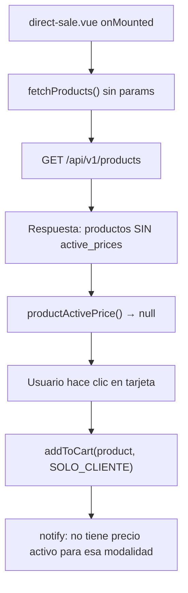

# DIRECT_SALE_PRICING_AUDIT_AND_ROADMAP.md

**Fecha:** 2026-06-05  
**Alcance:** Error de precios en Venta directa + estado actual del roadmap  
**Método:** Revisión de backend (resolver, use cases, API, BD), frontend (POS, catálogo, comandas), documentación de fases y reportes. **Sin implementación.**

**Referencias revisadas:**

| Documento | Relevancia |
|-----------|------------|
| `backend/DIRECT_SALES_REPORT.md` | Flujo `POST /direct-sales`, permisos, tests |
| `frontend/DIRECT_SALES_REPORT.md` | Pantalla POS, validaciones frontend |
| `backend/PHASE_6_REPORT.md` | Modelo `product_prices`, reglas SOLO/CON_ACOMPANANTE |
| `backend/PHASE_C1_REPORT.md` | `POST /products/quick`, producto + precios en transacción |
| `FINANCE_AND_WAITER_PRODUCT_SELECTOR_AUDIT.md` | Estado reciente caja/liquidaciones/venta directa |
| `FRONTEND_GUIDELINES.md` | Regla: validar API antes de UI |
| `NIGHTPOS_MASTER_AUDIT.md` | Veredicto piloto vs producción |
| `PRODUCT_PRICING_AUDIT.md` | Desacople producto/precio, PP-01 |
| `ROADMAP.md` | Orden módulos (desactualizado en estados) |

---

## Resumen ejecutivo

### Problema reportado

En **Venta directa**, al hacer clic en un producto aparece:

> «Este producto no tiene precio activo para esa modalidad.»

### Veredicto

**Causa principal (bug de integración frontend):** la pantalla `direct-sale.vue` llama `GET /products` **sin** el parámetro `include=active_prices`. El helper `productActivePrice()` depende de `product.active_prices`, que **no viene en la respuesta**. Por eso **todos** los productos parecen sin precio en el POS, aunque en base de datos sí tengan filas en `product_prices` (p. ej. tras `NightPosSeeder` o `POST /products/quick`).

**Causa secundaria (dato real):** productos creados solo con `POST /products` (sin precio posterior) no tienen filas en `product_prices`. En ese caso el error es correcto también en backend al cobrar.

**El `sale_mode` por defecto no está mal** — es `SOLO_CLIENTE`, coherente con el negocio y con el backend.

---

## 1. Causa probable del error

### 1.1 Cadena del fallo (caso más frecuente)



### 1.2 Evidencia en código

**Frontend — carga sin precios:**

```javascript
// frontend/src/pages/nightpos/cash/direct-sale.vue
products.value = await fetchProducts()  // ← falta { include: 'active_prices' }
```

**Frontend — resolución de precio:**

```javascript
// frontend/src/composables/useProductLabels.js
export function productActivePrice(product, saleMode) {
  const prices = product?.active_prices ?? []
  return prices.find(p => p.sale_mode === saleMode && p.status === 'active') ?? null
}
```

**Backend — precios solo bajo demanda en listado:**

```php
// GetProductsUseCase.php
$includeActivePrices = $input instanceof GetProductsListInput && $input->includeActivePrices;
// Si false → ProductMapper::product($product) sin active_prices
```

**Comparación — pantallas que SÍ cargan precios:**

| Pantalla | Llamada API |
|----------|-------------|
| `waiter/orders/[id].vue` | `fetchProducts({ include: 'active_prices' })` ✓ |
| `products/index.vue` | `fetchProducts({ include: 'active_prices' })` ✓ |
| `catalog/prices/index.vue` | `fetchProducts({ include: 'active_prices' })` ✓ |
| **`cash/direct-sale.vue`** | **`fetchProducts()`** ✗ |

**Nota:** `direct-sale.vue` importa `fetchProductPrices` pero **no lo usa** (código muerto). Comandas admin compensa con `onPreviewPrice` → `fetchProductPrices(product_id)` al cambiar producto/modalidad; venta directa no tiene ese fallback.

---

## 2. Dónde se rompe

| Capa | ¿Roto? | Detalle |
|------|--------|---------|
| **BD `product_prices`** | No (en demo seed) | Seeder crea SOLO + CON_ACOMPANANTE por producto |
| **`ProductPriceResolver`** | No | Resuelve bien si existe fila activa |
| **`CreateDirectSaleUseCase`** | No | Usa `OrderItemPricing` → resolver; error correcto si no hay precio |
| **`GET /products`** | Diseño intencional | Precios opcionales vía `?include=active_prices` |
| **`direct-sale.vue` carga** | **Sí — bug** | No pide `active_prices` |
| **`direct-sale.vue` UX** | **Sí — gap** | Tarjeta entera clickeable sin precio; no muestra «Sin precio» ni deshabilita |
| **Alta catálogo estándar** | Parcial | `POST /products` permite producto sin precio (API cruda) |
| **Alta catálogo UI** | OK en flujo actual | `products/create.vue` usa `quickCreateProduct` con `solo_price` obligatorio |

---

## 3. Datos esperados en `product_prices`

### 3.1 Esquema relevante

| Campo | SOLO_CLIENTE | CON_ACOMPANANTE |
|-------|--------------|-----------------|
| `product_id` | FK al producto | Igual |
| `sale_mode` | `SOLO_CLIENTE` | `CON_ACOMPANANTE` |
| `price` | Monto al cliente (ej. 40.00) | Total cobrado (ej. 80.00) |
| `girl_amount` | `null` | Parte chica (ej. 40.00) |
| `house_amount` | `null` | Parte casa (ej. 40.00) |
| `status` | `active` | `active` |
| `branch_id` | `null` (tenant) o id sucursal | Igual |
| `currency` | `BOB` | `BOB` |

### 3.2 Resolución por sucursal (`ProductPriceResolver`)

1. Si hay `branch_id` en contexto → busca precio activo **de esa sucursal**.
2. Si no encuentra → busca precio activo **tenant-wide** (`branch_id IS NULL`).
3. Si no hay fila → `ProductDomainException::priceNotFoundForMode()`.

El seeder demo guarda precios con `branch_id = CENTRO`. Con cajero en sucursal Centro, el resolver los encuentra.

### 3.3 Respuesta API con precios

`GET /products?include=active_prices` devuelve por producto:

```json
{
  "id": 1,
  "name": "Paceña",
  "active_prices": [
    { "sale_mode": "SOLO_CLIENTE", "price": "40.00", "status": "active", "currency": "BOB" },
    { "sale_mode": "CON_ACOMPANANTE", "price": "80.00", "girl_amount": "40.00", "house_amount": "40.00", "status": "active" }
  ],
  "has_active_pricing": true
}
```

Sin `include`, `active_prices` **no existe** en el JSON.

---

## 4. Respuestas al cuestionario BACKEND

| # | Pregunta | Respuesta |
|---|----------|-----------|
| 1 | ¿El producto tiene `product_prices`? | En demo seed: **sí**. Si se creó solo con `POST /products`: **puede no**. |
| 2 | ¿Tiene precio activo SOLO_CLIENTE? | En BD demo: **sí**. En venta directa UI: **no visible** por falta de `include`. |
| 3 | ¿Tiene precio activo CON_ACOMPANANTE? | En BD demo: **sí** (bebidas/tragos). En UI: **no visible** (misma causa). |
| 4 | ¿Venta directa usa SOLO_CLIENTE por defecto? | **Sí** — `addToCart(product, 'SOLO_CLIENTE')` y clic en tarjeta. |
| 5 | ¿El error es por `sale_mode` mal seleccionado? | **No** en el caso típico. El modo es correcto; faltan datos `active_prices` en memoria. |
| 6 | ¿Hay productos sin precio en el POS? | **Sí** — el listado muestra **todos** los productos activos, sin filtrar `has_active_pricing`. |
| 7 | ¿`GET /products` devuelve precios activos? | **Solo** con `?include=active_prices`. Por defecto: datos básicos del producto. |

### Endpoints revisados

| Endpoint | Rol en venta directa |
|----------|----------------------|
| `GET /products` | Catálogo POS — **debe** usar `include=active_prices` |
| `GET /products/{id}` | Siempre incluye `active_prices` (detalle) |
| `GET /products/{id}/prices` | Historial/lista; comandas lo usan en preview |
| `POST /products` | Crea producto **sin** precio |
| `POST /products/quick` | Producto + SOLO (+ opcional CON_ACOMPANANTE) en transacción |
| `POST /products/{id}/prices` | Agrega precio a producto existente |
| `POST /products/{id}/quick-prices` | Alta rápida de precio (comandas) |
| `POST /direct-sales` | Resuelve precio server-side; 422 si no hay activo |

### Mensaje de error backend

`ProductDomainException::priceNotFoundForMode()`:

> «Este producto no tiene precio configurado para la modalidad SOLO_CLIENTE.»

El frontend muestra una variante ligeramente distinta («precio activo»), pero el significado es el mismo.

---

## 5. Respuestas al cuestionario FRONTEND

| # | Pregunta | Respuesta |
|---|----------|-----------|
| 1 | ¿El POS muestra precio antes de agregar? | **Diseñado sí** (chips Solo / +C), pero **hoy no** sin `active_prices`. |
| 2 | ¿Muestra «Sin precio»? | **No** — si no hay precio, no muestra chip; la tarjeta queda sin indicación clara. |
| 3 | ¿Deshabilita modalidad sin precio? | **No** — toda la tarjeta dispara `addToCart(SOLO_CLIENTE)` aunque no haya chip. |
| 4 | ¿Usa SOLO_CLIENTE por defecto? | **Sí**. |
| 5 | ¿Permite configurar precio desde venta directa? | **No** — no hay `QuickProductPriceCreateDialog` ni botón «Configurar precio». |
| 6 | ¿Manda `sale_mode` correcto al backend? | **Sí** — el carrito conserva el modo elegido (chip +C o default Solo). |

### Comparación UX: Venta directa vs `OrderAddProductDialog` (garzón/comandas)

| Comportamiento | `OrderAddProductDialog` | `direct-sale.vue` |
|----------------|-------------------------|-------------------|
| Muestra «Solo / Con acompañante» con monto | Sí (`Sin precio` si falta) | No (solo chips si hay precio) |
| Botón modalidad deshabilitado sin precio | Sí (`:disabled="!priceFor(...)"`) | No |
| «Configurar precio» | Sí (si `canConfigurePrice`) | No |
| Carga `active_prices` | Garzón: sí; comandas admin: preview API | **No** |
| Clic en tarjeta sin precio | No agrega (botones deshabilitados) | **Sí — muestra toast error** |

---

## 6. Flujo correcto de venta directa

### 6.1 Flujo objetivo (negocio)

```
Cajera abre caja
  → Entra a Venta directa
  → Catálogo carga productos CON precios activos por modalidad
  → Cada tarjeta muestra:
       Solo cliente: 40 Bs
       Con acompañante: 80 Bs  (si existe)
  → Clic en modalidad con precio → carrito
  → Si CON_ACOMPANANTE → asignar chica
  → Cobrar → POST /direct-sales
  → Backend re-valida precio activo (fuente de verdad)
  → Venta + movimiento INCOME en caja
```

### 6.2 Reglas por modalidad

| Situación | Comportamiento esperado |
|-----------|-------------------------|
| Tiene SOLO_CLIENTE | Permitir agregar y cobrar como Solo |
| Tiene CON_ACOMPANANTE | Permitir agregar; exigir chica antes de cobrar |
| No tiene ningún precio | Mostrar «Sin precio»; **no** agregar al carrito |
| Tiene permiso `products.create` / quick price | Ofrecer «Configurar precio ahora» inline |

### 6.3 Flujo de creación de productos (hoy)

| Vía | ¿Obliga precio? | Resultado |
|-----|-----------------|-----------|
| `products/create.vue` (UI) | **Sí** — `solo_price` requerido vía `ProductPricingFields` | Usa `POST /products/quick` |
| `QuickProductCreateDialog` (comandas) | **Sí** — `solo_price` obligatorio | Producto + precios |
| `POST /products` (API directa) | **No** | Producto vendible solo tras `POST /products/{id}/prices` |
| `NightPosSeeder` | N/A | 13 bebidas con SOLO + CON_ACOMPANANTE |

**Respuesta a la pregunta importante:** desde **Catálogo UI actual**, crear producto **sí obliga** precio Solo (vía quick create). Desde **API `POST /products`**, **no** obliga — queda producto huérfano sin precio (brecha PP-01 documentada en `PRODUCT_PRICING_AUDIT.md`).

---

## 7. Propuesta UX (Venta directa)

Alinear `direct-sale.vue` con la regla recomendada y con patrones ya probados en `OrderAddProductDialog`:

### 7.1 Por tarjeta de producto

```
┌─────────────────────────┐
│ Paceña                  │
│ Solo cliente:    40 Bs  │
│ Con acompañante: 80 Bs  │
│ [Solo] [Con acompañante]│  ← deshabilitados si no hay precio
│ Configurar precio       │  ← si permiso y falta precio
└─────────────────────────┘
```

### 7.2 Reglas

1. **Nunca** permitir agregar modalidad sin precio activo.
2. Mostrar explícitamente «Sin precio» en la línea correspondiente.
3. Quitar `@click` de toda la tarjeta; solo botones/chips por modalidad.
4. Opcional: filtro «Solo vendibles» o ocultar productos sin `has_active_pricing`.
5. Integrar `QuickProductPriceCreateDialog` + recarga de catálogo tras crear precio.

### 7.3 Acciones rápidas para caja

| Acción | Cuándo |
|--------|--------|
| Configurar precio ahora | Producto sin SOLO_CLIENTE y usuario con permiso |
| Crear producto rápido | Producto no existe (fase posterior; hoy no en venta directa) |
| Ir a Catálogo → Precios | Sin permiso de alta rápida |

---

## 8. Cambios necesarios BACKEND

| ID | Cambio | Prioridad | Esfuerzo |
|----|--------|-----------|----------|
| B0 | **Ninguno obligatorio** para el bug principal | — | El resolver y direct sale ya funcionan |
| B1 | Opcional: `GET /products/pos-catalog` con `active_prices` siempre + filtro `sellable_only` | Media | Medio |
| B2 | Opcional: flag `has_active_pricing` en listado por defecto (sin cargar todos los precios) | Baja | Bajo |
| B3 | Endurecer `POST /products`: advertir o rechazar si no viene precio (breaking) | Baja | Medio |
| B4 | Test Feature: direct sale tras `GET /products` sin include sigue cobrando (documentar que UI debe incluir precios) | Baja | Bajo |

**Conclusión backend:** el motor de precios está **correcto**. El gap es de **contrato API + consumo frontend**, no de `ProductPriceResolver` ni `CreateDirectSaleUseCase`.

---

## 9. Cambios necesarios FRONTEND

| ID | Cambio | Prioridad | Esfuerzo |
|----|--------|-----------|----------|
| **F1** | `loadProducts()` → `fetchProducts({ include: 'active_prices' })` | **Crítica** | Mínimo (1 línea) |
| **F2** | UX por producto: líneas Solo/Con acompañante, «Sin precio», botones deshabilitados | **Alta** | Medio |
| **F3** | Quitar clic global en tarjeta; solo agregar por modalidad explícita | **Alta** | Bajo |
| **F4** | Integrar `QuickProductPriceCreateDialog` + permiso `products.create` | **Media** | Medio |
| **F5** | Filtrar u ocultar productos sin `has_active_pricing` (opcional) | **Media** | Bajo |
| **F6** | Eliminar import muerto `fetchProductPrices` o usarlo como fallback por producto | **Baja** | Bajo |
| **F7** | Alinear `orders/[id].vue` admin: también `include=active_prices` (consistencia) | **Media** | Mínimo |

---

## 10. Prioridad de solución

| Orden | ID | Tarea | Impacto | Tiempo estimado |
|-------|-----|-------|---------|-----------------|
| **1** | F1 | Cargar `active_prices` en venta directa | **Desbloquea el 90% del error reportado** | Minutos |
| **2** | F2–F3 | UX: Sin precio, botones deshabilitados, sin clic ciego | Evita confusión y toasts falsos | 2–4 h |
| **3** | F4 | Configurar precio desde POS | Operación en pico sin salir de caja | 2–3 h |
| **4** | F5 | Solo productos vendibles en grilla | Catálogo limpio para cajera | 1–2 h |
| **5** | B1 | Endpoint POS catalog dedicado | Escalabilidad 200+ productos | Fase posterior |
| **6** | B3 | Producto sin precio no creable por API | Integridad catálogo | Fase posterior |

### Escenarios de validación manual (post-fix F1)

1. Login cajera → abrir caja → Venta directa.
2. Producto del seeder (ej. Paceña) → debe mostrar chip **40 Bs** (o monto seed).
3. Clic Solo → entra al carrito **sin** toast de error.
4. Cobrar → venta `V-XXXX` + ingreso en Mi caja.
5. Producto creado sin precio (si existe) → «Sin precio», no agrega.
6. CON_ACOMPANANTE → chip +C, exige chica antes de cobrar.

---

## 11. Estado actual del sistema y fases pendientes

### 11.1 ¿En qué fase estamos?

NightPOS está en **fase post-MVP operativo (fases 4–18 + C1–C4 + Quick Actions A/B + venta directa + ajustes finanzas jun 2026)**.

No corresponde al «Sprint 7» literal del `ROADMAP.md` (documento desactualizado). La realidad del código está en reportes `PHASE_*` y `NIGHTPOS_MASTER_AUDIT.md`.

**Posición aproximada:** ~**70% camino a piloto real**; ~**55%** a producción comercial sostenida.

### 11.2 Qué ya está operativo

| Área | Estado |
|------|--------|
| Auth PIN/password, multi-tenant, sucursales | ✓ Operativo |
| Productos, categorías, precios SOLO/CON_ACOMPANANTE | ✓ Backend + catálogo UI |
| Quick product / quick price (comandas) | ✓ |
| Comandas, envío barra, cobro, pagos mixtos | ✓ |
| Caja, movimientos, arqueo (con ajustes F1 recientes) | ✓ |
| Turnos oficiales, cierre, historial | ✓ |
| Liquidaciones garzones/chicas/limpieza | ✓ (requiere «Generar») |
| Egresos caja al pagar personal (L4) | ✓ Implementado jun 2026 |
| KPIs liquidación en cierre (L0) | ✓ Implementado jun 2026 |
| Venta directa backend `POST /direct-sales` | ✓ Tests 10/10 |
| Venta directa frontend POS | ⚠ **Bug precios (F1)** |
| Servicios: manillas, piezas, shows | ✓ |
| Modo garzón móvil + selector optimizado (P1) | ✓ |
| Permiso `sales.direct_create` + menú Caja/Operación | ✓ (re-login cajero) |

### 11.3 Qué está en ajuste / deuda reciente

| Ítem | Estado |
|------|--------|
| Venta directa — carga precios en POS | **Bug abierto (este informe)** |
| Mi caja — KPIs `financial_summary` | Ajustado; validar en operación |
| Cierre turno — snapshot payouts | Implementado; validar historial |
| Comandas admin — listado sin `active_prices` | Funciona por preview API; inconsistente |
| Reportes PDF/Excel gerenciales | Pendiente |
| Impresión tickets barra/caja | Pendiente (contratos Domain sin API) |
| Inventario / kardex | Pendiente |
| PWA / push garzón-limpieza | Pendiente |

### 11.4 Qué falta antes de piloto real (1 noche con personal capacitado)

| # | Requisito | Bloqueante |
|---|-----------|------------|
| 1 | **Corregir venta directa F1** (precios en catálogo) | **Sí** si usan venta sin comanda |
| 2 | Capacitar: Generar liquidaciones antes de cerrar | Sí (UX) |
| 3 | Verificar garzones con % comisión en `staff_profiles` | Sí (liquidación 0) |
| 4 | `migrate` + permisos en BD de cada entorno | Sí |
| 5 | Impresión | Solo si el local exige ticket físico |
| 6 | Backup y HTTPS en servidor piloto | Recomendado |

### 11.5 Qué falta para producción comercial

Según `NIGHTPOS_MASTER_AUDIT.md`:

1. Impresión / tickets  
2. Reportes y exportaciones contables  
3. Auditoría ampliada de movimientos críticos  
4. Infraestructura producción (backups, monitoreo, rate limit)  
5. Inventario si descuentan stock  
6. Onboarding tenant sin datos vacíos  

---

## 12. Próxima fase recomendada

### Fase DSP — Direct Sale Pricing (inmediata)

**Objetivo:** Venta directa usable en operación diaria sin error de precios.

| Paso | Entrega |
|------|---------|
| DSP-1 | F1: `include=active_prices` en `direct-sale.vue` |
| DSP-2 | F2–F3: UX alineada a `OrderAddProductDialog` |
| DSP-3 | F4: «Configurar precio» inline en POS |
| DSP-4 | Checklist manual + actualizar `frontend/DIRECT_SALES_REPORT.md` |

**Duración estimada:** 0.5–1 día de desarrollo + prueba cajera.

### Fase siguiente (después de DSP)

**Fase POS-CAT — Catálogo vendible**

1. Pantalla «Productos sin precio» en Catálogo.  
2. Filtro vendibles en POS (venta directa + comandas).  
3. Opcional `GET /products/pos-catalog` (escala).  

### Fase piloto (paralelo operativo)

1. Impresión mínima (ticket caja).  
2. Export CSV/PDF cierre de turno (ya hay CSV shift; consolidar).  
3. Guía «Primera noche» para cajera (generar liquidaciones → pagar → arquear → cerrar).  

---

## 13. Conclusión

El mensaje «Este producto no tiene precio activo para esta modalidad» en Venta directa **no indica, en la mayoría de casos, que falte precio en base de datos**. Indica que el **frontend no cargó `active_prices`** al listar el catálogo.

El backend (`ProductPriceResolver`, `CreateDirectSaleUseCase`) está alineado con el negocio boliche. La corrección prioritaria es **frontend F1** (una línea de integración), seguida de **UX F2–F4** para cumplir la regla «nunca agregar modalidad sin precio» y ofrecer «Configurar precio» en caja.

Para el roadmap: el sistema está en **MVP operativo avanzado**; la venta directa es la pieza crítica pendiente de este sub-módulo. La **próxima fase recomendada es DSP (Direct Sale Pricing)** antes de ampliar piloto o impresión.

---

## 14. Checklist de auditoría (referencia rápida)

- [x] `ProductPriceResolver` revisado  
- [x] `CreateDirectSaleUseCase` revisado  
- [x] `GET /products` + `include=active_prices` revisado  
- [x] `direct-sale.vue` revisado  
- [x] `OrderAddProductDialog.vue` comparado  
- [x] `products/create.vue` + `QuickCreateProduct` revisados  
- [x] Seeder demo y tests `DirectSaleApiTest` revisados  
- [x] Roadmap y master audit sintetizados  
- [ ] **Implementación** — explícitamente fuera de alcance (per solicitud del usuario)

---

*Auditoría de precios en venta directa y estado del roadmap. Sin cambios de código.*
