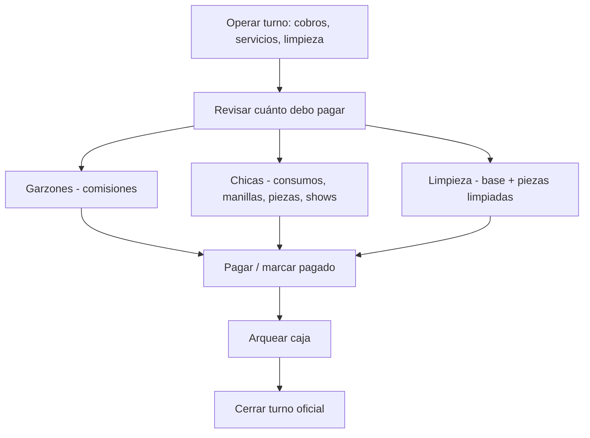

# FINANCE_AND_WAITER_PRODUCT_SELECTOR_AUDIT.md

**Fecha:** 2026-06-05 (actualización: egresos liquidación + venta directa)  
**Alcance:** Finanzas/caja, liquidaciones al cierre, **egresos de caja al pagar personal**, **visibilidad venta directa**, selector garzón  
**Método:** Revisión de backend (use cases, repositorios, rutas), frontend (navegación, permisos, páginas), fases 13–18, roadmap y reportes. **Sin implementación.**

**Referencias revisadas:**

| Documento | Relevancia |
|-----------|------------|
| `ROADMAP.md` | Orden módulos: Caja → Ventas → Comisiones |
| `NIGHTPOS_MASTER_AUDIT.md` | Liquidaciones marcadas como hechas en núcleo operativo |
| `OPERATION_CASH_FINANCE_AUDIT.md` | Menú Finanzas = Liquidaciones + Cierre + Turnos |
| `backend/PHASE_13_REPORT.md` | Turnos oficiales; columnas `total_*_payouts` preparadas |
| `backend/PHASE_14_REPORT.md` | Liquidaciones garzones/chicas desde ventas cobradas |
| `backend/PHASE_16_REPORT.md` | Manillas, piezas, shows en liquidación |
| `backend/CLEANING_SETTLEMENTS_REPORT.md` | Limpieza: base + pieza limpiada |
| `backend/SETTLEMENTS_CASH_UI_FIX_REPORT.md` | Fix congelamiento UI; banner caja |
| `backend/SERVICES_CASH_ACCOUNTING_FIX_REPORT.md` | Servicios registran ingreso en caja |
| `frontend/NAVIGATION_UX_FINAL_REPORT.md` | Finanzas reorganizado post-auditoría UX |
| `frontend/DIRECT_SALES_REPORT.md` | Venta directa implementada; ruta y permiso |
| `backend/DIRECT_SALES_REPORT.md` | `POST /direct-sales` funcional; tests 10/10 |

---

## Resumen ejecutivo

### Problema central reportado (corrección al análisis anterior)

Cuando la **cajera va a cerrar el turno**, necesita saber **cuánto debe pagar a cada garzón, chica y personal de limpieza**. Eso es parte del cierre nocturno y debería estar en **Finanzas**. Hoy **no se muestra en el flujo de cierre** y en Liquidaciones **solo aparece después de un paso manual** que muchas cajeras no conocen.

El análisis anterior se centró en caja/Mi caja y mencionó liquidaciones de pasada («Finanzas no es vista de caja»). **Eso era correcto para el arqueo, pero incompleto para el cierre operativo:** el gap real es la **desconexión entre Cierre de turno ↔ Liquidaciones**.

### Cinco problemas distintos (no confundir)

| # | Problema | Veredicto |
|---|----------|-----------|
| **1 — Caja** | «Abrí con 50, cobré, no cuadra» | Persistencia **OK**; UI Mi caja **confunde** (`income_total` incluye cobros) |
| **2 — Liquidaciones** | «No veo cuánto pagar a garzones/chicas/limpieza» | Backend **OK** tras generar; UI **no integrada** al cierre; montos **0.00** hasta pulsar «Generar» |
| **3 — Egresos al pagar** | «Pagué garzones/chicas y el arqueo no baja» | **BUG confirmado** — solo limpieza crea `cash_movements`; garzón/chica **deben** impactar caja |
| **4 — Venta directa** | «No veo venta directa en Operación» | **Confirmado en BD local:** permiso `sales.direct_create` **no existe** → ítem **filtrado** en todos los accesos (no es solo ubicación del menú) |
| **5 — Garzón** | 200 productos en selector móvil | Grilla completa sin límite; sin paginación API |

---

# PARTE A — CAJA Y ARQUEO (resumen)

*(Detalle técnico conservado del análisis previo; sigue vigente.)*

## A.1 Flujo contable

El cobro **sí persiste** correctamente:

```
Apertura 50 Bs → cash_sessions.opening_amount
Cobro comanda   → sales + sale_payments + cash_movements INCOME + orders BILLED
Asociación      → sales.cash_session_id = sesión del cajero que cobra
```

## A.2 Dónde se ve hoy vs dónde debería

| Dato | Pantalla correcta | Estado |
|------|-------------------|--------|
| Fondo inicial / ventas cobradas | **Mi caja** | OK con refresh |
| Arqueo fiscal multicaja | **Fiscalización** (admin) | OK (`CashSessionFinancialSummaryBuilder`) |
| KPI «Ingresos manuales» | Mi caja | **MAL** — muestra `income_total` (incluye cobros) |
| Ventas del día | Dashboard | **MAL** — placeholder «—» |
| Pagos a personal | **Liquidaciones** | Ver Parte B |

## A.3 Corrección propuesta (sin cambios de alcance liquidaciones)

| Fase | Tarea |
|------|-------|
| F1 | `GET /cash/session/current` + `financial_summary` del builder |
| F2 | Mi caja: separar manual vs cobros; refresh tras mutaciones |
| F3 | Dashboard/consola alineados |

---

# PARTE B — LIQUIDACIONES Y CIERRE DE TURNO (análisis profundo)

## B.1 Expectativa de negocio (cajera al cerrar)

Flujo mental de una noche real:



**Lo que la cajera espera:** un solo lugar en **Finanzas** donde vea totales por tipo y por persona **antes y durante** el cierre.

**Lo que el sistema ofrece hoy:** dos pantallas separadas sin enlace operativo:

| Pantalla | Ruta menú | Qué muestra |
|----------|-----------|-------------|
| Liquidaciones → Resumen | `nightpos-settlements` | KPIs agregados (9 tarjetas) |
| Liquidaciones → Garzones/Chicas/Limpieza | sub-rutas | Tablas por persona |
| Cierre de turno | `nightpos-shifts-close` | **Solo ventas y arqueo** — sin liquidaciones |

---

## B.2 Alineación con roadmap y fases

| Fase / doc | Estado backend | Estado UX cierre |
|------------|----------------|------------------|
| Fase 13 — Turnos | `official_shifts`, `shift_closures` | Cierre muestra ventas/efectivo |
| Fase 14 — Liquidaciones garzón/chica | `staff_settlements`, generate, mark-paid | Existe menú Finanzas |
| Fase 16 — Manillas/piezas/shows | Ítems `GIRL_*` en generate | Resumen con subtotales |
| Limpieza (`CLEANING_SETTLEMENTS_REPORT`) | `CLEANING_BASE`, `CLEANING_ROOM` | Tab Limpieza |
| `PHASE_14` próximo paso | Rellenar `shift_closures.total_*_payouts` | **Pendiente — siempre null** |

El roadmap coloca **Comisiones** en Sprint 9; las fases 14–16 ya implementaron el **motor** de liquidaciones, pero **no cerraron el circuito** con la pantalla de cierre de turno ni con totales persistidos en `shift_closures`.

---

## B.3 Modelo técnico: liquidaciones NO son automáticas

### Regla crítica

Los montos **no aparecen solos** al cobrar comandas. El sistema usa un **paso explícito de generación**:

```
POST /api/v1/settlements/generate-current-shift
  → EnsureOperationalShiftUseCase (crea turno si no existe)
  → EloquentStaffSettlementRepository::generateForShift()
  → Inserta/actualiza staff_settlements + staff_settlement_items
```

Hasta que la cajera (o admin) pulse **«Generar liquidaciones del turno actual»** en `settlements/index.vue`:

- `GET /settlements/current-shift` devuelve `summary` con **todos los totales en 0.00**
- Tablas Garzones / Chicas / Limpieza están **vacías**
- Consola de turno: `pending_settlements = 0`, `pending_amount = 0.00`

### Fuentes que alimentan `generateForShift`

| Tipo personal | Fuente de datos | Condición |
|---------------|-----------------|-----------|
| **Garzón** | `sale_items.waiter_commission_amount_snapshot` | Venta cobrada del turno; `waiter_user_id` en sale; % comisión en perfil al cobrar |
| **Chica — consumo** | `sale_items.girl_amount_snapshot` | Modo `CON_ACOMPANANTE` + `girl_user_id` |
| **Chica — manilla** | tabla `bracelets` | Del turno |
| **Chica — pieza** | tabla `room_services` | Status `FINISHED` |
| **Chica — show** | tabla `shows` | Del turno |
| **Limpieza — pieza** | tabla `cleaning_tasks` | Status `DONE` (tras `mark-clean`) |
| **Limpieza — base** | `staff_profiles.cleaning_base_amount` | Una vez por usuario si tuvo tareas en el turno |

**Snapshots al cobrar** (`ChargeOrderUseCase`):

```php
'girl_amount_snapshot' => $item->girlAmount,
'waiter_commission_percent_snapshot' => $waiterPercent,
'waiter_commission_amount_snapshot' => $commissionAmount,
```

Si el garzón no tiene `%` en `staff_profiles.waiter_commission_percent`, la comisión es **0** y no genera línea.

---

## B.4 Endpoints y permisos (cajera)

| Endpoint | Permiso | Cajera (seeder) | Función |
|----------|---------|-----------------|---------|
| `GET /settlements/current-shift` | `settlements.access` | ✓ | Resumen + arrays waiters/girls/cleaning |
| `GET /settlements/current-shift/pending-sources` | `settlements.pending_sources` | ✓ | Alertas (no montos); piezas activas, staff sin config |
| `POST /settlements/generate-current-shift` | `settlements.generate` | ✓ | **Crea** liquidaciones |
| `GET /settlements/{id}` | `settlements.access` | ✓ | Detalle por persona |
| `POST /settlements/{id}/mark-paid` | `settlements.pay` | ✓ | Marca pagado |
| `GET /settlements/history` | `settlements.history` | ✓ | Historial |

`SettlementAccessPolicy`: cajera con `generate`/`pay` ve **todas** las liquidaciones del turno (no solo la propia).

---

## B.5 Qué muestra cada pantalla de Finanzas hoy

### B.5.1 Liquidaciones → Resumen (`settlements/index.vue`)

**Sí muestra** (tras generar y con turno resuelto):

| Tarjeta KPI | Campo API | Significado |
|-------------|-----------|-------------|
| Total garzones | `summary.total_waiters` | Suma liquidaciones WAITER |
| Total chicas | `summary.total_girls` | Suma liquidaciones GIRL |
| Total limpieza | `summary.total_cleaning` | Suma liquidaciones CLEANING |
| Pendiente | `summary.total_pending` | Status PENDING |
| Pagado | `summary.total_paid` | Status PAID |
| Subtotales chicas | `total_consumption`, `total_bracelets`, `total_pieces`, `total_shows` | Desglose por fuente |

**No muestra:**

- Tabla «quién cobra cuánto» en el resumen (hay que ir a tabs Garzones/Chicas/Limpieza)
- Montos **proyectados** antes de generar (solo 0.00)
- Enlace prominente hacia **Cierre de turno**
- Checklist «pasos antes de cerrar»

**Acción requerida visible:** botón «Generar liquidaciones del turno actual» (muchas cajeras pueden no entender que es obligatorio).

### B.5.2 Liquidaciones → Garzones / Chicas / Limpieza

Tablas con una fila por persona, total y estado. Acción «Ver detalle» → `settlements/[id].vue` con ítems y botón **Marcar pagado**.

| Tab | Columnas clave |
|-----|----------------|
| Garzones | staff_name, %, ventas, comisión, estado |
| Chicas | consumos, manillas, piezas, shows, total |
| Limpieza | base, piezas limpias, tarifa, total |

**Vacías** si no se generó o si no hay fuentes (ej. sin ventas CON_ACOMPANANTE, sin cleaning_tasks DONE).

### B.5.3 Cierre de turno (`shifts/close.vue`)

Usa `GET /shifts/current` + `GET /shifts/{id}/summary` → `buildSummaryTotals()`:

| KPI en pantalla | Incluido |
|-----------------|----------|
| Efectivo ventas, QR, tarjeta | ✓ |
| Total ventas | ✓ |
| Ingresos/egresos manuales | ✓ |
| Efectivo esperado | ✓ |
| **Total garzones** | ✗ |
| **Total chicas** | ✗ |
| **Total limpieza** | ✗ |
| **Pendiente por pagar** | ✗ |
| Enlace a liquidaciones | ✗ |
| Validación liquidaciones pendientes | ✗ |

`CloseOfficialShiftUseCase` solo valida:

1. Turno OPEN
2. **No hay cajas abiertas** (`hasOpenCashSessions`)
3. Arqueo con `counted_cash`

**No valida** liquidaciones PENDING ni exige haber generado.

### B.5.4 Consola de turno (`shift-console/index.vue`)

Tarjeta «Liquidaciones pendientes»: cuenta y monto desde `staff_settlements` **ya generados**. Si no se generó, muestra 0 aunque haya ventas con comisión.

### B.5.5 `shift_closures` — columnas vacías

Migración preparó `total_girl_payouts` y `total_waiter_payouts`. Al cerrar:

```php
// EloquentOfficialShiftRepository::createClosure()
'total_girl_payouts' => null,
'total_waiter_payouts' => null,
```

No existe `total_cleaning_payouts`. El historial de turnos **no conserva** cuánto se debía pagar al personal esa noche.

---

## B.6 Por qué la cajera «no ve nada» — árbol de causas

```
¿Entró a Finanzas → Liquidaciones?
├─ NO → fue a Cierre de turno o Mi caja → no hay datos de personal (diseño)
└─ SÍ
   ├─ ¿Pulsó «Generar liquidaciones»?
   │  ├─ NO → summary = 0.00 en todas las tarjetas (CAUSA #1 más frecuente)
   │  └─ SÍ
   │     ├─ ¿Hay turno oficial resuelto?
   │     │  ├─ NO → alerta «Sin turno clasificado» (EnsureOperationalShift al generar)
   │     │  └─ SÍ
   │     │     ├─ ¿Ventas cobradas con snapshots > 0?
   │     │     │  ├─ Garzón sin % comisión → 0 comisiones (CAUSA #2)
   │     │     │  ├─ Sin CON_ACOMPANANTE / sin chica asignada → 0 chicas consumo
   │     │     │  └─ Sin servicios registrados → 0 manillas/piezas/shows
   │     │     ├─ ¿Limpieza marcó piezas? (cleaning_tasks DONE)
   │     │     │  └─ NO → 0 limpieza (CAUSA #3)
   │     │     └─ ¿Miró solo Resumen sin abrir tabs?
   │     │        └─ Ve totales pero no nombres (CAUSA #4 UX)
   └─ ¿Pantalla congelada?
      └─ Fix aplicado (SETTLEMENTS_CASH_UI_FIX) — duplicado `cleaning` en composable
```

### B.6.1 `pending-sources` no resuelve el problema de montos

`GET /settlements/current-shift/pending-sources` devuelve **conteos y alertas**, no dinero:

- `active_room_services_count`
- `unpaid_bracelets_count`, `unpaid_shows_count`, `unpaid_finished_room_services_count`
- `waiters_without_commission`, `girls_without_commission_flag`

Útil para advertencias, **inútil** para responder «¿cuánto BOB debo pagar?».

### B.6.2 Bug menor: `emptySummary` sin `total_cleaning`

`GetCurrentShiftSettlementsUseCase::emptySummary()` no incluye `total_cleaning`. Si no hay turno, el frontend puede mostrar `undefined` en esa tarjeta.

---

## B.7 Comportamiento de pago (`mark-paid`) — BUG confirmado

### Estado actual (incorrecto para el negocio)

| Tipo | ¿Egreso en `cash_movements`? | ¿Exige caja abierta (backend)? | Impacto en `expected_cash` |
|------|------------------------------|--------------------------------|----------------------------|
| `CLEANING` | **Sí** — `EXPENSE` + motivo «Limpieza» | **Sí** (422 sin caja) | **Sí** — resta del esperado |
| `WAITER` | **No** — solo `status = PAID` | No | **No** — arqueo queda inflado |
| `GIRL` | **No** — solo `status = PAID` | No | **No** — arqueo queda inflado |

Código actual (`MarkSettlementPaidUseCase`): el bloque `addMovement(EXPENSE)` está **solo** dentro de `if ($model->settlement_type === 'CLEANING')`. Los tests de Fase 14 (`marks settlement as paid`) validan el cambio de estado, **no** la existencia de movimiento de caja para WAITER/GIRL.

El frontend **sí** pide caja abierta antes de pagar cualquier liquidación (`SettlementsCashBanner`, diálogo en `settlements/[id].vue`), pero el backend **no registra el egreso** para garzón ni chica. Resultado operativo:

```
Cajera paga 150 BOB a garzones en efectivo (marca pagado)
→ Mi caja sigue mostrando el mismo «Total esperado»
→ Al contar billetes, sobra dinero «fantasma» o el arqueo «no cuadra» al revés
```

**Veredicto:** No es una «implicación» aceptable — es un **defecto contable** que hay que corregir. En un boliche real, pagar comisiones y chicas **sale del cajón** y debe reflejarse igual que limpieza.

### Por qué el arqueo no se actualiza hoy

`CashSessionFinancialSummaryBuilder` calcula:

```
expected_cash = opening + ventas_efectivo + ingresos_manuales - egresos_manuales
```

`sumManualMovements()` suma **todos** los `cash_movements` tipo `EXPENSE`. Si el pago a garzón/chica no crea movimiento, ese egreso **no entra** en la fórmula. Limpieza sí entra porque ya genera `EXPENSE`.

### Solución propuesta — Fase L4 (obligatoria, no opcional)

**Objetivo:** Unificar `mark-paid` para WAITER, GIRL y CLEANING con el mismo patrón contable.

#### L4.1 Backend — `MarkSettlementPaidUseCase`

1. **Extraer** lógica común `recordSettlementPayoutExpense()` (servicio nuevo, p. ej. `SettlementCashPayoutRecorder`).
2. Para **los tres** `settlement_type`:
   - Resolver caja abierta del pagador (`OpenCashSessionResolver` — igual que limpieza hoy).
   - Si no hay caja → `StaffSettlementDomainException::cashRequiredForPayment()` (422).
   - `cashSessions->addMovement(EXPENSE, amount = total_amount, paymentMethod = CASH por defecto)`.
   - Actualizar `staff_settlements.cash_session_id` con la sesión del pago.
   - Luego `markPaid()` como hoy.
3. **Motivo de caja** (`cash_movement_reason_id`) por tipo:

| `settlement_type` | Motivo sugerido (seed) | Descripción movimiento |
|-------------------|------------------------|-------------------------|
| `WAITER` | «Comisión garzón» o «Pago garzones» | `{motivo} — {nombre garzón}` |
| `GIRL` | «Pago chicas» o «Liquidación chicas» | `{motivo} — {nombre chica}` |
| `CLEANING` | «Limpieza» (ya existe en seeder) | Sin cambio de regla |

4. Resolver motivos: mismo patrón que `resolveCleaningExpenseReason()` — buscar por nombre; fallback al primer EXPENSE activo; error claro si no hay motivos configurados.
5. **Migración / seeder** para tenants existentes: crear motivos EXPENSE «Comisión garzón» y «Pago chicas» en `cash_movement_reasons` (hoy el seeder demo solo tiene Limpieza, Taxi, Compra hielo, etc. — **no** hay motivo específico garzón/chica).

#### L4.2 API — extensión opcional del payload `mark-paid`

```json
POST /settlements/{id}/mark-paid
{
  "notes": "Pago en efectivo",
  "payment_method": "CASH"
}
```

Por defecto `CASH` (sale del cajón). QR/tarjeta para pago a personal sería fase posterior si el negocio lo requiere.

#### L4.3 Trazabilidad

- Mantener vínculo `staff_settlements.cash_session_id` (ya existe columna).
- Opcional: campo `source_type` en movimiento o descripción estándar `Liquidación #{id}` para auditoría.
- Audit log: `settlement.paid` con `settlement_type`, `amount`, `cash_session_id`.

#### L4.4 Tests Feature (ampliar existentes)

| Caso | Assert |
|------|--------|
| Pagar WAITER con caja | `cash_movements` EXPENSE = total; `expected_cash` baja |
| Pagar GIRL con caja | Idem |
| Pagar WAITER sin caja | 422 |
| Pagar CLEANING | Sigue pasando (regresión) |
| `GET /cash/session/current` tras pagar garzón | `expense_total` / summary reflejan egreso |

#### L4.5 Frontend (mínimo tras L4 backend)

- Mi caja: los egresos ya aparecen en tabla movimientos si el backend los crea (verificar etiqueta legible).
- Liquidaciones detalle: mensaje «Se registrará egreso de caja por {monto}» al confirmar pago.
- Cierre de turno: tras L4, el `expected_cash` del turno **sí** incluirá pagos a personal hechos desde esa caja.

#### L4.6 Orden respecto a otras fases

**L4 debe ir antes o junto con F1** (financial summary en Mi caja). Sin L4, aunque se corrijan los KPIs de «ingresos manuales», el arqueo seguirá **ignorando** pagos a garzones/chicas.

```
Flujo contable objetivo al marcar pagado (cualquier tipo):

  Cajera confirma pago
    → Validar caja abierta
    → cash_movements EXPENSE (monto = total_amount)
    → staff_settlements.status = PAID, cash_session_id = sesión
    → expected_cash = opening + ventas_efectivo + ingresos_manuales - TODOS_los_egresos
```

---

## B.8 Escenario de prueba documentado (PHASE_14)

Flujo que **sí funciona** si se sigue completo:

```
1. Turno abierto (o se crea al generar)
2. Caja abierta → comanda SOLO + CON_ACOMPANANTE con chica → cobrar
3. Finanzas → Liquidaciones → Generar
4. GET current-shift → totales > 0, tablas pobladas
5. Detalle → Marcar pagado
```

Si la cajera salta el paso 3 y va directo a **Cierre de turno**, el sistema le muestra ventas pero **cero información de personal**.

---

## B.9 Matriz de brechas (liquidaciones ↔ cierre)

| # | Brecha | Severidad | Capa |
|---|--------|-----------|------|
| L1 | Cierre de turno sin KPIs de liquidación | **Crítica** | Frontend + API shift summary |
| L2 | Generación manual no obvia; montos 0 hasta pulsar | **Crítica** | UX / producto |
| L3 | Resumen sin tabla por persona | **Alta** | Frontend |
| L4 | `shift_closures.total_*_payouts` siempre null | **Alta** | Backend cierre |
| L5 | Cerrar turno no advierte liquidaciones PENDING | **Alta** | Backend + Frontend |
| L6 | Sin preview monetario pre-generate | **Media** | Backend nuevo endpoint o extensión |
| L7 | Pago garzón/chica no genera egreso caja | **Crítica** | Backend `MarkSettlementPaidUseCase` |
| L8 | `pending-sources` sin montos | **Media** | API |
| L9 | `emptySummary` sin `total_cleaning` | **Baja** | Backend |
| L10 | Cierre exige cajas cerradas pero no guiar «pagar limpieza antes» | **Media** | UX flujo |

---

## B.10 Propuesta de corrección — liquidaciones y cierre

### Fase L0 — Quick wins UX (prioridad máxima)

1. **Cierre de turno:** bloque «Pagos al personal» con 3 KPIs (`total_waiters`, `total_girls`, `total_cleaning`, `total_pending`) consumiendo `GET /settlements/current-shift`.
2. CTA: «Ver liquidaciones» / «Generar si está en 0» con enlace a `nightpos-settlements`.
3. Alerta si `total_pending > 0` al intentar cerrar (confirmación, no bloqueo duro inicial).
4. **Resumen liquidaciones:** mini-tablas (top 5 por tipo) + total pendiente sticky.
5. Banner en Resumen si `summary.total_pending === 0` y hay ventas del turno: «Aún no generó liquidaciones».

### Fase L1 — Backend integración cierre

1. Extender `GetOfficialShiftSummaryUseCase` / `buildSummaryTotals` con bloque `staff_settlements_summary` (o llamar repositorio settlements).
2. Al `CloseOfficialShiftUseCase`, persistir en `shift_closures`:
   - `total_waiter_payouts`
   - `total_girl_payouts`
   - (nueva columna) `total_cleaning_payouts` o usar JSON `staff_payouts_snapshot`
3. Tests: cobrar → generar → cerrar turno → assert columnas no null.

### Fase L2 — Preview pre-generate (opcional)

1. `GET /settlements/current-shift/preview` — calcula montos **sin escribir** `staff_settlements` (misma lógica que generate, read-only).
2. Mostrar preview en Resumen y Cierre antes de generar.

### Fase L3 — Flujo «Cierre nocturno» unificado (ideal)

Wizard o página única:

```
1. Generar/actualizar liquidaciones
2. Revisar por tipo (garzones/chicas/limpieza)
3. Marcar pagados (con caja abierta)
4. Arqueo caja
5. Cerrar turno oficial
```

### Fase L4 — Egresos de caja al pagar personal (obligatoria)

Ver sección **B.7** — unificar `mark-paid` WAITER/GIRL/CLEANING con `cash_movements EXPENSE`, motivos de caja y tests.

---

## B.11 Flujo objetivo vs actual

```
ACTUAL (fragmentado):
  Cobrar → … → Cierre turno (solo ventas)
              Liquidaciones (aislado, requiere Generar manual)

OBJETIVO (cierre nocturno):
  Cobrar → Liquidaciones (auto o 1 clic) → Revisar montos por tipo
         → Pagar (egreso en caja) → Arqueo cuadra → Cerrar turno (snapshot payouts)
```

---

# PARTE G — VENTA DIRECTA (auditoría real — cajero no la ve)

## G.1 Veredicto

**En código, «Venta directa» SÍ está en Operación** (`nightpos-r4.js` línea 29).  
**En tu entorno actual, la cajera NO puede verla en ningún lado** — ni Operación, ni Mi caja, ni dashboard — porque **falta el permiso en base de datos**.

No es un problema de «haberla quitado de Caja». Ponerla otra vez en Caja **no ayudaría** sin el permiso: el mismo filtro CASL la ocultaría.

## G.2 Evidencia en base de datos (entorno local verificado)

Consulta ejecutada contra la BD del proyecto:

| Comprobación | Resultado |
|--------------|-----------|
| Fila `permissions` con slug `sales.direct_create` | **NO existe** |
| Rol `cashier` tiene `sales.direct_create` | **NO** |
| Usuario `cajero.demo` tiene el permiso | **NO** |
| Migración `add_direct_sale_permission` ejecutada | **NO** |
| Usuario `cajero.demo` tiene `sales.charge` (Cobrar comandas) | **SÍ** (42 permisos en rol) |

**Conclusión:** La cajera ve «Cobrar comandas» pero no «Venta directa» porque el rol tiene cobro y **no** tiene venta directa. El menú Operación **sí aparece**; el ítem «Venta directa» se **elimina del árbol** al filtrar permisos.

## G.3 Cómo funciona el filtro (por qué desaparece del menú)

Cadena completa:

```
nightpos-r4.js
  { title: 'Venta directa', subject: 'sales.direct_create', action: 'access' }
       ↓
useNightPosNavItems → filterNavTree → canSeeItem
       ↓
can('access', 'sales.direct_create')  ← CASL / auth.permissions[]
       ↓
Si el slug NO está en user.permissions → ítem NO se renderiza
```

Lo mismo aplica a:

| UI | Condición | Con permiso faltante |
|----|-----------|----------------------|
| Menú Operación → Venta directa | `sales.direct_create` | **Oculto** |
| Mi caja → botón «Venta directa» | `v-if="canDirectSale"` | **Oculto** |
| Dashboard → acceso rápido | `enabled: canDirectSale` | **Deshabilitado/oculto** |
| Consola → enlace venta directa | ruta + permiso implícito | **No útil sin permiso** |
| Ruta `/nightpos/cash/direct-sale` | `meta.permission: sales.direct_create` | **403 / not-authorized** |

**Código de navegación:** correcto. **Datos de permisos en BD:** incompletos para instalaciones que no corrieron la migración.

## G.4 ¿Por qué falta el permiso si el seeder lo define?

El seeder `SeedsNightPosFoundation` **sí** incluye `sales.direct_create` en la lista de permisos y en el rol `cashier`, pero:

1. Eso solo aplica en **`db:seed` sobre BD vacía** o cuando se vuelve a sincronizar roles.
2. Para BDs **ya existentes** se creó la migración `2026_06_10_100071_add_direct_sale_permission.php` que agrega el permiso y lo asigna a `super_admin`, `tenant_owner`, `cashier`, `cashier_senior`.
3. En este entorno **esa migración no se ejecutó** → el permiso nunca se creó ni se asignó.

Instalaciones seedeadas **antes** de agregar venta directa al código quedan sin el permiso hasta `migrate`.

## G.5 Árbol de causas actualizado (cajero no ve en Operación)

```
¿Usuario es cajero (no garzón/chica)?
└─ SÍ
   ├─ ¿permissions incluye sales.direct_create?
   │  ├─ NO  ← TU CASO (BD verificada)
   │  │     ├─ Migración add_direct_sale_permission no corrida
   │  │     ├─ Rol cashier sin sync posterior
   │  │     └─ Sesión con JWT/cookie antiguo (re-login tras migrate)
   │  └─ SÍ
   │     ├─ ¿Expandió grupo «Operación» en sidebar?
   │     │  └─ NO → ítem existe pero colapsado (CAUSA UX secundaria)
   │     └─ SÍ → debe verse como 4.º ítem tras Cobrar comandas
   └─ Superadmin sin contexto tenant → menú operativo entero oculto (no aplica a cajero)
```

## G.6 Solución (sin programar frontend) — prioridad VD-0

### Paso obligatorio (resuelve el 100% del caso reportado)

```bash
cd backend
php artisan migrate
```

Eso ejecuta `2026_06_10_100071_add_direct_sale_permission.php` → crea permiso y lo asigna a cajero/cajero senior/admin.

Luego **cerrar sesión y volver a entrar** con PIN (la lista `user.permissions` viene del login; cookies viejas no incluyen el slug nuevo).

**Verificación tras migrate + re-login:**

1. En respuesta de login (o cookie `userData`): `permissions` debe incluir `sales.direct_create`.
2. Sidebar → **Operación** (expandir) → debe aparecer **Venta directa** entre «Cobrar comandas» y «Comandas activas».
3. **Mi caja** → botón «Venta directa» arriba a la derecha.
4. URL `/nightpos/cash/direct-sale` → carga la pantalla POS (pide abrir caja para vender).

### Si migrate no es opción ahora (manual)

- Admin → Roles → Cajero → asignar permiso «Venta directa desde caja» (`sales.direct_create`).
- O SQL: crear permiso y pivot rol-permiso (equivalente a la migración).

### VD-A (volver a poner en menú Caja) — NO es la solución primaria

| | Sin permiso | Con permiso |
|---|-------------|-------------|
| Entrada en Operación | Oculta | Visible |
| Entrada en Caja (VD-A) | **También oculta** | Visible en ambos |

VD-A solo tiene sentido **después de VD-0**, como mejora de descubrimiento para quien busca en Caja. **No sustituye** migrate + re-login.

### Mejoras UX opcionales (post VD-0)

| ID | Acción | Cuándo |
|----|--------|--------|
| VD-A | Duplicar ítem en menú Caja | Si tras permiso siguen buscando en Caja |
| VD-B | Aviso en Mi caja «Venta sin comanda» | Refuerzo |
| VD-C | Botón en Cobrar comandas | Flujo cajera |
| VD-F | Renombrar a «Venta directa (sin comanda)» | Claridad |

## G.7 Auditoría del código de menú (confirmación)

Archivo activo: `frontend/src/navigation/vertical/index.js` → exporta `nightpos-r4.js`.

Entrada venta directa **presente** en Operación:

```javascript
{ title: 'Venta directa', to: 'nightpos-cash-direct-sale', action: 'access', subject: 'sales.direct_create' },
```

No hay bug de «no está en Operación». Hay **desfase deploy**: código frontend listo, **permiso backend no desplegado** en la BD.

---

# PARTE C — SELECTOR PRODUCTOS GARZÓN (resumen)

*(Sin cambios sustanciales respecto al análisis previo.)*

## C.1 Problema

`OrderAddProductDialog.vue` en modo móvil garzón renderiza **toda la grilla** (~200 tarjetas) sin búsqueda/categoría. `GET /products` devuelve catálogo completo sin paginación.

## C.2 Corrección propuesta

| Prioridad | Acción |
|-----------|--------|
| P1 | Ocultar grilla hasta búsqueda (≥2 chars) o categoría |
| P1 | Limitar resultados visibles a 20 |
| P2 | Virtual scroll en grilla por categoría |
| P3 | `GET /products/pos-catalog` con search/limit |

---

# PARTE D — PRIORIDAD GLOBAL DE IMPLEMENTACIÓN

| Orden | ID | Tarea | Impacto |
|-------|-----|-------|---------|
| **1** | L4 | Egresos caja al pagar WAITER/GIRL/CLEANING (unificar `mark-paid`) | **Crítico** — arqueo real; pagar personal debe bajar efectivo esperado |
| **2** | L0 | KPIs liquidación en Cierre de turno + alertas + CTA generar | **Crítico** — cuánto pagar al personal |
| **3** | VD-0 | `php artisan migrate` (permiso `sales.direct_create`) + **re-login cajero** | **Crítico** — sin esto no aparece en Operación ni en ningún acceso |
| **4** | VD-A | (Opcional post VD-0) Duplicar ítem en menú Caja | Medio — solo descubrimiento, no desbloqueo |
| **5** | L0 | Resumen liquidaciones: tablas por persona + banner «generar» | Alto |
| **6** | F1 | `financial_summary` en Mi caja | Alto — KPIs sin doble conteo |
| **7** | L1 | Persistir payouts en `shift_closures` + motivos caja garzón/chica | Alto |
| **8** | L1 | Advertencia liquidaciones pendientes al cerrar | Alto |
| **9** | F2–F3 | Dashboard, consola, refresh Mi caja | Medio |
| **10** | VD-B/C | Guías venta directa (solo si hace falta tras VD-0) | Bajo |
| **11** | L2 | Preview montos pre-generate | Medio |
| **12** | P1 | Selector garzón sin grilla inicial | Alto operación móvil |
| **13** | P3 | POS catalog API | Escalabilidad |

---

# PARTE E — PLAN DE FASES SUGERIDO (NO implementar aún)

### FASE L0 — CIERRE NOCTURNO VISIBLE

- Frontend: `shifts/close.vue` + `settlements/index.vue`
- Sin cambios backend obligatorios (reusa `GET /settlements/current-shift`)

### FASE L1 — CIERRE CON SNAPSHOT

- Backend: `GetOfficialShiftSummaryUseCase`, `CloseOfficialShiftUseCase`, migración opcional `total_cleaning_payouts`
- Tests Feature cierre con liquidaciones

### FASE F1 — CAJA REAL EN UI

- Backend + Mi caja (Parte A)

### FASE F3 — SELECTOR GARZÓN

- Frontend `OrderAddProductDialog.vue`

### FASE L4 — EGRESOS CAJA AL PAGAR PERSONAL (obligatoria)

- Backend: `MarkSettlementPaidUseCase`, `SettlementCashPayoutRecorder`, motivos caja, migración motivos
- Tests: pagar WAITER/GIRL con/sin caja; regresión CLEANING
- Frontend mínimo: copy en diálogo de pago

### FASE VD-0 — PERMISO VENTA DIRECTA (obligatoria)

- Ops: `php artisan migrate` → `add_direct_sale_permission`
- Re-login todos los cajeros
- Verificar `sales.direct_create` en login

### FASE VD-A — UX OPCIONAL (solo tras VD-0)

- Duplicar ítem en menú Caja si hace falta descubrimiento

### FASE L2 — Preview pre-generate

- Según prioridad post-piloto

---

# PARTE F — CHECKLIST VALIDACIÓN MANUAL (cajera)

1. Login cajera → cobrar comandas con garzón (% configurado) y líneas CON_ACOMPANANTE.
2. Registrar manilla/pieza/show si aplica; limpieza marca habitación limpia.
3. **Finanzas → Liquidaciones:** ¿totales 0? → pulsar **Generar**.
4. Verificar tarjetas Total garzones / chicas / limpieza / Pendiente.
5. Tabs Garzones, Chicas, Limpieza: filas con montos.
6. **Finanzas → Cierre de turno:** ¿aparecen esos montos? → **hoy NO** (brecha L1).
7. Marcar pagado **garzón**: ¿egreso en Mi caja? → **hoy NO** (brecha L7); **limpieza SÍ**.
8. Marcar pagado garzón/chica y revisar «Total esperado» → **hoy no baja** (debe corregirse en L4).
9. **Venta directa:** ¿`sales.direct_create` en login? → si NO: `migrate` + re-login. Si SÍ: expandir **Operación** → 4.º ítem; o Mi caja → botón.
10. Cerrar cajas → cerrar turno → historial: ¿payouts guardados? → **hoy NO** (null).

---

## Conclusión

### Liquidaciones y caja al pagar

El sistema **sí calcula** liquidaciones (fases 14–16), pero tiene **dos fallos graves** para el cierre nocturno:

1. **UX:** paso «Generar» + cierre de turno sin montos de personal (L0/L1).
2. **Contabilidad:** pagar garzones/chicas **no resta efectivo** en caja; solo limpieza sí (L4 — **bug, no decisión de diseño**).

Corregir **L4** es tan urgente como **L0**: sin egresos en `mark-paid`, la cajera puede pagar en billetes reales y el sistema seguirá mostrando un arqueo **inflado**.

### Venta directa

**Auditoría corregida:** el ítem **sí está en Operación** en el código. En la BD de este entorno el permiso `sales.direct_create` **no existe** (migración no corrida); por eso la cajera no lo ve **en ningún sitio**. No hace falta moverlo a Caja primero — hace falta **VD-0**: `migrate` + re-login. VD-A (duplicar en Caja) es opcional después.

### Prioridad de implementación sugerida

```
VD-0 (migrate + re-login) → L4 (egresos mark-paid) → L0 (liquidaciones en cierre) → F1 (Mi caja KPIs) → VD-A opcional
```

---

*Auditoría actualizada (egresos liquidación + venta directa). Sin cambios de código.*
