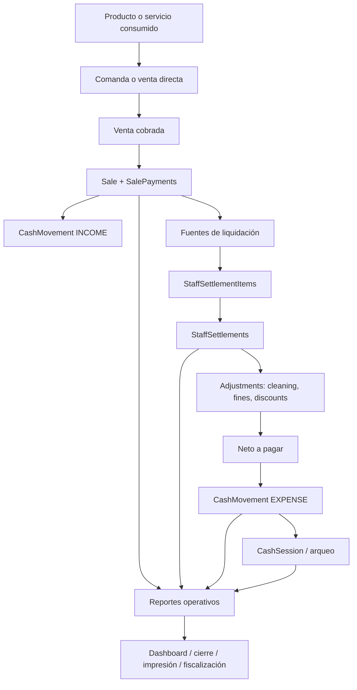
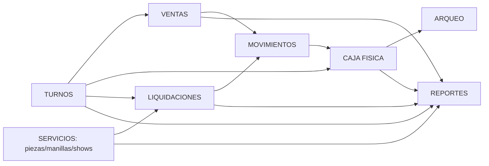
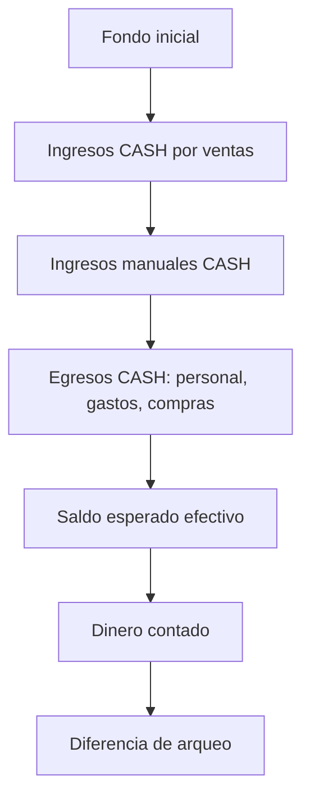
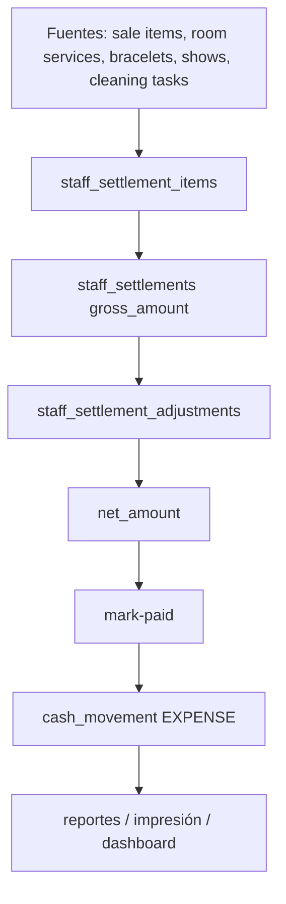

# Financial Architecture Master — NightPOS

**Fecha:** 2026-07-10
**Estado:** Documento maestro de arquitectura financiera — diseño y auditoría, sin implementación
**Propósito:** convertirse en la referencia oficial del sistema financiero de NightPOS antes de cualquier refactor o rediseño de Caja

---

## 1. Arquitectura financiera completa

NightPOS ya tiene casi todos los componentes necesarios para operar dinero real, pero hoy están repartidos en varios módulos con fronteras conceptuales incompletas.

La arquitectura financiera oficial propuesta para NightPOS debe quedar separada en **cinco dominios mayores**:

1. **Ventas**
- Todo lo que representa intención de cobro, cobro efectivo y facturación operativa del consumo.
- Incluye comandas, venta directa, pagos mixtos y desglose por método.

2. **Caja física**
- Todo lo que representa dinero físicamente esperable y arqueable.
- Incluye fondo inicial, ingresos en efectivo, egresos en efectivo, contado y diferencia.

3. **Movimientos financieros**
- Libro cronológico de entradas y salidas económicas.
- Debe incluir tanto movimientos manuales como movimientos automáticos de ventas y pagos de liquidaciones, pero clasificados estructuralmente.

4. **Liquidaciones**
- Sistema de obligaciones económicas con el personal.
- Incluye cálculo bruto, ajustes, neto, pendientes, pagos y trazabilidad documental.

5. **Control y reportes**
- Cierre de caja, cierre de turno, fiscalización administrativa, reportes diarios y gerenciales, impresión y conciliación.

### Principio rector

Ningún indicador financiero debe mezclar más de un dominio sin decirlo explícitamente.

Ejemplos:

- “Venta total” pertenece a **Ventas**, no a Caja física.
- “Saldo esperado” pertenece a **Caja física**, no a Ventas.
- “Pago chicas” pertenece a **Liquidaciones** y también a **Movimientos**, pero no a “Gastos manuales”.

---

## 2. Flujo del dinero desde que nace hasta que desaparece

## 2.1 Flujo general

## 2.2 Flujo por tipo de origen

### A. Comanda

1. Se crea `order`.
2. Se agregan `order_items`.
3. Al cobrar:
- nace `sale`
- nacen `sale_items`
- nacen `sale_payments`
- nace uno o más `cash_movements` de tipo `INCOME`
4. Esa venta luego alimenta:
- reportes de ventas
- caja
- posibles liquidaciones de garzón/chica

### B. Venta directa

1. No pasa por comanda.
2. Nace directamente `sale`.
3. Nacen `sale_payments`.
4. Nacen `cash_movements INCOME`.
5. Alimenta ventas, caja y reportes.

### C. Servicio de chica

#### Manillas
- Nace `bracelet`.
- Luego genera `staff_settlement_item`.
- No necesariamente genera venta separada si el flujo ya vino desde comanda/venta.

#### Piezas
- Nace `room_service`.
- Tiene `gross_girl_amount`, `girl_amount`, `house_amount`, `cleaning_amount`.
- Luego genera liquidaciones de chica y/o limpieza.

#### Shows
- Nace `show`.
- Luego genera liquidación.

### D. Liquidaciones

1. Se detectan fuentes pendientes.
2. Se generan `staff_settlements` y `staff_settlement_items`.
3. Se aplican ajustes.
4. El neto queda listo.
5. Al pagar:
- se marca `PAID`
- nace `cash_movement EXPENSE`
- nace ticket/documento de pago

### E. Gastos o movimientos manuales

1. Se registra `cash_movement` manual.
2. Impacta caja física y reportes.
3. No debe alterar ventas.

---

## 3. Responsabilidades de cada módulo

## 3.1 Matriz maestra de módulos financieros

| Módulo | Qué dinero genera | Qué dinero consume | Tablas que modifica | APIs principales | Dominio oficial | Resumen financiero que debe alimentar | Inconsistencias actuales | Cambios necesarios para adaptarlo al nuevo modelo |
|---|---|---|---|---|---|---|---|---|
| Comandas | Ninguno al crear; al cobrar genera venta | No consume dinero | `orders`, `order_items`, luego `sales`, `sale_items`, `sale_payments`, `cash_movements` | `/orders`, `/orders/{id}/charge` | Ventas | `sales_summary`, `movement_summary` | Cobro termina reflejándose también como movement INCOME y puede duplicar lectura visual | Separar visualmente intención de venta vs cobro vs caja |
| Venta directa | Genera venta y movimiento de ingreso | No consume | `sales`, `sale_items`, `sale_payments`, `cash_movements` | `/direct-sales` | Ventas | `sales_summary`, `movement_summary` | Comparte lógica con cobro de comanda; duplicación de flujo | Unificar taxonomía de cobro |
| Pagos mixtos | Genera venta distribuida en métodos | No consume | `sale_payments`, `sales`, `cash_movements` | cobro de comanda / venta directa | Ventas | `sales_summary`, `cash_summary` parcial | Puede hacer más confuso qué es caja física y qué es medio no físico | Separar “métodos de venta” de “arqueo efectivo” |
| Caja | No genera dinero de negocio; registra sesión | No consume en sí misma | `cash_sessions` | `/cash/session/open`, `/cash/session/current`, `/cash/session/close` | Caja física | `cash_summary`, `scope_summary` | Una caja puede arrastrar múltiples turnos | Explicitar scope y definir política final caja-turno |
| Movimientos manuales | Puede generar ingreso manual | Puede consumir dinero como gasto | `cash_movements` | `/cash/movements` | Movimientos | `movement_summary`, `cash_summary` | Clasificación depende demasiado de razón + texto | Categorías estructuradas |
| Liquidaciones | No generan ingreso; generan obligación | Consumen dinero al pagarse | `staff_settlements`, `staff_settlement_items`, `staff_settlement_adjustments`, `cash_movements` | `/settlements/*` | Liquidaciones + Movimientos | `settlement_summary`, `movement_summary`, `cash_summary` | Pagos al personal se diluyen dentro de egresos | Separar KPIs por rol y categoría |
| Piezas | Generan ingreso económico y luego obligación | Pueden generar pago a chica/limpieza | `room_services`, luego `staff_settlement_items`, `staff_settlements` | `/room-services/*` | Ventas/Servicios + Liquidaciones | `sales_summary` o `services_summary`, `settlement_summary` | Hoy se mezclan entre servicios, caja y liquidaciones según pantalla | Definir fuente canónica en arquitectura |
| Manillas | Generan ingreso económico y luego obligación | Pueden generar liquidación | `bracelets`, `sale_item_allocations`, `staff_settlement_items` | `/bracelets`, combos | Ventas/Servicios + Liquidaciones | `sales_summary`, `settlement_summary` | Complejidad combo/manilla/chica puede ocultar el origen del dinero | Mantener trazabilidad explícita de origen |
| Shows | Generan ingreso económico y luego obligación | Pueden generar pago | `shows`, `staff_settlement_items` | `/shows` | Ventas/Servicios + Liquidaciones | `sales_summary`, `settlement_summary` | Igual que piezas/manillas, poca separación visual | Mismo modelo estructurado de origen |
| Habitaciones | No generan dinero por sí solas; contienen piezas | No consume | `rooms` | `/rooms/*` | Soporte operativo | `scope_summary` secundario | Puede influir en bloqueos, no en ventas directas | Mantener fuera de KPIs financieros primarios |
| Limpieza | Puede generar obligación de pago | Consume dinero al pagarse | `cleaning_tasks`, `staff_settlements`, `cash_movements` | `/cleaning/*`, `/settlements/cleaning` | Liquidaciones + Movimientos | `settlement_summary`, `movement_summary` | Se mezcla con otros egresos | KPI dedicado |
| Gastos operativos | No generan; consumen | Sí | `cash_movements` | `/cash/movements` | Movimientos + Caja física | `movement_summary`, `cash_summary` | No siempre separados de pagos al personal | Categoría obligatoria |
| Compras | No generan; consumen | Sí | hoy probablemente `cash_movements` | `/cash/movements` o razones | Movimientos + Caja física | `movement_summary`, `cash_summary` | No tienen capa financiera separada | Categoría de compra explícita |
| Reportes | No generan ni consumen; consolidan | No consume | No deberían modificar, salvo snapshots de cierre | `/reports/*` | Control y reportes | Todos | Mezclan a veces caja, ventas y gastos sin explicar frontera | Redefinir KPIs oficiales |
| Impresión | No genera dinero; documenta | No consume | `print_jobs` y fuentes documentales | `/print-*`, jobs | Control | N/A | No es sistema financiero, pero materializa cifras oficiales | Debe imprimir solo KPIs oficiales y consistentes |
| Dashboard operativo | No genera | No consume | No modifica | varias APIs | Presentación | según pantalla | Hoy mezcla dominios | Rediseño por bloques separados |
| Fiscalización admin | No genera | No consume | No modifica | `/admin/cash-sessions*` | Control | `cash_summary`, `movement_summary`, `sales_summary` | Agrega indicadores ambiguos | Reagrupar por dominio |
| Turnos | No generan directo; definen corte temporal | No consume | `official_shifts`, `shift_closures` | `/shifts/*` | Contexto/Control | `scope_summary`, `managerial_summary` | Turno y caja no siempre coinciden | Decidir política final |
| Arqueo | No genera; verifica existencia física | Consume tiempo/validación operativa | `cash_sessions` | cierre caja/turno | Caja física | `cash_summary` | QR/Tarjeta hoy no son arqueados estructuralmente | Persistencia estructurada o copy claro |
| Agente de impresión | No genera ni consume | No consume | `print_jobs` | heartbeat, pending jobs | Control | N/A | Puede imprimir cifras ambiguas si origen ambiguo | Alinear payloads con KPIs oficiales |
| Reporte gerencial | No genera ni consume | No consume | no debería modificar | `/reports/managerial-daily` | Control | `managerial_summary` | Mezcla netos operativos con estructuras heredadas | Rebase sobre nueva taxonomía |

---

## 4. Diagramas conceptuales

## 4.1 Dominios financieros oficiales

## 4.2 Flujo de caja física

## 4.3 Flujo de liquidaciones

---

## 5. Relación entre tablas

## 5.1 Tablas maestras del dinero

### Ventas
- `orders`
- `order_items`
- `sales`
- `sale_items`
- `sale_payments`
- `sale_item_allocations`

### Caja física y movimientos
- `cash_sessions`
- `cash_movements`
- `cash_movement_reasons`
- `cash_registers`

### Liquidaciones
- `staff_settlements`
- `staff_settlement_items`
- `staff_settlement_adjustments`
- `staff_fines`

### Servicios generadores de valor
- `bracelets`
- `room_services`
- `shows`
- `cleaning_tasks`
- `rooms`

### Contexto y control
- `official_shifts`
- `shift_closures`
- `print_jobs`
- `document_sequences` o equivalente de numeración oficial

## 5.2 Relaciones conceptuales principales

- `sales.cash_session_id` vincula venta cobrada con sesión de caja.
- `sale_payments.sale_id` define desglose por método.
- `cash_movements.cash_session_id` define impacto financiero cronológico.
- `staff_settlements.cash_session_id` vincula pago/pendiente a caja.
- `staff_settlement_items` vincula fuentes de ingreso para personal.
- `staff_settlement_adjustments` ajusta el neto.
- `official_shift_id` cruza casi todos los dominios, pero hoy no siempre coincide con una sola caja viva.

---

## 6. Relación entre APIs

## 6.1 APIs que nacen dinero o lo convierten en venta

- `/orders/*`
- `/direct-sales`
- `/room-services/*`
- `/bracelets/*`
- `/shows/*`

## 6.2 APIs que registran impacto financiero directo en caja

- `/cash/session/open`
- `/cash/movements`
- `/cash/session/close`
- pago de liquidación (`/settlements/{id}/mark-paid`)

## 6.3 APIs que consolidan visión financiera

- `/cash/session/current`
- `/cash/session/current/close-check`
- `/reports/daily`
- `/reports/sales`
- `/reports/cash`
- `/reports/services`
- `/reports/settlements`
- `/reports/managerial-daily`
- `/admin/cash-sessions/*`
- `/shifts/*/summary`

## 6.4 APIs futuras recomendadas por dominio

Sin implementarlas todavía, el modelo objetivo sugiere payloads separados como:

- `sales_summary`
- `cash_summary`
- `movement_summary`
- `settlement_summary`
- `scope_summary`
- `managerial_summary`

---

## 7. KPIs oficiales

Los siguientes KPIs deben convertirse en la referencia oficial del sistema.

## 7.1 KPIs oficiales de Ventas

- `total_sales`
- `sales_count`
- `average_ticket`
- `sales_cash`
- `sales_qr`
- `sales_card`
- `sales_mixed`
- `sales_by_hour`
- `products_sold_count`
- `services_sold_count`

## 7.2 KPIs oficiales de Caja física

- `opening_cash`
- `cash_income_sales`
- `cash_income_manual`
- `cash_expense_settlements`
- `cash_expense_operational`
- `cash_expense_purchases`
- `expected_cash`
- `counted_cash`
- `cash_difference`
- `cash_available_for_settlements`
- `cash_available_for_expenses`

## 7.3 KPIs oficiales de Movimientos

- `movement_income_count`
- `movement_expense_count`
- `movement_income_total`
- `movement_expense_total`
- `movement_last`
- `movement_max`
- `movement_total_by_category`
- `movement_total_by_payment_method`

## 7.4 KPIs oficiales de Liquidaciones

- `pending_waiter_count`
- `pending_waiter_amount`
- `pending_girl_count`
- `pending_girl_amount`
- `pending_cleaning_count`
- `pending_cleaning_amount`
- `pending_total_count`
- `pending_total_amount`
- `paid_today_count`
- `paid_today_amount`

## 7.5 KPIs oficiales gerenciales

- `gross_revenue`
- `settlements_paid_total`
- `operating_expenses_total`
- `cash_difference_total`
- `net_house_estimated`
- `best_hour_by_revenue`
- `top_waiters_by_sales`
- `top_girls_by_generated_income`
- `top_products_by_revenue`

---

## 8. Fórmulas oficiales

## 8.1 Venta total

$$
Venta\ total = \sum sale\_payments.amount
$$

## 8.2 Cantidad de ventas

$$
Cantidad\ de\ ventas = count(sales)
$$

## 8.3 Ticket promedio

$$
Ticket\ promedio = \frac{Venta\ total}{Cantidad\ de\ ventas}
$$

## 8.4 Saldo esperado de caja física

$$
Saldo\ esperado\ efectivo = Fondo\ inicial + Ingresos\ CASH - Egresos\ CASH
$$

## 8.5 Diferencia de arqueo

$$
Diferencia = Dinero\ contado - Saldo\ esperado\ efectivo
$$

## 8.6 Neto de liquidación

$$
Neto\ liquidacion = Gross\ Amount + Adjustments\ Total
$$

Donde `Adjustments Total` puede incluir:

- `CLEANING_DEDUCTION`
- `MANUAL_FINE`
- `MANUAL_DISCOUNT`
- otros futuros ajustes oficiales

## 8.7 Neto estimado de la casa

$$
Neto\ casa\ estimado = Gross\ Revenue - Settlements\ Paid - Operating\ Expenses
$$

## 8.8 Disponible para liquidaciones

$$
Disponible\ para\ liquidaciones = Saldo\ esperado\ efectivo - Egresos\ operativos\ comprometidos
$$

Nota: esta fórmula requiere definición final de qué egresos ya están comprometidos o reservados.

---

## 9. Diccionario financiero

| Término | Definición oficial |
|---|---|
| Venta | Cobro efectivamente realizado sobre una comanda o venta directa |
| Venta total | Suma de pagos cobrados en ventas dentro del alcance consultado |
| Caja física | Dinero efectivo que debería existir físicamente |
| Movimiento | Registro cronológico de entrada o salida financiera |
| Ingreso manual | Entrada a caja que no proviene de una venta |
| Egreso operativo | Salida de caja por gasto del negocio |
| Liquidación | Obligación económica calculada a favor del personal |
| Neto de liquidación | Monto final a pagar después de ajustes |
| Fondo inicial | Efectivo con que abre la sesión |
| Arqueo | Comparación entre dinero esperado y dinero contado |
| Diferencia | Variación entre arqueo esperado y arqueo real |
| Turno oficial | Ventana temporal DAY/NIGHT usada como corte operativo |
| Cash session | Sesión concreta de caja abierta por una persona |
| Alcance | Regla que define si un resumen se calcula por caja, turno o conjunto híbrido |
| Método de pago | CASH, QR, CARD, MIXED u otros equivalentes estructurados |

---

## 10. Reglas de negocio

## 10.1 Reglas vigentes que el modelo maestro debe respetar

1. Cobro de comanda crea venta y movimientos de caja.
2. Venta directa también crea venta y movimientos de caja.
3. Liquidación pagada siempre crea egreso de caja.
4. Caja no debe cerrarse si hay bloqueos críticos definidos por el sistema.
5. Los ajustes de liquidación no deben destruir la trazabilidad de bruto y neto.
6. El método de pago de una venta no equivale a “dinero físico disponible”.
7. QR y tarjeta son conciliaciones de medios, no caja física.

## 10.2 Reglas oficiales futuras del modelo objetivo

1. Ningún KPI financiero debe depender de texto libre para clasificarse.
2. Todo movimiento debe tener categoría estructurada.
3. Todo KPI visible debe pertenecer a un dominio financiero claro.
4. Caja física y Ventas no deben compartir el mismo indicador con distinto nombre.
5. Pagos al personal no deben mostrarse como gasto manual genérico.
6. El alcance por caja y el alcance por turno deben ser explícitos en UI y API.

---

## 11. Casos especiales

## 11.1 Pagos mixtos

- Una sola venta puede dividirse en varios métodos.
- Debe impactar `sales_summary` por método.
- Solo la porción CASH debe impactar caja física esperada.

## 11.2 Caja abierta durante múltiples turnos

Caso real encontrado en `nigtpos`:

- misma `cash_session` abierta con `official_shift_id` inicial,
- ventas posteriores en otros `official_shift_id`.

Tratamiento obligatorio del modelo:

- declarar explícitamente el alcance,
- no fingir que la caja representa un solo turno si no es verdad.

## 11.3 Servicios sin venta tradicional

Piezas, manillas y shows pueden generar valor económico y luego liquidaciones, aun si su representación visual no pasa siempre por la misma pantalla de ventas.

El modelo financiero debe absorberlos como generadores de valor, no como rarezas operativas separadas.

## 11.4 Limpieza

Hay al menos tres fenómenos distintos que no deben mezclarse:

- `room_services.cleaning_amount`
- pago a personal de limpieza
- `CLEANING_DEDUCTION` sobre liquidación de chicas

## 11.5 Impresión

La impresión no crea dinero.

Solo materializa estados financieros ya oficiales. Si el backend es ambiguo, la impresión replica la ambigüedad.

---

## 12. Estrategia de migración

La migración al nuevo modelo no debe ser big-bang.

## Fase M1 — Congelar semántica oficial

- Aprobación de este documento como fuente de verdad.
- Congelar nombres, dominios y KPIs oficiales.

## Fase M2 — Taxonomía estructurada de movimientos

- Categorizar movimientos por familia y categoría.
- Dejar de depender de `description` para separar ventas de ingresos manuales.

## Fase M3 — Separación de payloads

- Exponer resúmenes backend separados por dominio.
- Mantener compatibilidad temporal con payloads actuales.

## Fase M4 — Rediseño de Caja

- Rehacer dashboard y cierres sobre el nuevo modelo conceptual.

## Fase M5 — Fiscalización y reportes

- Ajustar reportes, fiscalización admin, impresión y managerial summary.

## Fase M6 — Política final caja vs turno

- decidir y ejecutar modelo final: caja continua explícita o `1 turno = 1 caja`.

---

## 13. Riesgos

## 13.1 Riesgos actuales

- Duplicación conceptual entre ventas e ingresos.
- Egresos mal etiquetados.
- Sesiones de caja que arrastran múltiples turnos sin señalización fuerte.
- QR y tarjeta pseudo arqueados sin persistencia estructurada.
- Pagos al personal diluidos entre egresos generales.

## 13.2 Riesgos de migración

- romper compatibilidad de dashboards existentes;
- recalcular históricos sin categoría explícita;
- duplicar KPIs durante la transición;
- introducir divergencia entre caja operativa y reportes si se migra por partes sin contrato claro.

## 13.3 Riesgos de no actuar

- Caja seguirá siendo operable pero cada vez menos confiable como centro financiero.
- Los próximos módulos seguirán apoyándose en métricas ambiguas.
- El costo de refactor crecerá con cada feature nueva.

---

## 14. Orden exacto de implementación

## Etapa 0 — Aprobación de arquitectura

1. Aprobar este documento como referencia oficial.
2. Alinear todos los equipos sobre dominios, KPIs y fórmulas.

## Etapa 1 — Modelo financiero base

1. Definir taxonomía de movimientos.
2. Definir categorías obligatorias.
3. Definir payloads oficiales por dominio.

## Etapa 2 — Backend financiero

1. Reestructurar summaries de Caja.
2. Separar ventas, caja, movimientos y liquidaciones.
3. Mantener endpoints existentes con compatibilidad transitoria.

## Etapa 3 — Dashboard Caja

1. Rediseñar vista cajera.
2. Rediseñar cierre.
3. Hacer visible el scope caja/turno.

## Etapa 4 — Vistas administrativas

1. Fiscalización multicaja
2. Resumen por cajera
3. Resumen por turno
4. Detalle de caja

## Etapa 5 — Reportes y managerial

1. Rebase del reporte diario
2. Rebase del reporte cash
3. Rebase del reporte gerencial
4. Rebase de impresión financiera

## Etapa 6 — Política estructural final

1. Decidir si NightPOS migra a `1 turno = 1 caja`.
2. Implementar restricciones, validaciones y UX correspondientes.

---

## 15. Conclusión oficial

NightPOS ya tiene casi todas las piezas de un sistema financiero real, pero todavía no tiene una **arquitectura financiera oficial única y no ambigua**.

Este documento establece esa arquitectura.

La clave no es agregar más datos. La clave es **poner cada dato en su dominio correcto**:

- Ventas
- Caja física
- Movimientos
- Liquidaciones
- Control / Reportes

Solo después de fijar estas fronteras debe comenzar la implementación por fases.
