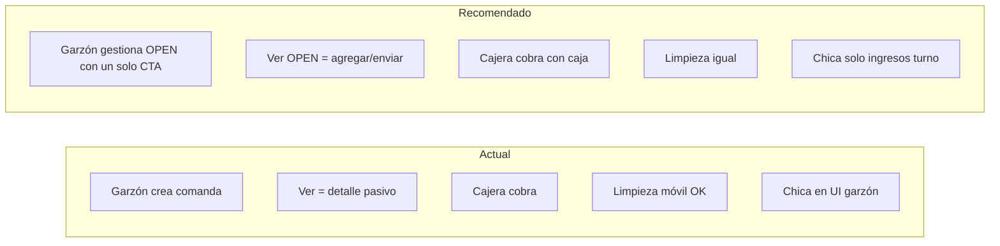

# Auditoría operativa completa — NightPOS

**Fecha:** Jun 2026  
**Alcance:** Flujos reales por rol (garzón, cajera, limpieza, chica, admin, superadmin)  
**Método:** Revisión de código frontend/backend, permisos seeder, guards, use cases y documentación existente. **Sin cambios de código.**

---

## 1. Resumen ejecutivo

NightPOS tiene implementadas las fases operativas núcleo de un boliche (comandas, caja, servicios, habitaciones, liquidaciones, turno oficial, modo garzón móvil, limpieza móvil, fiscalización de cajas). El flujo **cajera → caja → cobro → liquidaciones → cierre** es coherente en backend y mayormente usable.

Las mayores brechas frente a operación real están en:

1. **UX garzón:** “Ver” no equivale a “seguir operando”; acciones desalineadas con estado.
2. **Rol chica:** comparte RBAC `waiter` y queda atrapada en UI de garzón sin pantalla propia.
3. **Módulos Finanzas placeholder:** reportes, movimientos, cierre de caja (vistas vacías).
4. **Provisionamiento SaaS:** tenants nuevos pueden quedar sin permisos garzón/limpieza completos.
5. **Reglas UI vs backend:** agregar ítems permitido en `SENT_TO_BAR` en API, bloqueado en botón garzón.

---

## 2. Auditoría GARZÓN

### 2.1 Qué puede hacer hoy

| Área | Capacidad |
|------|-----------|
| Dashboard | KPIs (activas, abiertas, en barra, pendiente cobro) + comandas recientes |
| Comandas | Listar por scope (`active`, `open`, `sent_to_bar`, `pending_charge`) — solo **sus** comandas (`waiter_user_id`) |
| Nueva comanda | Ambiente o texto libre (`orders.create`) |
| Detalle OPEN | Agregar productos, enviar a barra, asignar chica en ítems CON_ACOMPANANTE |
| Detalle SENT_TO_BAR | API permite agregar ítems; UI deshabilita “+ Bebida” salvo deep link `?add=1` |
| Detalle IN_PREPARATION / READY | Solo lectura |
| Cobrar | **No** (`sales.charge` no asignado) |
| Caja / liquidaciones | **No** |
| Navegación | Solo `/nightpos/waiter/*` (guard) |

**Permisos demo (garzon.demo / PIN 5678):** `waiter.dashboard`, `waiter.orders`, `orders.*`, `products.list`, `staff.quick_create_girl`, notificaciones.

### 2.2 Qué no puede / no debería

| No puede (correcto) | No puede (incorrecto o confuso) |
|---------------------|----------------------------------|
| Cobrar comandas | Cancelar comanda (tiene `orders.access` en API, sin botón UI) |
| Abrir caja | Editar comanda de otro garzón |
| Ver módulos admin | Agregar ítems con botón visible en `SENT_TO_BAR` (sí vía `?add=1`) |

### 2.3 Qué debería poder hacer (operación real boliche)

- Crear y **seguir gestionando** comandas OPEN hasta envío a barra.
- Opcional: correcciones mientras barra no cerró (`SENT_TO_BAR`) — backend ya lo permite.
- Ver estado “pendiente cobro” sin poder cobrar.
- Acciones claras según estado; sin pantallas que parecen solo lectura.

### 2.4 Caso reportado: “Ver” vs “Agregar más cosas”

**Etiquetas reales en UI:** no existe “Agregar más cosas”. Los botones son:

| Botón | Ruta | Comportamiento |
|-------|------|----------------|
| **Ver** | `/waiter/orders/:id` | Abre detalle **sin** diálogo de producto |
| **+ Bebida** | `/waiter/orders/:id?add=1` | Si `canModifyOrder` → abre diálogo agregar automáticamente |
| **Enviar barra** | `?send=1` (solo si `status === OPEN` en card) | Dispara envío |

**¿Ver es lectura o gestión?**

| Estado | Ver (sin query) | Gestión real |
|--------|-----------------|--------------|
| **OPEN** | Muestra ítems + barra de acciones (+ Bebida, Enviar barra) | **Sí gestión**, pero usuario debe pulsar + Bebida (no se abre solo) |
| **SENT_TO_BAR** | Barra visible; + Bebida **deshabilitado** | Parcial: `?add=1` sí abre diálogo (API permite) |
| **IN_PREPARATION / READY** | Sin barra de acciones | **Solo lectura** ✓ |
| **BILLED** | Solo lectura | **Solo lectura** ✓ (no aparece en “recientes”) |

**Recientes del dashboard:** solo estados activos (`OPEN`, `SENT_TO_BAR`, `IN_PREPARATION`, `READY`) — no incluye `BILLED`.

**Diagnóstico del caso:** El usuario que pulsa **Ver** espera continuar la comanda; la pantalla **no auto-abre** el selector de productos. La gestión existe en OPEN pero no es obvia. En `SENT_TO_BAR`, el botón + Bebida en detalle está deshabilitado pese a que el backend acepta más ítems.

**Regla recomendada vs actual:**

| Regla recomendada | Actual |
|-------------------|--------|
| OPEN → Ver = gestión completa | Ver = detalle; gestión requiere segundo clic o usar + Bebida en card |
| BILLED → Ver solo lectura | ✓ Coincide |
| Botones en card según estado | + Bebida y Ver **siempre** visibles en recientes (sin gate) |

---

## 3. Auditoría CAJERA

### 3.1 Flujo completo (turno abierto → cierre)

```
1. Login PIN (1234) → Consola de turno (home)
2. Abrir turno oficial (auto al primer cobro/apertura; admin puede abrir manual)
3. Abrir SU caja (fondo inicial) — sesión por usuario
4. Operar:
   a. Comandas: ver todas, agregar, enviar barra, asignar chica, COBRAR (requiere caja)
   b. Servicios: manillas, piezas, shows (requiere caja para ingreso)
   c. Caja: ingresos/egresos manuales
   d. Liquidaciones: generar turno, pagar (pago requiere SU caja abierta)
5. Piezas terminadas → habitación CLEANING → limpieza marca disponible
6. Cerrar SU caja (arqueo declarado)
7. Cerrar turno oficial (bloqueado si hay cajas abiertas en sucursal)
```

### 3.2 Qué hace / no hace

| Puede | No puede (cajera estándar) |
|-------|----------------------------|
| Caja propia, cobros, servicios, liquidaciones generate/pay | Fiscalizar **todas** las cajas (`admin.cash_sessions.*`) |
| Consola turno, quick-create chica/garzón | Abrir turno manual (`shifts.open`) |
| Cerrar turno y caja | CRUD usuarios, productos completos, reportes reales |
| Ver habitaciones (no crear) | Historial turnos (`shifts.list`) |

**Cajera senior:** igual + fiscalización de cajas.

### 3.3 Huecos operativos

- Menú **Movimientos** y **Cierre de caja** (Finanzas) son placeholders → redirigen a Caja.
- **Reportes** es placeholder (`reports.access` sin API).
- Varias cajeras = varias sesiones; admin fiscaliza sin abrir caja propia ✓ (fase reciente).

---

## 4. Auditoría LIMPIEZA

### 4.1 Flujo móvil actual

```
Login PIN 3333 → /nightpos/cleaning (única pantalla, layout blank)
→ KPI: activas, tiempo cumplido, en limpieza, terminadas hoy
→ Poll 30s + alerta sonora piezas vencidas
→ Acciones: revisar pieza, finalizar servicio, marcar habitación limpia
→ Card "Mi pago del turno" (base + piezas)
```

### 4.2 ¿Puede trabajar toda la noche desde celular?

**Sí**, para el circuito pieza → finish → mark clean. Guard impide salir de `/nightpos/cleaning/*`.

### 4.3 Pasos que sobran / faltan

| Sobran / redundantes | Faltan |
|----------------------|--------|
| Notificaciones backend sin bandeja UI dedicada en limpieza | Vista simple “mis tareas completadas” historial |
| — | Push / vibración nativa (solo sonido in-app) |
| — | Acceso solo lectura a pieza activa si otra área la registró mal |
| Desktop “Control piezas” no accesible para rol cleaning | Indicador explícito “esperando cajera/cobro” en pieza |

---

## 5. Auditoría CHICAS

### 5.1 Realidad en código

- `staff_role = GIRL`, pero `role_id = waiter` (mismo rol RBAC que garzón).
- `isWaiterStaff()` → `role === 'waiter'` → **chica entra al sandbox garzón**.
- Backend `WaiterOrderAccessPolicy::isWaiter()` incluye `roleSlug === 'waiter'` → chica usa APIs waiter.
- **No existe** módulo “chica”: sin liquidación propia en móvil, sin registro de servicios propios.

### 5.2 Qué debería ser en boliche real

- Chica **no** abre comandas de mesa (garzón/cajera lo hacen).
- Chica ve **sus ingresos del turno** (consumo, piezas, manillas, shows).
- Liquidación la paga admin/cajera.

### 5.3 Brecha

| Esperado | Actual |
|----------|--------|
| Pantalla mínima “Mi turno / mis ingresos” | UI de garzón completa |
| Sin crear comandas | Puede crear comandas si tiene permisos waiter |

---

## 6. Auditoría ADMINISTRADOR (tenant_owner)

### 6.1 ¿Puede administrar sucursal completa?

**Sí en demo seed:** usuarios, productos, categorías, habitaciones, liquidaciones, fiscalización cajas, turnos (abrir/cerrar/historial), configuración operativa, auditoría.

### 6.2 Qué no ve / ve de más

| No ve (gap) | Ve de más / confuso |
|-------------|---------------------|
| Reportes financieros reales (placeholder) | Menú Movimientos/Cierre caja duplicado con Caja |
| Multi-sucursal en una sola vista (cambia contexto) | Puede operar como cajero sin distinguir “modo fiscalización” vs “modo caja propia” |
| SaaS otros tenants | — |

### 6.3 Liquidaciones y caja

- Fiscalizar cajas **sin** caja propia abierta ✓
- Pagar liquidación requiere **su** caja abierta (egreso) ✓
- Congelamiento liquidaciones: corregido (SyntaxError composable); validar en producción.

---

## 7. Auditoría SUPERADMIN

### 7.1 Capacidades

- Sin tenant: empresas, sucursales, setup plataforma, planes (UI).
- Con tenant+sucursal: menú operativo completo (todos los permisos).
- `PlatformContextSelector`: cambio tenant/sucursal.

### 7.2 ¿SaaS real?

| Tiene | Falta |
|-------|-------|
| CRUD tenants/branches | Dashboard multi-tenant consolidado (KPIs por empresa) |
| Setup wizard | Facturación / suscripciones operativas |
| Fiscalización con filtro `tenant_id` | Onboarding permisos garzón/limpieza en wizard (`TenantDefaultRolePermissions::waiter()` incompleto) |

**Wizard waiter solo tiene:** `orders.access`, `products.list`, `notifications.*` — **sin** `waiter.dashboard`, `waiter.orders`, `orders.create`, `orders.add_items`, `orders.send_to_bar`.

---

## 8. Matriz de flujos

Leyenda resultado actual: ✅ OK · ⚠️ Parcial · ❌ Falla / no existe

### Garzón

| Pantalla | Acción | Esperado | Actual |
|----------|--------|----------|--------|
| Dashboard | Ver recientes | Ver estado y operar si OPEN | ⚠️ Ver = detalle sin auto-agregar |
| Dashboard | + Bebida | Agregar producto | ✅ Con `?add=1` |
| Detalle OPEN | + Bebida | Agregar | ✅ |
| Detalle OPEN | Enviar barra | Pasa a barra | ✅ |
| Detalle SENT_TO_BAR | + Bebida | Agregar si política lo permite | ⚠️ Botón disabled; API sí |
| Detalle BILLED | Cualquiera | Solo lectura | ✅ (si accede por URL) |
| Cualquiera | Cobrar | No | ✅ Bloqueado |

### Cajera

| Pantalla | Acción | Esperado | Actual |
|----------|--------|----------|--------|
| Consola turno | Ver KPIs | Resumen turno | ✅ |
| Caja | Abrir/cerrar | Sesión propia | ✅ |
| Comanda | Cobrar | Venta + movimiento caja | ✅ (requiere caja) |
| Servicios | Registrar pieza/manilla | Ingreso caja | ✅ |
| Liquidaciones | Generar / pagar | Egreso al pagar | ✅ |
| Finanzas → Reportes | Ver reportes | Datos reales | ❌ Placeholder |
| Turno | Cerrar | Cierra turno | ✅ (si cajas cerradas) |

### Limpieza

| Pantalla | Acción | Esperado | Actual |
|----------|--------|----------|--------|
| Móvil | Finalizar pieza | Room → limpieza | ✅ |
| Móvil | Marcar limpia | Room disponible | ✅ |
| Móvil | Alerta vencida | Aviso sonoro | ✅ |
| Móvil | Mi pago turno | Ver montos | ✅ |
| Notificaciones | Leer push | Avisos | ⚠️ Permiso sin UI |

### Chica

| Pantalla | Acción | Esperado | Actual |
|----------|--------|----------|--------|
| Móvil propio | Ver ingresos turno | Solo lectura ingresos | ❌ No existe |
| Garzón UI | Nueva comanda | No debería | ⚠️ Puede (rol waiter) |
| Admin | Liquidación chicas | Pagada por cajera | ✅ |

### Admin

| Pantalla | Acción | Esperado | Actual |
|----------|--------|----------|--------|
| Fiscalización cajas | Ver todas las cajas | Sin caja propia | ✅ |
| Liquidaciones | Operar | Generar/pagar | ✅ |
| Usuarios / productos | CRUD | Completo | ✅ |
| Reportes | Análisis | Información | ❌ Placeholder |

### Superadmin

| Pantalla | Acción | Esperado | Actual |
|----------|--------|----------|--------|
| Empresas | Listar/crear | Multi-tenant | ✅ |
| Contexto | Cambiar tenant | Operar sucursal | ✅ |
| Dashboard global | KPIs multi-empresa | Vista plataforma | ⚠️ Parcial |

---

## 9. Problemas de negocio encontrados

| # | Problema | Severidad |
|---|----------|-----------|
| B-01 | “Ver” comanda no abre flujo de agregar; parece solo lectura en OPEN | **ALTO** |
| B-02 | + Bebida en card sin filtro por estado; en SENT_TO_BAR lleva a detalle confuso | **MEDIO** |
| B-03 | UI bloquea agregar en SENT_TO_BAR pero API permite (`canModifyOrder` vs `isOpen`) | **MEDIO** |
| B-04 | Chicas usan UI garzón (rol RBAC `waiter`) | **CRÍTICO** |
| B-05 | Sin pantalla chica “mis ingresos / mi turno” | **ALTO** |
| B-06 | Reportes financieros placeholder con permiso activo | **ALTO** |
| B-07 | Movimientos / Cierre caja (Finanzas) placeholder | **MEDIO** |
| B-08 | Wizard SaaS: permisos garzón incompletos | **CRÍTICO** (tenants nuevos) |
| B-09 | Wizard SaaS: `tenant_owner` sin `shift_console`, `admin.cash_sessions`, `cleaning_*` vs seed demo | **ALTO** |
| B-10 | Garzón no cobra (diseño) pero ve “pendiente cobro” sin explicación de siguiente paso | **BAJO** |
| B-11 | Comanda creada por cajera puede tener `waiter_user_id` incorrecto → comisión garzón | **ALTO** |
| B-12 | Liquidaciones congeladas (composable duplicado) | **CRÍTICO** — **corregido**; validar en QA |
| B-13 | Caja no reflejada en liquidaciones | **ALTO** — **corregido**; validar en QA |
| B-14 | Label “+ Bebida” cuando catálogo incluye comida/servicios | **BAJO** |
| B-15 | Chica con permisos waiter puede crear comandas en nombre propio | **ALTO** |

---

## 10. Clasificación priorizada

### CRÍTICO
- B-04 Chicas atrapadas en flujo garzón
- B-08 Permisos garzón incompletos en provisionamiento SaaS
- B-12 Liquidaciones congeladas (fix aplicado — re-validar)

### ALTO
- B-01 Ver vs gestión comanda OPEN
- B-05 Sin módulo chica
- B-06 Reportes vacíos
- B-09 Permisos admin/limpieza en wizard vs demo
- B-11 Comisiones garzón por comanda mal atribuida
- B-13 Caja en liquidaciones (fix aplicado — re-validar)
- B-15 Chica puede operar como garzón

### MEDIO
- B-02/B-03 Inconsistencia SENT_TO_BAR agregar ítems
- B-07 Placeholders Finanzas
- B-10 UX pendiente cobro garzón

### BAJO
- B-14 Etiqueta “Bebida” vs catálogo mixto

---

## 11. Flujo recomendado vs actual (síntesis)



---

## 12. Próximas correcciones sugeridas (sin implementar aquí)

1. **Garzón:** Unificar “Ver” en OPEN con gestión (auto-focus agregar o un solo botón “Gestionar”); ocultar + Bebida si no modifiable; alinear botón detalle con `canModifyOrder`.
2. **Chica:** Rol RBAC propio o guard por `staff_role=GIRL`; pantalla mínima ingresos turno.
3. **SaaS:** Alinear `TenantDefaultRolePermissions` con `SeedsNightPosFoundation`.
4. **Finanzas:** Implementar reportes o ocultar menú hasta tener API; eliminar placeholders confusos.
5. **Comisiones:** Forzar `waiter_user_id` al crear comanda según actor o reglas de sucursal.
6. **QA regresión:** Liquidaciones + fiscalización cajas + selector productos garzón.

---

## 13. Validación manual sugerida (sin ejecutar en esta auditoría)

| Rol | PIN/Usuario | Checklist clave |
|-----|-------------|----------------|
| Garzón | 5678 | Recientes → Ver OPEN → ¿puedo agregar sin segundo clic? |
| Garzón | 5678 | SENT_TO_BAR → + Bebida en card vs en detalle |
| Cajera | 1234 | Turno → caja → cobro → liquidación → cierre |
| Limpieza | 3333 | Pieza vencida → finish → mark clean → pago turno |
| Chica | 9012 | ¿A dónde redirige login? ¿Puede crear comanda? |
| Admin | admin.demo | Fiscalizar 2 cajas sin abrir caja propia |
| Superadmin | superadmin | Cambiar tenant → operar sucursal |

---

## 14. Referencias de código revisadas

- `frontend/src/components/nightpos/waiter/WaiterOrderActions.vue`
- `frontend/src/pages/nightpos/waiter/orders/[id].vue`
- `frontend/src/composables/useOrderHelpers.js` (`canModifyOrder`)
- `backend/app/Application/Waiter/UseCases/GetWaiterDashboardUseCase.php`
- `backend/app/Application/Waiter/Services/WaiterOrderAccessPolicy.php`
- `backend/app/Application/Tenant/Support/TenantDefaultRolePermissions.php`
- `frontend/src/navigation/vertical/nightpos-r4.js`
- `frontend/src/plugins/1.router/guards.js`
- Informes previos: `WAITER_MOBILE_FIX_REPORT.md`, `SETTLEMENTS_CASH_UI_FIX_REPORT.md`, `ADMIN_CASH_SESSIONS_REPORT.md`

---

*Auditoría cerrada. No se modificó código ni se iniciaron nuevas fases de desarrollo.*
