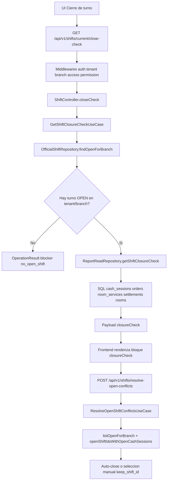

# AUDITORIA FORENSE BACKEND - BOTON "Resolver turnos abiertos duplicados"

## Alcance
Investigacion tecnica extremo a extremo del backend relacionado al boton de resolucion de turnos duplicados en cierre de turno, usando:
- Codigo real del backend NightPOS.
- Evidencia SQL real en MySQL `nigtpos`.
- Sin hipotesis no verificadas.

## Cadena backend real

### 1) Endpoints involucrados
En `backend/routes/api.php` (grupo de turnos de cierre):
- `GET /api/v1/shifts/current/close-check`
- `POST /api/v1/shifts/resolve-open-conflicts`

Middlewares efectivos de esta cadena:
- `auth:api`
- `nightpos.tenant`
- `nightpos.branch`
- `nightpos.branch.access`
- `nightpos.permission:shifts.close`

### 2) Controller
En `backend/app/Http/Controllers/Api/V1/ShiftController.php`:
- `closeCheck(...)` llama a `GetShiftClosureCheckUseCase`.
- `resolveOpenConflicts(...)` llama a `ResolveOpenShiftConflictsUseCase`.

### 3) UseCases

#### 3.1 close-check
`backend/app/Application/Reports/UseCases/GetShiftClosureCheckUseCase.php`
Flujo:
1. Lee tenant/branch desde contexto operativo.
2. Busca turno abierto en sucursal con `OfficialShiftRepository::findOpenForBranch(tenant, branch)`.
3. Si no hay turno abierto: retorna estructura valida con blocker `no_open_shift`.
4. Si hay turno abierto: llama `ReportReadRepository::getShiftClosureCheck(...)`.

#### 3.2 resolver duplicados
`backend/app/Application/Shift/UseCases/ResolveOpenShiftConflictsUseCase.php`
Flujo:
1. Lista turnos abiertos de sucursal: `listOpenForBranch`.
2. Detecta turnos protegidos por caja abierta: `openShiftIdsWithOpenCashSessions`.
3. Si hay mas de uno protegido: exige seleccion manual (`keep_shift_id`).
4. Auto-cierra solo turnos no protegidos.

### 4) Repositories y SQL aplicadas

#### 4.1 Turno abierto actual
`backend/app/Infrastructure/Persistence/Eloquent/Repositories/EloquentOfficialShiftRepository.php`
- `findOpenForBranch`: filtra por `tenant_id`, `branch_id`, `status='OPEN'`.
- `listOpenForBranch`: mismo filtro.
- `openShiftIdsWithOpenCashSessions`: DISTINCT `official_shift_id` de `cash_sessions` con `status='OPEN'`, por tenant/sucursal.

#### 4.2 Estructura de closureCheck
`backend/app/Infrastructure/Persistence/Eloquent/Repositories/EloquentReportReadRepository.php` metodo `getShiftClosureCheck(...)`.

Consultas de bloqueo (blockers):
- Cajas abiertas del turno (`cash_sessions` OPEN por `official_shift_id`).
- Servicios de habitacion activos (`room_services` ACTIVE/DUE).
- Comandas activas (`orders` OPEN/SENT_TO_BAR).
- Liquidaciones no generadas y fuentes sin liquidar.

Consultas de advertencia (warnings):
- Liquidaciones pendientes.
- Habitaciones en limpieza.
- Diferencia de caja en sesiones cerradas.

Retorno backend:
- `can_close`
- `blockers[]`
- `warnings[]`
- `summary{...}`
- `combo_bracelets`

## Cadena de autorizacion completa (backend)

1. `ResolveTenantMiddleware`: fija tenant desde usuario o headers (`X-Tenant-Slug`).
2. `ResolveBranchMiddleware`: fija branch desde usuario/header (`X-Branch-Code`).
3. `EnsureUserHasBranchAccessMiddleware`: valida acceso de usuario a sucursal.
4. `EnsureRolePermissionMiddleware`: exige `shifts.close`.

Si tenant/branch no quedan resueltos correctamente, la cadena no produce respuesta operativa valida para close-check.

## Evidencia SQL real (MySQL nigtpos)

Comandos ejecutados contra `nigtpos` (resumen forense):

### Evidencia 1: usuarios administrativos reales
Resultado:
- `superadmin` (id 1), super_admin, tenant/branch NULL.
- `admin.demo` (id 2), tenant_owner, tenant 1 branch 1.
- En tenant 2 existen administradores (`LAURA`, `HEYDDI`, `MABEL`) como `tenant_owner`.

### Evidencia 2: permisos `shifts.close`
Resultado:
- `superadmin`: `has_shifts_close=1`.
- `admin.demo`: `has_shifts_close=1`.
- tenant_owner de tenant 2: `has_shifts_close=1`.

Conclusion de esta evidencia:
No hay bloqueo universal por permiso para perfiles administrador.

### Evidencia 3: branch access ADM
Resultado:
- `admin.demo` tiene acceso a tenant 1, branch 1 (`CENTRO`).
- `superadmin` aparece sin branch fija (global), depende de contexto operativo seleccionado.

### Evidencia 4: turnos abiertos
Resultado:
- tenant 1 / branch 1: existe un unico turno abierto (id 1).
- tenant 2 / branch 2: existen multiples turnos abiertos simultaneos (ids 78,79,80,81,82,83,84,85).

### Evidencia 5: cajas abiertas
Resultado:
- Existen cajas OPEN en tenant 2 / branch 2 asociadas a `official_shift_id` 74,56,51,36.
- Esas cajas abiertas no corresponden a los turnos actualmente abiertos 78..85.

Lectura tecnica:
Existe inconsistencia operativa real en tenant 2/branch 2 (duplicidad de turnos + referencias de caja a turnos historicos).

## Determinacion tecnica backend

### Hecho demostrado
El backend SI tiene implementado el endpoint y la logica de resolucion.

### Hecho demostrado
La ausencia del boton no se explica por falta estructural del endpoint ni por falta universal de permiso administrador.

### Hecho demostrado
La cadena depende de contexto operativo tenant/branch valido para close-check y turno actual.

### Punto critico para visibilidad en UI
Cuando el contexto operativo no queda correctamente resuelto para la sesion activa, `close-check` no llega en forma util al frontend, y la vista no entra al bloque donde vive el boton.

## Conclusión unica solicitada (A-F)

**Clasificacion elegida: C**

**Causa raiz:** fallo de contexto operativo (tenant/branch/sesion efectiva) que impide disponer de `closureCheck` util para la vista de cierre, por lo que el frontend oculta el bloque del boton.

No corresponde a:
- endpoint inexistente,
- backend no implementado,
- ni ausencia general de permiso administrador.

## Diagrama end-to-end (backend enfocado)

