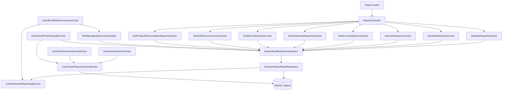

# REPORTS MODULE DISCOVERY AUDIT (BACKEND)

Fecha de auditoria: 2026-07-03
Modo: solo descubrimiento e ingenieria inversa
Alcance: modulo de Reportes y dependencias operativas que consumen su capa de lectura
Base analizada: MySQL real nigtpos (XAMPP), no sqlite, no seeders, no factories

## 1. Arquitectura actual

El modulo de Reportes backend sigue este flujo:

- Entrada HTTP en ReportController.
- Orquestacion por use case por reporte.
- Lectura consolidada en un unico read repository: EloquentReportReadRepository.
- Servicios de soporte compartidos:
  - ComboBraceletReportingService.
  - CashCloseReportSectionsBuilder.
  - ShiftManagerialSummaryBuilder (consume ReportReadRepositoryInterface).
- Respuesta uniforme mediante ApiResponsePresenterInterface y OperationResult.

Arquitectura por capas observada:

- Rutas: backend/routes/api.php
- Controlador principal: backend/app/Http/Controllers/Api/V1/ReportController.php
- Use cases: backend/app/Application/Reports/UseCases/*.php
- Contrato repositorio: backend/app/Domain/Reports/Repositories/ReportReadRepositoryInterface.php
- Implementacion Eloquent: backend/app/Infrastructure/Persistence/Eloquent/Repositories/EloquentReportReadRepository.php
- Binding DI: backend/app/Infrastructure/Providers/NightPosServiceProvider.php

## 2. Flujo completo de datos

Flujo estandar de endpoints /reports:

1. Request llega a /api/v1/reports/* con middleware:
   - nightpos.branch:required
   - nightpos.branch.access
   - nightpos.permission:reports.access
2. ReportController toma filtros por query string (date_from, date_to, official_shift_id y extras por endpoint).
3. Use case valida contexto tenant + branch.
4. Use case invoca metodo especifico en ReportReadRepositoryInterface.
5. EloquentReportReadRepository ejecuta queries agregadas y detalle sobre tablas operativas.
6. Se formatean montos con 2 decimales (string decimal).
7. Presenter devuelve payload NightPOS estandar.

Flujo transversal observado (fuera de /reports pero dependiente de la misma capa de reportes):

- Cierre de turno: GetOfficialShiftSummaryUseCase + ShiftManagerialSummaryBuilder + ComboBraceletReportingService.
- Cierre de caja (detalle operativo): GetCashSessionUseCase y GetCashSessionAdminUseCase via CashCloseReportSectionsBuilder.
- Impresion cierre caja: CashClosePrintPayloadEnricher usa ReportReadRepositoryInterface + CashCloseReportSectionsBuilder.
- Validaciones de cierre: GetShiftClosureCheckUseCase y CashSessionCloseCheckBuilder usan consolidaciones de reportes y settlement sources.

## 3. Diagrama de dependencias

## 4. Inventario completo de reportes

### 4.1 Reporte Diario

- Nombre: Daily Summary
- Endpoint: GET /api/v1/reports/daily
- Controlador: ReportController::daily
- Use case: GetDailyReportUseCase
- Repository: EloquentReportReadRepository::getDailySummary
- Filtros: date_from, date_to, official_shift_id
- Tablas principales:
  - official_shifts
  - sales
  - sale_payments
  - bracelets
  - shows
  - room_services
  - cash_sessions
  - cash_movements
  - staff_settlements
  - rooms
- Calculos:
  - total ventas por metodo
  - total servicios por tipo
  - liquidaciones pagadas y pendientes
  - expected cash (opening + cash sales + manual income - manual expense)
  - habitaciones usadas y en cleaning
  - resumen combos/manillas
- Devuelve:
  - sales
  - services
  - settlements
  - cash
  - rooms
  - combo_bracelets

### 4.2 Reporte de Ventas

- Nombre: Sales Report
- Endpoint: GET /api/v1/reports/sales
- Controlador: ReportController::sales
- Use case: GetSalesReportUseCase
- Repository: EloquentReportReadRepository::getSalesReport
- Filtros: date_from, date_to, official_shift_id, cashier_user_id, waiter_user_id, payment_method
- Tablas:
  - sales
  - sale_payments
  - sale_items
  - sale_item_allocations
  - users
  - products (enriquecimiento combos)
- Calculos:
  - total ventas, conteo, agrupado por metodo
  - enriquecimiento combos: required vs allocated bracelet units
- Devuelve:
  - sales (detalle por venta con items y payments)
  - totals

### 4.3 Reporte de Caja

- Nombre: Cash Report
- Endpoint: GET /api/v1/reports/cash
- Controlador: ReportController::cash
- Use case: GetCashReportUseCase
- Repository: EloquentReportReadRepository::getCashReport
- Filtros: date_from, date_to, official_shift_id
- Tablas:
  - cash_sessions
  - cash_movements
  - sale_payments
  - sales
  - users
- Calculos:
  - resumen por sesion
  - total ventas por metodo dentro de sesion
  - ingresos/egresos manuales
  - conteo open/closed
- Devuelve:
  - sessions
  - open_count
  - closed_count

### 4.4 Reporte de Servicios

- Nombre: Services Report
- Endpoint: GET /api/v1/reports/services
- Controlador: ReportController::services
- Use case: GetServicesReportUseCase
- Repository: EloquentReportReadRepository::getServicesReport
- Filtros: date_from, date_to, official_shift_id, girl_user_id
- Tablas:
  - bracelets
  - shows
  - room_services
  - sale_item_allocations (combo_allocations)
  - sale_items
  - sales
  - users
- Calculos:
  - totales por tipo de servicio
  - house_total, girl_total, cleaning_total para piezas
- Devuelve:
  - bracelets
  - shows
  - room_services
  - combo_allocations
  - totals

### 4.5 Reporte de Liquidaciones

- Nombre: Settlements Report
- Endpoint: GET /api/v1/reports/settlements
- Controlador: ReportController::settlements
- Use case: GetSettlementsReportUseCase
- Repository: EloquentReportReadRepository::getSettlementsReport
- Filtros: date_from, date_to, official_shift_id
- Tablas:
  - staff_settlements
  - staff_settlement_items
  - users
  - sale_item_allocations (enrich de GIRL_BRACELET_ALLOCATION)
  - sale_items
  - sales
- Calculos:
  - total generated, total paid, total pending
  - totales por staff_role
  - conteo paid/pending
- Devuelve:
  - settlements (con items)
  - totals

### 4.6 Reporte de Habitaciones

- Nombre: Rooms Report
- Endpoint: GET /api/v1/reports/rooms
- Controlador: ReportController::rooms
- Use case: GetRoomsReportUseCase
- Repository: EloquentReportReadRepository::getRoomsReport
- Filtros: date_from, date_to, official_shift_id
- Tablas:
  - rooms
  - room_services
- Calculos:
  - services_count por habitacion
  - total_income por habitacion
  - avg_duration
  - cleanings
  - totales globales
- Devuelve:
  - rooms
  - totals

### 4.7 Verificacion de cierre de turno

- Nombre: Shift Closure Check
- Endpoint: GET /api/v1/reports/shift-closure
- Controlador: ReportController::shiftClosure
- Use case: GetShiftClosureCheckUseCase
- Repository: EloquentReportReadRepository::getShiftClosureCheck + StaffSettlementRepositoryInterface::countUnsettledShiftSources
- Filtros: sin filtros en request; toma turno abierto de la sucursal
- Tablas:
  - cash_sessions
  - room_services
  - orders
  - staff_settlements
  - rooms
  - combo allocations via ComboBraceletReportingService
- Calculos:
  - blockers y warnings de cierre
  - can_close
  - summary operacional
- Devuelve:
  - shift_id
  - shift_name
  - can_close
  - blockers
  - warnings
  - summary
  - combo_bracelets

### 4.8 Conciliacion de productos

- Nombre: Product Reconciliation
- Endpoint: GET /api/v1/reports/product-reconciliation
- Controlador: ReportController::productReconciliation
- Use case: GetProductReconciliationReportUseCase
- Repository: EloquentReportReadRepository::getProductReconciliation
- Filtros: date_from, date_to, official_shift_id, cash_session_id, waiter_user_id
- Tablas:
  - sale_items
  - sales
  - order_items
  - orders
  - sale_item_allocations
  - products / product_categories (indirecto en otras vistas del modulo)
- Calculos:
  - comparacion vendido vs comandado cobrado
  - status por producto (OK, mismatch, direct only, pending, cancelled)
  - resumen de diferencias
  - total bracelet units vendidos en combos
- Devuelve:
  - sold
  - ordered
  - comparison
  - summary
  - combo_bracelets

## 5. Inventario de endpoints

### 5.1 Endpoints directos del modulo Reportes

- GET /api/v1/reports/daily
- GET /api/v1/reports/sales
- GET /api/v1/reports/cash
- GET /api/v1/reports/services
- GET /api/v1/reports/settlements
- GET /api/v1/reports/rooms
- GET /api/v1/reports/shift-closure
- GET /api/v1/reports/product-reconciliation

### 5.2 Endpoints dependientes que consumen datos/report builders del modulo

- GET /api/v1/shifts/current/close-check
- GET /api/v1/shifts/{id}/summary
- GET /api/v1/shifts/{id}/export.csv
- POST /api/v1/shifts/{id}/print-closure
- GET /api/v1/cash/session/current
- GET /api/v1/cash/session/current/close-check
- GET /api/v1/cash/sessions/{id}
- POST /api/v1/cash/sessions/{id}/print-close
- GET /api/v1/admin/cash-sessions/{id}

## 6. Inventario de consultas

Consultas principales observadas:

- Aggregaciones de ventas por payment_method:
  - sale_payments join sales, group by payment_method.
- Resolucion de scope por turno:
  - official_shifts por tenant/branch y opcional date range.
- Servicios:
  - sum/count de bracelets, shows, room_services.
- Liquidaciones:
  - staff_settlements con filtros por shift/status.
  - items con posible enriquecimiento allocation.
- Caja:
  - cash_sessions con movimientos y agregados por sesion.
- Conciliacion:
  - sold side: sale_items join sales.
  - ordered side: order_items join orders.
  - merge y status por producto.
- Combo/manillas:
  - sale_item_allocations join sale_items join sales.

Consultas con DB::raw relevantes:

- SUM/CASE por estado y tipo de pago.
- SUM de cantidades comandadas/vendidas.
- Grouping por product_id, girl_user_id, payment_method.

## 7. Inventario de componentes Vue (consumo backend)

Componentes frontend que consumen payload del backend de reportes o derivados:

- ProductReconciliationPanel.vue
- ComboBraceletSummaryPanel.vue
- PrintableShiftClosureReport.vue
- PrintableCashSessionReport.vue

Paginas consumidoras principales:

- nightpos/finance/reports/index.vue
- nightpos/cash/index.vue
- nightpos/shifts/close.vue
- nightpos/print/shift/[id].vue
- nightpos/print/cash.vue
- nightpos/print/cash-session/[id].vue
- nightpos/print/my-cash-session/[id].vue
- nightpos/finance/cash-sessions/[id].vue

## 8. Inventario de permisos

Permiso central del modulo:

- reports.access

Permisos relacionados por dependencias de reportes:

- shifts.access
- shifts.close
- shifts.list
- cash.access
- admin.cash_sessions.view
- admin.cash_sessions.summary

Observacion de defaults por rol (TenantDefaultRolePermissions):

- tenant_owner: incluye reports.access.
- cashier: no incluye reports.access.
- cashier_senior: no incluye reports.access.
- waiter: no incluye reports.access.
- cleaning: no incluye reports.access.
- girl: no incluye reports.access.

## 9. Inventario de filtros

Filtros detectados en backend:

- date_from
- date_to
- official_shift_id
- cash_session_id
- cashier_user_id
- waiter_user_id
- girl_user_id
- payment_method

Aplicacion por reporte:

- daily: date_from, date_to, official_shift_id
- sales: date_from, date_to, official_shift_id, cashier_user_id, waiter_user_id, payment_method
- cash: date_from, date_to, official_shift_id
- services: date_from, date_to, official_shift_id, girl_user_id
- settlements: date_from, date_to, official_shift_id
- rooms: date_from, date_to, official_shift_id
- product-reconciliation: date_from, date_to, official_shift_id, cash_session_id, waiter_user_id

## 10. Que datos existen (MySQL real)

Auditoria real de tablas relevantes (conteos):

- official_shifts: 12
- sales: 44
- sale_payments: 45
- sale_items: 100
- sale_item_allocations: 0
- bracelets: 0
- shows: 0
- room_services: 1
- rooms: 11
- cash_sessions: 9
- cash_movements: 89
- staff_settlements: 12
- staff_settlement_items: 52
- staff_settlement_adjustments: 5
- orders: 55
- order_items: 122
- products: 37
- product_categories: 12
- print_jobs: 223
- shift_closures: 0

No se detectaron views SQL ni materialized views:

- todas las fuentes reportadas son BASE TABLE.

## 11. Que datos consume cada reporte

Resumen de consumo por reporte:

- daily: ventas + servicios + liquidaciones + caja + rooms + combo allocation summary.
- sales: ventas detalle + pagos + items + allocations.
- cash: sesiones + movimientos + pagos por sesion.
- services: bracelets/shows/room services + combo allocations.
- settlements: settlements + items + enrich combos por allocation.
- rooms: rooms + room_services.
- shift-closure: cash sessions/open blockers + orders + room services + settlements + rooms + combo summary.
- product-reconciliation: sold side (sale_items) vs ordered side (order_items).

## 12. Que datos nunca se usan (estado actual observado)

En la base real auditada, hay fuentes modeladas pero actualmente sin datos:

- sale_item_allocations = 0
- bracelets = 0
- shows = 0
- shift_closures = 0

Efecto en reportes hoy:

- Secciones combo/manillas y distribucion por chica retornan vacio o 0.
- Secciones de shows/manillas en servicios retornan 0.
- En cierre de turno impreso, los bloques que dependen de cierre persistido quedan sin contenido historico de cierre.

Nota: el codigo las consume activamente; la ausencia corresponde a estado de datos, no a codigo muerto.

## 13. Modulos que dependen de Reportes

Dependencias directas de ReportReadRepositoryInterface o servicios report:

- ReportController y todos sus use cases /reports.
- ShiftManagerialSummaryBuilder.
- GetOfficialShiftSummaryUseCase.
- CashCloseReportSectionsBuilder (servicio de cierre operativo).
- GetCashSessionUseCase.
- GetCashSessionAdminUseCase.
- CashClosePrintPayloadEnricher.
- GetCurrentCashSessionUseCase (combo summary de sesion).
- CashSessionCloseCheckBuilder (combo summary y settlement source checks).

## 14. Riesgos encontrados

Riesgos tecnicos observados (estado actual):

- N+1 en getCashReport:
  - por cada cash session consulta sale_payments/sales por separado.
- N+1 en getRoomsReport:
  - por cada room consulta room_services.
- N+1 potencial en enriquecimiento de settlement items combo:
  - enrichSettlementItem hace find con relaciones por item GIRL_BRACELET_ALLOCATION.
- Multiples consultas agregadas separadas sobre mismas tablas en getDailySummary.
- Carga potencial alta en reportes sin paginacion para servicios (bracelets/shows/room_services completos del scope).
- Dependencia de whereDate sobre paid_at/created_at en varios filtros, lo cual puede reducir aprovechamiento de indices en escenarios de alto volumen.

## 15. Deuda tecnica observada

Deuda de estructura detectada:

- Read model de reportes concentrado en un unico repository con metodos extensos y responsabilidades mixtas.
- Logica de reporte duplicada entre:
  - EloquentReportReadRepository
  - ShiftManagerialSummaryBuilder
  - CashCloseReportSectionsBuilder
- Ausencia de capa de query objects especializados por reporte.
- Repeticion de formatos de monto y transformaciones entre servicios.
- Dependencias cruzadas entre reportes, caja, turno e impresion que acoplan cambios funcionales.

## 16. Estado general del modulo

Estado funcional actual:

- Modulo operativo y en produccion funcional para lectura agregada de ventas, caja, servicios, liquidaciones, habitaciones y conciliacion.
- Integrado transversalmente con cierre de turno, cierre de caja e impresion.

Estado de datos real auditado:

- Hay datos suficientes para ventas/caja/liquidaciones/ordenes.
- No hay datos en fuentes de manillas/shows/allocations/cierres persistidos en la replica auditada.

Estado de arquitectura:

- Capa de lectura centralizada, funcional, sin read models materializados.
- Riesgo de performance por N+1 y consultas repetidas en crecimiento de volumen.

Sin propuestas ni cambios en este documento.
