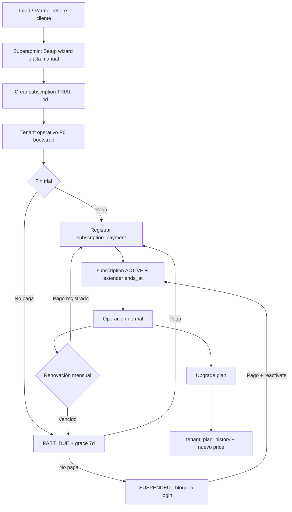

# SAAS-2 — AUDITORÍA COMERCIAL BACKEND

**Fecha:** 2026-06-25  
**Estado:** Auditoría — **sin implementación**  
**Contexto:** SAAS P0 completado (superadmin, onboarding, permisos, bootstrap, perfil). SAAS-1 completado (planes + límites informativos).  
**Objetivo:** Evaluar qué falta para que Ribersoft venda, administre, suspenda, renueve, cobre y escale NightPOS como SaaS comercial.

---

## Resumen ejecutivo

NightPOS hoy es un **multi-tenant operativo** con capa SaaS **parcial**:

| Capa | Madurez | Comentario |
|------|---------|------------|
| Operación boliche | Alta | No tocar en SAAS-2 |
| Onboarding técnico (P0) | Alta | Wizard + bootstrap OK |
| Catálogo planes/límites (SAAS-1) | Media | CRUD + usage informativo |
| Suscripción comercial | Baja | Solo fechas en `tenants` |
| Cobro / facturación | Nula | Sin tablas ni API |
| Partners / instaladores | Nula | Sin modelo |
| Métricas MRR/churn | Nula | Dashboard básico conteos |
| Enforcement comercial | Parcial | Solo `status` + `subscription_ends_at` |

**Conclusión:** Se puede **vender manualmente hoy** con superadmin + fechas + suspensión manual, pero **no hay trazabilidad comercial** (pagos, historial, trial real, MRR, partners). SAAS-2 V1 debe introducir el **modelo de suscripción y cobro manual** sin romper operación del boliche.

---

## 1. Planes SaaS — estado actual y respuestas

### Qué existe

**Tablas:** `plans`, `plan_limits`, `tenants.plan_id`  
**Migración:** `database/migrations/2026_06_15_100001_create_plans_and_plan_limits_tables.php`  
**Calculador:** `TenantPlanUsageCalculator`  
**CRUD:** `PlatformPlanController` + use cases en `Application/Plan/`  
**Dashboard:** `GetPlatformDashboardUseCase`  
**Reporte previo:** `SAAS_PLAN_MANAGEMENT_REPORT.md`

**Límites existentes hoy (6 claves):**

| Clave | Qué cuenta |
|-------|------------|
| `branches` | Sucursales del tenant |
| `users` | Usuarios del tenant |
| `cashiers` | Staff profiles `CASHIER` |
| `waiters` | Staff profiles `WAITER` |
| `products` | Productos del tenant |
| `rooms` | Habitaciones del tenant |

Valores: entero; `-1` = ilimitado. Planes sembrados: FREE, STARTER, BUSINESS, ENTERPRISE.

**Campos tenant comerciales actuales:**

| Campo | Uso |
|-------|-----|
| `status` | `active`, `inactive`, `suspended` |
| `plan_id` | FK a `plans` |
| `plan_name` | Legacy, sincronizado desde plan |
| `subscription_starts_at` | Nullable, **no validado en runtime** |
| `subscription_ends_at` | Nullable, **sí bloquea login/API si vencido** |

### Respuestas a las 10 preguntas

| # | Pregunta | Respuesta |
|---|----------|-----------|
| 1 | ¿Qué límites existen? | 6 claves arriba; precios `monthly_price`/`yearly_price` en plan (solo display) |
| 2 | ¿Qué límites faltan? | Órdenes/mes, impresoras, agentes, storage, API calls, sucursales activas vs totales, features flags (shows, rooms module) |
| 3 | ¿Se aplican o son informativos? | **Solo informativos.** `plan_usage` en GET tenant admin; estados OK/WARNING/LIMIT_REACHED sin bloqueo |
| 4 | ¿Qué pasa si supera límites? | **Nada.** Creación de sucursales/usuarios/productos sigue funcionando |
| 5 | ¿Hay bloqueo? | **No** por límites de plan |
| 6 | ¿Hay warnings? | **Sí, solo en API admin** (`WARNING` ≥80%, `LIMIT_REACHED` ≥100%) — tenant no los ve en UI operativa |
| 7 | ¿Historial cambio de plan? | **No.** Solo `plan_id` actual en `tenants` |
| 8 | ¿Fecha inicio/fin plan? | **Sí** (`subscription_*`) — fin enforced; inicio almacenado pero ignorado en guards |
| 9 | ¿Hay trial? | **No como entidad.** Dashboard cuenta "trial" = active + `subscription_ends_at` futuro (heurística incorrecta) |
| 10 | ¿Hay renovación? | **No.** Superadmin edita fechas manualmente en PUT tenant |

### Riesgo actual del contador "trial"

```36:40:backend/app/Application/Platform/UseCases/GetPlatformDashboardUseCase.php
        $trial = TenantModel::query()
            ->where('status', 'active')
            ->whereNotNull('subscription_ends_at')
            ->where('subscription_ends_at', '>=', $now)
            ->count();
```

Cualquier tenant con fecha fin futura cuenta como "trial", incluyendo clientes pagos anuales. **Métrica engañosa** — requiere campo `subscription_status` o tabla `subscriptions`.

---

## 2. Suscripciones — modelo propuesto

### Qué existe hoy

No hay tablas `subscriptions`, `invoices`, `payments`. La "suscripción" es **proyección de campos en `tenants`**.

### Qué conviene crear (SAAS-2 V1 mínimo)

#### Tabla `subscriptions` (1 activa por tenant recomendado)

| Campo | Tipo | Notas |
|-------|------|-------|
| id | PK | |
| tenant_id | FK unique (activa) | o permitir historial con `is_current` |
| plan_id | FK | |
| status | enum | `trial`, `active`, `past_due`, `suspended`, `cancelled` |
| billing_cycle | enum | `monthly`, `quarterly`, `yearly`, `custom` |
| price | decimal | precio acordado (puede diferir del catálogo) |
| currency | char(3) | default BOB |
| starts_at | timestamp | |
| ends_at | timestamp nullable | fin contrato |
| trial_ends_at | timestamp nullable | |
| next_billing_at | date nullable | |
| grace_until | date nullable | |
| cancelled_at | timestamp nullable | |
| cancelled_reason | text nullable | |
| notes | text nullable | |
| created_by_user_id | FK nullable | superadmin |
| timestamps | | |

#### Tabla `tenant_plan_history`

| Campo | Notas |
|-------|-------|
| tenant_id, plan_id, from_plan_id | |
| changed_at, changed_by_user_id | |
| reason | upgrade, downgrade, manual, renewal |
| subscription_id | FK opcional |

#### Tablas diferidas (SAAS-3 / V2)

| Tabla | Fase |
|-------|------|
| `subscription_invoices` | SAAS-2 V1 (opcional simple) o SAAS-4 |
| `subscription_payments` | SAAS-2 V1 manual |
| `subscription_items` | SAAS-4 (add-ons) |

**Recomendación:** En V1 crear `subscriptions` + `subscription_payments` + `tenant_plan_history`. Facturas PDF pueden esperar.

---

## 3. Estados del tenant — auditoría y propuesta

### Estado actual

| Valor | En DB | Enforced |
|-------|-------|----------|
| `active` | Sí | Login + API OK si suscripción válida |
| `inactive` | Sí | Bloqueado (`!isActive()`) |
| `suspended` | Sí | Bloqueado (mismo mensaje que inactive) |

Guard central:

```34:42:backend/app/Application/Auth/Services/TenantAccessGuard.php
    public function assertTenantAvailable(?Tenant $tenant): void
    {
        if ($tenant === null) {
            return;
        }

        if (! $tenant->isActive() || ! $tenant->hasValidSubscription()) {
            throw TenantNotAvailableException::inactiveOrExpired();
        }
    }
```

**Puntos de enforcement (existentes):** login password/PIN, `ResolveTenantMiddleware`, `OperationalContextBootstrapper`, listado login context.

**Superadmin bypass:** usuarios `tenant_id = null` operan sin tenant; pueden impersonar cualquier tenant (incluso suspendido) vía headers.

### Propuesta de estados comerciales

| Estado | Operación | UX tenant | Implementación sugerida |
|--------|-----------|-----------|-------------------------|
| ACTIVE | Normal | — | `subscriptions.status = active` + `tenants.status = active` |
| TRIAL | Normal hasta `trial_ends_at` | Banner aviso | `subscriptions.status = trial` |
| PAST_DUE | **Modo degradado V1:** aviso + permitir operar X días | Banner rojo | `grace_until`; luego SUSPENDED |
| SUSPENDED | **Bloqueo total** operación | Pantalla contacto/pago | `tenants.status = suspended` o subscription status |
| CANCELLED | No operar | Solo lectura contacto | `subscriptions.status = cancelled` |
| INTERNAL_HOLD | Bloqueo manual Ribersoft | Mensaje soporte | `tenants.status = suspended` + flag `internal_hold` |

### Middleware propuesto (SAAS-2)

| Capa | Regla |
|------|-------|
| Login | Rechazar SUSPENDED/CANCELLED/expired; TRIAL/PAST_DUE permitir con metadata en respuesta |
| API operativa (`nightpos.tenant`) | Mismo guard ampliado con matriz estado |
| Rutas pago/contacto | Siempre accesibles (tenant owner) |
| Superadmin | Bypass total |
| Selección empresa (login context) | Filtrar suspendidos/cancelados para usuarios tenant |

**No romper:** tenants demo `casa-demo` — migración debe dejar suscripción activa sin fin o fin lejano.

---

## 4. Cobros del SaaS

### Qué existe

**Nada.** Precios en `plans` son referenciales. No hay registro de pagos Ribersoft ↔ cliente.

### Propuesta V1 — cobro manual

#### Tabla `subscription_payments`

| Campo | Notas |
|-------|-------|
| id | PK |
| tenant_id | FK |
| subscription_id | FK |
| amount | decimal |
| currency | |
| paid_at | date |
| period_start | date | mes/periodo cubierto |
| period_end | date | |
| payment_method | enum: `cash`, `transfer`, `qr`, `other` |
| reference | string nullable | nro transferencia |
| receipt_url | string nullable | comprobante adjunto |
| notes | text | |
| recorded_by_user_id | FK | superadmin |
| status | `confirmed`, `voided` |
| timestamps | | |

#### Campos calculados (vista o servicio)

- `outstanding_balance` — deuda estimada
- `last_payment_at`
- `days_overdue`

### Fases de pago

| Fase | Alcance |
|------|---------|
| SAAS-2 V1 | Registro manual + periodo + comprobante notas |
| SAAS-3 V1.1 | QR/transferencia con referencia obligatoria |
| SAAS-4 V2 | Pasarela (Stripe/MercadoPago/local) + webhooks |

---

## 5. Facturación / datos comerciales del cliente

### Campos actuales en `tenants`

Solo: `name`, `slug`, `status`, `plan_id`, `plan_name`, `subscription_*`.

### Migración propuesta — `tenant_commercial_profiles` (1:1 tenant)

| Campo | Ejemplo |
|-------|---------|
| legal_name | Razón social |
| trade_name | Nombre comercial |
| tax_id | NIT |
| primary_contact_name | |
| primary_contact_phone | WhatsApp |
| primary_contact_email | |
| address, city, country | |
| industry | rubro / tipo boliche |
| internal_notes | notas Ribersoft |
| ribersoft_owner_user_id | responsable comercial |
| lead_source | referido, web, partner, feria |
| partner_id | FK nullable (SAAS-3) |

**Alternativa:** columnas en `tenants` si se prefiere simplicidad V1 — perfil separado escala mejor.

---

## 6. Partners / revendedores

### Qué existe

Nada en código NightPOS.

### Modelo propuesto (SAAS-3 V1.1)

#### `partners`

| Campo | Notas |
|-------|-------|
| id, name, type | vendedor, instalador, soporte, reseller, franquicia |
| contact_email, phone | |
| commission_default_percent | |
| status | active/inactive |
| notes | |

#### `partner_tenants`

| Campo | Notas |
|-------|-------|
| partner_id, tenant_id | |
| commission_type | percent_monthly, fixed_monthly, one_time_signup, install_fee |
| percent, fixed_amount | |
| starts_at, ends_at | |
| status | |

#### `partner_commissions` + `partner_payments`

Ledger mensual: comisión calculada, pagada, pendiente.

**V1:** Solo `lead_source` + notas en perfil comercial. Partners completos en V1.1.

---

## 7. Instaladores / soporte técnico

### Propuesta (SAAS-3 V1.1)

#### `tenant_installations`

| Campo | Notas |
|-------|-------|
| tenant_id, branch_id | |
| installer_partner_id o installer_user_id | |
| installed_at | |
| agent_installed | bool |
| printer_tested | bool |
| checklist_completed | bool |
| installation_cost | |
| technician_paid_at | |
| notes | |

Relacionar con checklist P0 post-wizard y agent docs (`agent/INSTALLATION_GUIDE.md`).

**V1:** Campo notas + fecha en perfil comercial; checklist operativo ya existe en wizard.

---

## 8. Soporte y tickets

### Qué existe

Notificaciones operativas del boliche (`notifications.*`). No hay tickets SaaS.

### Propuesta V1.1 — `support_tickets`

| Campo | |
|-------|---|
| tenant_id, branch_id nullable | |
| priority, status, category | |
| subject, body | |
| assigned_to_user_id | Ribersoft |
| created_by_user_id | |
| resolved_at | |
| attachments | JSON URLs |

**V1:** `internal_notes` en perfil comercial + audit log existente.

---

## 9. Métricas SaaS

### Dashboard actual (`GET /admin/platform/dashboard`)

| Métrica | Existe |
|---------|--------|
| Tenants activos / suspendidos / vencidos / "trial" / total | Sí |
| Top 5 planes por cantidad tenants | Sí |
| MRR / ARR | **No** |
| Churn | **No** |
| Ingresos mes | **No** |
| Pagos vencidos / próximos vencimientos | **No** |
| Sucursales/usuarios/productos totales plataforma | **No** |
| Tickets abiertos | **No** |
| Partners top ventas | **No** |

### Propuesta por fases

| Métrica | Fase |
|---------|------|
| MRR básico (sum payments mes / suscripciones activas × price) | SAAS-2 V1 |
| Próximos vencimientos (30 días) | SAAS-2 V1 |
| Pagos vencidos (past_due count) | SAAS-2 V1 |
| ARR, churn, cohortes | SAAS-3 |
| Totales recursos plataforma | SAAS-2 V1 (query agregada) |
| Tickets/partners | SAAS-3 |

---

## 10. Notificaciones SaaS

### Qué existe

Notificaciones in-app operativas (comandas, liquidaciones). No hay notificaciones comerciales.

### Propuesta

| Evento | V1 | V1.1 | V2 |
|--------|----|----|-----|
| Trial por vencer (7/3/1 días) | Job + notif interna superadmin | Email tenant owner | WhatsApp |
| Pago vencido | Notif superadmin + banner tenant | Email | WhatsApp |
| Suspensión inminente | Idem | Email | |
| Renovación próxima | Idem | Email | |
| Límite plan WARNING/LIMIT_REACHED | Banner tenant admin | Email | |
| Alerta Ribersoft dashboard | Card roja | Digest diario | |

Implementación V1: tabla `platform_notifications` o reutilizar `notifications` con scope `platform` + `tenant_id` null para superadmin.

---

## 11. Permisos y seguridad plataforma

### Qué existe

| Permiso | Seed | Uso real |
|---------|------|----------|
| `admin.tenants.list` | Sí | Dashboard, planes, tenants list |
| `admin.tenants.create` | Sí | Crear tenant, planes |
| `admin.tenants.update` | **No seedeado** | Plan update, tenant update (solo superadmin bypass) |
| `platform.setup` | Sí | Wizard |
| `billing.*` | Referenciado, no seedeado | Nada |

**Superadmin bypass:** `hasPermission()` true para todo — suficiente hoy para Ribersoft pequeño.

### Permisos propuestos (SAAS-2+)

```
platform.subscriptions.view
platform.subscriptions.manage
platform.billing.view
platform.billing.manage
platform.partners.view
platform.partners.manage
platform.support.view
platform.support.manage
platform.tenant.suspend
platform.tenant.reactivate
platform.audit.view
platform.users.view      # CRUD superadmins (post-P0 pendiente)
platform.users.manage
```

### Roles globales propuestos (SAAS-3+)

| Rol | Alcance |
|-----|---------|
| `super_admin` | Todo |
| `platform_admin` | Tenants, planes, suscripciones |
| `billing_admin` | Pagos, vencimientos, no suspende |
| `support_agent` | Tickets, ver tenant, no billing |
| `partner_manager` | Partners, comisiones |
| `installer` | Solo instalaciones asignadas |

**V1:** Mantener superadmin bypass; introducir permisos en seed para futuro staff Ribersoft.

---

## 12. Menú SaaS propuesto (referencia frontend)

Ver `frontend/SAAS_2_COMMERCIAL_AUDIT.md` — backend debe exponer APIs alineadas.

---

## 13. Fases propuestas (backend)

### SAAS-2 V1 — Vender manualmente

| Entregable | Prioridad |
|------------|-----------|
| Tabla `subscriptions` + sync con tenant | P0 |
| Tabla `subscription_payments` | P0 |
| Tabla `tenant_plan_history` | P1 |
| Tabla `tenant_commercial_profiles` | P1 |
| Estados trial/active/past_due/suspended/cancelled | P0 |
| API CRUD suscripción + registrar pago | P0 |
| Suspender/reactivar tenant (acciones comerciales) | P0 |
| Dashboard MRR + vencimientos + past_due | P1 |
| Middleware ampliado + metadata login (banner) | P1 |
| Permisos platform.* seedeados | P2 |
| Job vencimientos diario | P1 |

**Explícitamente fuera V1:** pasarela, partners, tickets, enforcement límites plan.

### SAAS-3 V1.1 — Crecimiento

Partners, comisiones, instalaciones, tickets, notificaciones internas ampliadas.

### SAAS-4 V2 — Automatización

Billing automático, pasarela, WhatsApp/email, 2FA, enforcement límites, API pública.

---

## 14. Tablas a crear (resumen)

| Tabla | Fase |
|-------|------|
| `subscriptions` | SAAS-2 V1 |
| `subscription_payments` | SAAS-2 V1 |
| `tenant_plan_history` | SAAS-2 V1 |
| `tenant_commercial_profiles` | SAAS-2 V1 |
| `platform_notifications` (opcional) | SAAS-2 V1 |
| `subscription_invoices` | SAAS-3/V2 |
| `partners`, `partner_tenants`, `partner_commissions`, `partner_payments` | SAAS-3 |
| `tenant_installations` | SAAS-3 |
| `support_tickets` | SAAS-3 |

---

## 15. Endpoints propuestos (SAAS-2 V1)

| Método | Ruta | Función |
|--------|------|---------|
| GET | `/admin/platform/subscriptions` | Listar (filtros status, vencimiento) |
| GET | `/admin/platform/subscriptions/{tenantId}` | Detalle suscripción actual + historial |
| POST | `/admin/platform/subscriptions` | Crear/asignar suscripción |
| PATCH | `/admin/platform/subscriptions/{id}` | Cambiar plan, fechas, status |
| POST | `/admin/platform/subscriptions/{id}/renew` | Renovar periodo |
| POST | `/admin/platform/subscriptions/{id}/suspend` | Suspender |
| POST | `/admin/platform/subscriptions/{id}/reactivate` | Reactivar |
| GET | `/admin/platform/payments` | Listar pagos |
| POST | `/admin/platform/payments` | Registrar pago manual |
| GET | `/admin/platform/tenants/{id}/commercial-profile` | Datos comerciales |
| PUT | `/admin/platform/tenants/{id}/commercial-profile` | Actualizar |
| GET | `/admin/platform/dashboard` | **Ampliar** MRR, vencimientos, past_due |
| GET | `/auth/me/subscription-status` | Banner tenant (trial/past_due) |

**No tocar:** rutas operativas caja/comandas/productos.

---

## 16. Riesgos

| Riesgo | Impacto | Mitigación |
|--------|---------|------------|
| Romper tenants demo al migrar estados | Alto | Migración: demo → subscription active sin fin |
| Suspender tenant en horario pico | Alto | PAST_DUE + grace antes de SUSPENDED; avisos |
| Duplicar lógica tenant.status vs subscription.status | Medio | Una fuente de verdad: subscription manda, tenant.status es cache |
| Métrica "trial" actual engañosa | Medio | Deprecar contador; usar `subscriptions.status` |
| Superadmin único con todo el poder | Medio | Roles Ribersoft en V1.1 |
| Enforcement límites plan rompe operación | Alto | Dejar para SAAS-4; V1 solo warnings |
| Wizard sin fechas suscripción | Medio | Default trial 14 días en provisioner |
| `subscription_starts_at` ignorado | Bajo | Validar en guard o eliminar ambigüedad |

---

## 17. Flujo comercial completo (objetivo Ribersoft)



---

## 18. Qué implementar primero vs después

| Primero (SAAS-2 V1) | Después |
|---------------------|---------|
| `subscriptions` + estados | Partners |
| Pagos manuales | Pasarela |
| Suspender/reactivar comercial | Enforcement límites |
| Perfil comercial tenant | Tickets soporte |
| Historial plan | Facturas PDF |
| Dashboard MRR/vencimientos | ARR/churn avanzado |
| Banner past_due/trial | Email/WhatsApp auto |
| Permisos platform.* seed | Roles staff Ribersoft |

---

## 19. Compatibilidad con SAAS P0 / SAAS-1

| Regla | Acción |
|-------|--------|
| No romper operación boliche | Middleware comercial solo en capa acceso, no en lógica POS |
| No romper planes actuales | `plans`/`plan_limits` se mantienen; subscription referencia plan_id |
| No romper setup | Wizard añade subscription trial default (fase implementación) |
| No romper superadmin P0 | Comando y perfil intactos |
| Seeders demo | Demo tenant → subscription active permanente en migración |

---

## 20. Referencias código existente

| Archivo | Rol |
|---------|-----|
| `TenantPlanUsageCalculator.php` | Límites informativos |
| `GetPlatformDashboardUseCase.php` | Métricas básicas |
| `TenantAccessGuard.php` | Enforcement acceso |
| `Tenant.php` (domain) | isActive + hasValidSubscription |
| `TenantProvisioner.php` | Alta tenant (sin subscription hoy) |
| `PlatformPlanController.php` | CRUD planes |
| `SAAS_PLAN_MANAGEMENT_REPORT.md` | SAAS-1 |
| `SAAS_P0_SUPERADMIN_ONBOARDING_IMPLEMENTATION_REPORT.md` | Onboarding |

---

*Documento de auditoría. Sin cambios de código. Siguiente paso: aprobar alcance SAAS-2 V1 e iniciar migraciones + API.*
