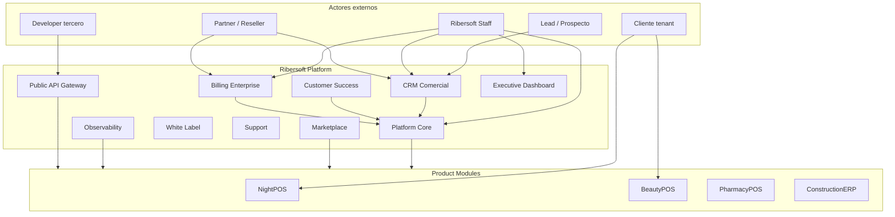
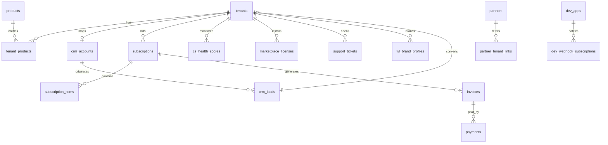
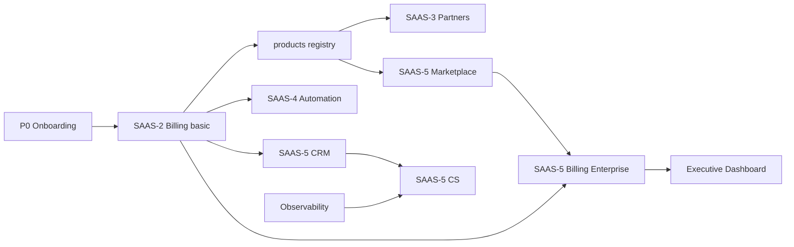

# SAAS-5 — RIBERSOFT PLATFORM — AUDITORÍA Y PLAN MAESTRO (BACKEND)

**Fecha:** 2026-06-25  
**Estado:** Diseño empresarial + **SAAS-1.5 Control Center implementado** (monitoreo operativo V1)  
**Alcance:** Arquitectura de plataforma multi-producto para 10+ años  
**Producto ancla:** NightPOS (primer producto; no se modifica operación POS)

---

## 0. Declaración de visión

**NightPOS deja de ser el producto raíz del repositorio.** Pasa a ser el **primer módulo producto** de **Ribersoft Platform**: una capa SaaS compartida que en el futuro alojará BeautyPOS, PharmacyPOS, ConstructionERP y otros sistemas.

| Antes | Después |
|-------|---------|
| SaaS = multi-tenant NightPOS | SaaS = Ribersoft Platform |
| Planes/límites pensados para boliche | Planes por **producto** + add-ons marketplace |
| `/admin/platform/*` = consola NightPOS | `/platform/*` = consola Ribersoft |
| Permisos mezclados venue + plataforma | Permisos **platform.*** vs **product.*** |

**Principio rector:** Evolucionar por **capas acumulativas** (Strangler Fig). Nada de reescritura big-bang.

---

## 1. Mapa de capas SAAS (P0 → SAAS-5)

```
┌──────────────────────────────────────────────────────────────────────────┐
│ SAAS-5  RIBERSOFT PLATFORM (Enterprise)                                  │
│ CRM · Customer Success · Billing Enterprise · Marketplace · White Label  │
│ Partners · Support · Observability · Public API · Executive Dashboard    │
├──────────────────────────────────────────────────────────────────────────┤
│ SAAS-4  Automatización (V2)                                              │
│ Pasarela · webhooks billing · enforcement límites · API pública básica   │
├──────────────────────────────────────────────────────────────────────────┤
│ SAAS-3  Crecimiento (V1.1)                                               │
│ Partners · comisiones · instaladores · tickets · notificaciones internas │
├──────────────────────────────────────────────────────────────────────────┤
│ SAAS-1.5 Platform Operations (✅ V1)                                     │
│ Ribersoft Control Center · health score · agentes · checklist · soporte  │
├──────────────────────────────────────────────────────────────────────────┤
│ SAAS-2  Comercial manual (V1)                                            │
│ subscriptions · pagos manuales · estados · perfil comercial · MRR básico │
├──────────────────────────────────────────────────────────────────────────┤
│ SAAS-1  Planes + límites (✅)                                            │
│ plans · plan_limits · usage informativo                                  │
├──────────────────────────────────────────────────────────────────────────┤
│ SAAS P0 Onboarding (✅)                                                  │
│ superadmin CLI · wizard · bootstrap · perfil · permisos alineados        │
├──────────────────────────────────────────────────────────────────────────┤
│ PRODUCT LAYER — NightPOS (✅ operativo ~99% V1)                          │
│ Order · Cash · Shift · Room · GirlIncome · Printing · …                  │
└──────────────────────────────────────────────────────────────────────────┘
```

**SAAS-5 no reemplaza SAAS-2/3/4.** Los **absorbe y extiende**. SAAS-2 sigue siendo el primer paso implementable; SAAS-5 define el **estado final** hacia el que convergen todas las fases.

---

## 2. Arquitectura objetivo (C4 — Contexto)



### Estilo arquitectónico

| Patrón | Aplicación |
|--------|------------|
| **Modular Monolith** (fase 1–5 años) | Un deploy Laravel; módulos por namespace/package |
| **Bounded Contexts (DDD)** | CRM, Billing, CS, etc. con interfaces claras |
| **Hexagonal / Clean** | Reutilizar patrón actual Domain → Application → Infrastructure |
| **Event-driven interno** | Domain events + outbox (fase SAAS-4+) |
| **Multi-tenant shared DB** | Mantener `tenant_id`; añadir `product_id` donde aplique |
| **Plugin registry** | Productos registran bootstrap, límites, permisos, rutas |

---

## 3. Platform Core vs Product Plugin

### 3.1 Platform Core (extraíble / reutilizable hoy)

| Módulo actual | Evolución Ribersoft |
|---------------|---------------------|
| `Tenant`, `Branch` | Organización cliente (sin cambiar semántica branch) |
| `User`, `Role`, `Permission` | IAM tenant + IAM platform separados |
| `Auth` (JWT, context) | + product context header |
| `Plan`, `PlanLimit` | Plan **por producto** o plan bundle multi-producto |
| `TenantProvisioner` | Provisioner genérico + **ProductBootstrapRegistry** |
| `AuditLogRecorder` | Audit unificado platform + product |
| Middleware tenant/branch/permission | + `ResolveProductMiddleware` |
| `CreateSuperadminCommand` | `ribersoft:create-platform-admin` (alias gradual) |

### 3.2 Product Plugin (NightPOS = `product: nightpos`)

Cada producto registra:

```php
// Conceptual — no implementar aún
ProductRegistry::register('nightpos', [
    'bootstrap' => NightPosBranchBootstrap::class,
    'default_roles' => TenantDefaultRolePermissions::class,
    'limit_keys' => ['branches','users','cashiers','waiters','products','rooms'],
    'usage_counters' => NightPosUsageCalculator::class,
    'routes_prefix' => 'nightpos', // compat: mantener /api/v1/orders etc.
    'permissions_catalog' => NightPosPermissionCatalog::class,
    'sse_event_types' => [...],
]);
```

**NightPOS operativo no se mueve.** Solo se **declara** como producto instalado.

### 3.3 Tabla nueva fundamental: `products`

| Campo | Ejemplo |
|-------|---------|
| id, slug, name | `nightpos`, NightPOS |
| status | active, beta, deprecated |
| current_version | semver |
| api_namespace | `v1` (compat) |
| config_schema | JSON schema settings producto |

### 3.4 Tabla: `tenant_products` (entitlement)

| Campo | Notas |
|-------|-------|
| tenant_id, product_id | unique |
| status | active, trial, suspended |
| installed_at | |
| config | JSON product-specific |
| subscription_id | FK billing |

---

## 4. Bounded Contexts — mapa completo

| Context | Responsabilidad | Relación con NightPOS |
|---------|-----------------|----------------------|
| **Identity & Access (IAM)** | Users, roles, JWT, platform staff | Reutilizar; separar permisos platform |
| **Organization** | Tenant, Branch, sites | Sin cambio operativo |
| **Commercial CRM** | Lead → Cliente → Tenant | Nuevo; alimenta provisioning |
| **Customer Success** | Health, onboarding, renovación | Nuevo; lee usage observability |
| **Billing & Revenue** | Subscriptions, invoices, MRR | Evolución SAAS-2→5 |
| **Marketplace & Licensing** | Módulos, feature flags, add-ons | Nuevo; extiende plan_limits |
| **White Label** | Branding, dominios, temas | Nuevo; frontend-heavy |
| **Partner Network** | Partners, comisiones | Evolución SAAS-3 |
| **Support** | Tickets, KB, remote | Evolución SAAS-3 |
| **Observability** | Logs, métricas, alertas | Nuevo; instrumentar existente |
| **Developer Platform** | API keys, webhooks, SDK | Evolución SAAS-4 |
| **Analytics & Executive** | MRR, churn, LTV, dashboards | Nuevo; read models |
| **Product: NightPOS** | POS nocturno | **Intacto** — bounded contexts Order, Cash, … |

**Regla:** Contextos platform **no importan** Domain de Order/Cash/Room. Comunicación vía **eventos** o **application services** en Shared Kernel.

---

## 5. Módulos SAAS-5 — diseño detallado

---

### 5.1 CRM Comercial

**Objetivo:** Pipeline Lead → Cliente → Tenant con trazabilidad comercial.

#### Agregados

| Agregado | Raíz | Entidades internas |
|----------|------|-------------------|
| **Lead** | LeadId | ContactInfo, Source, Score, Status |
| **Opportunity** | OpportunityId | LeadId, Stage, Value, Probability |
| **Quote** | QuoteId | LineItems, ValidUntil, Status |
| **Account** | AccountId | CommercialProfile, Contacts[] |
| **Deal** | DealId | QuoteId, WonAt, TenantId (post-win) |

#### Entidades

- `Lead`, `Contact`, `Account`, `Quote`, `QuoteLine`, `Opportunity`, `PipelineStage`, `Activity` (call, email, meeting), `DemoSession`

#### Pipeline propuesto

```
NEW → CONTACTED → QUALIFIED → DEMO → QUOTE → NEGOTIATION → WON → PROVISIONED
                                                              ↘ LOST
```

#### Casos de uso

| UC | Descripción |
|----|-------------|
| CaptureLead | Web form / manual / partner referral |
| QualifyLead | Scoring + assign owner Ribersoft |
| ScheduleDemo | Link a tenant trial sandbox |
| CreateQuote | Plan + productos + add-ons + precio |
| ConvertToTenant | Invoca `TenantProvisioner` + crea subscription trial |
| MarkLost | Razón + reactivación futura |

#### Eventos de dominio

- `LeadCreated`, `LeadQualified`, `DemoScheduled`, `QuoteSent`, `DealWon`, `DealLost`, `AccountLinkedToTenant`

#### Tablas propuestas

`crm_leads`, `crm_contacts`, `crm_accounts`, `crm_opportunities`, `crm_quotes`, `crm_quote_lines`, `crm_activities`, `crm_pipeline_stages`, `crm_demo_sessions`

#### APIs propuestas

```
GET/POST   /platform/crm/leads
PATCH      /platform/crm/leads/{id}/stage
GET/POST   /platform/crm/quotes
POST       /platform/crm/quotes/{id}/send
POST       /platform/crm/deals/{id}/convert-to-tenant
GET        /platform/crm/pipeline
```

---

### 5.2 Customer Success

**Objetivo:** Retener clientes; detectar riesgo antes del churn.

#### Agregados

| Agregado | Raíz |
|----------|------|
| **CustomerHealth** | TenantId |
| **OnboardingProgram** | ProgramId |
| **RenewalCase** | RenewalId |

#### Health Score (modelo conceptual)

| Señal | Peso | Fuente |
|-------|------|--------|
| Login activo últimos 7d | Alto | IAM audit |
| Órdenes/día vs baseline | Alto | NightPOS metrics |
| Pagos al día | Crítico | Billing |
| Tickets abiertos | Medio | Support |
| Límite plan WARNING | Medio | Usage |
| Capacitación completada | Bajo | CS |

Score 0–100 → `healthy` | `at_risk` | `critical`

#### Casos de uso

| UC | Descripción |
|----|-------------|
| CalculateHealthScore | Job diario por tenant+product |
| ListAtRiskCustomers | CS dashboard |
| StartOnboardingChecklist | Post-provision |
| RecordTraining | Sesión capacitación |
| InitiateRenewal | 90/60/30 días antes fin |
| EscalateToSales | Health critical + past_due |

#### Eventos

- `HealthScoreUpdated`, `CustomerMarkedAtRisk`, `OnboardingCompleted`, `RenewalReminderDue`, `ChurnRiskDetected`

#### Tablas

`cs_health_scores`, `cs_health_signals`, `cs_onboarding_programs`, `cs_onboarding_tasks`, `cs_trainings`, `cs_renewal_cases`, `cs_playbooks`

#### APIs

```
GET  /platform/cs/health
GET  /platform/cs/at-risk
GET  /platform/tenants/{id}/health
POST /platform/cs/onboarding/{tenantId}/start
POST /platform/cs/renewals/{id}/actions
```

---

### 5.3 Billing Enterprise

**Objetivo:** Sistema financiero Ribersoft ↔ clientes; evolución completa de SAAS-2/4.

#### Agregados

| Agregado | Raíz |
|----------|------|
| **Subscription** | SubscriptionId |
| **Invoice** | InvoiceId |
| **Payment** | PaymentId |
| **CreditNote** | CreditNoteId |
| **AddOnEntitlement** | EntitlementId |

#### Estados subscription

`draft` → `trial` → `active` → `past_due` → `suspended` → `cancelled` → `expired`

#### Billing Enterprise (más allá SAAS-2)

| Capacidad | SAAS-2 | SAAS-5 |
|-----------|--------|--------|
| Pagos manuales | ✓ | ✓ |
| Facturas numeradas | — | ✓ |
| Prorrateo upgrade/downgrade | — | ✓ |
| Add-ons marketplace | — | ✓ |
| MRR/ARR calculado | básico | ledger + read models |
| Churn reconocido | — | ✓ |
| Grace period configurable | ✓ | ✓ por producto/plan |
| Multi-moneda | — | ✓ |
| Impuestos (NIT Bolivia) | — | V2 fiscal |

#### Eventos

- `SubscriptionCreated`, `SubscriptionRenewed`, `SubscriptionSuspended`, `InvoiceIssued`, `PaymentRecorded`, `PaymentFailed`, `AddOnPurchased`, `ProrationApplied`, `ChurnRecorded`

#### Tablas (consolidado evolutivo)

`subscriptions`, `subscription_items`, `subscription_plan_history`, `invoices`, `invoice_lines`, `payments`, `payment_allocations`, `credit_notes`, `billing_ledger_entries`, `mrr_snapshots`, `dunning_schedules`

#### APIs

```
/platform/billing/subscriptions/*
/platform/billing/invoices/*
/platform/billing/payments/*
/platform/billing/add-ons/*
GET /platform/billing/metrics/mrr|arr|churn
POST /platform/billing/subscriptions/{id}/upgrade
POST /platform/billing/subscriptions/{id}/cancel
```

**Compatibilidad NightPOS:** `TenantAccessGuard` lee **Subscription aggregate** (no solo columnas `tenants`). Migración dual-read durante transición.

---

### 5.4 Marketplace

**Objetivo:** Módulos instalables, feature flags, licencias por tenant.

#### Agregados

| Agregado | Raíz |
|----------|------|
| **ProductModule** | ModuleId |
| **ModuleLicense** | LicenseId |
| **FeatureFlag** | FlagKey (per tenant or global) |

#### Conceptos

| Concepto | Ejemplo NightPOS |
|----------|------------------|
| Product | nightpos |
| Module | `nightpos.rooms`, `nightpos.shows`, `nightpos.settlements` |
| Add-on | Impresión avanzada, multi-sucursal extra |
| Feature flag | `girl_income.enabled` |

#### Casos de uso

| UC | Descripción |
|----|-------------|
| ListAvailableModules | Por producto + plan |
| InstallModule | Crea license + sync permissions |
| UninstallModule | Revoca permisos (no borra datos históricos) |
| EvaluateFeatureFlag | Middleware / use case guard |
| CheckCompatibility | Versión producto vs módulo |

#### Tablas

`marketplace_modules`, `marketplace_module_versions`, `marketplace_licenses`, `feature_flags`, `feature_flag_overrides`, `module_dependencies`

#### APIs

```
GET  /platform/marketplace/modules
POST /platform/tenants/{id}/modules/{slug}/install
DELETE /platform/tenants/{id}/modules/{slug}
GET  /platform/feature-flags/evaluate?key=...
```

**NightPOS hoy:** permisos granulares ≈ prototipo de marketplace; migrar a licencias sin romper slugs existentes.

---

### 5.5 White Label

**Objetivo:** Resellers y clientes enterprise con marca propia.

#### Agregados

| Agregado | Raíz |
|----------|------|
| **BrandProfile** | BrandId |
| **DomainMapping** | DomainId |
| **ThemePack** | ThemeId |

#### Entidades

- Logo URLs, colores, favicon, email templates, login background, custom CSS vars, SMTP override (V2)

#### Resolución

```
Request Host → domain_mappings → tenant_id + brand_profile_id
```

#### Tablas

`wl_brand_profiles`, `wl_domain_mappings`, `wl_theme_packs`, `wl_email_templates`, `wl_reseller_configs`

#### APIs

```
/platform/white-label/brands
/platform/white-label/domains
/platform/white-label/themes
GET /public/brand/resolve?host=
```

**NightPOS:** login y shell cargan theme desde brand profile; fallback Ribersoft default.

---

### 5.6 Partners

**Objetivo:** Red comercial e instaladores (evolución SAAS-3 ampliada).

#### Agregados

| Agregado | Raíz |
|----------|------|
| **Partner** | PartnerId |
| **PartnerAgreement** | AgreementId |
| **CommissionLedger** | LedgerEntryId |
| **PartnerPayout** | PayoutId |

#### Tipos partner

`seller`, `installer`, `support`, `reseller`, `franchise`, `referral`

#### Comisiones

| Tipo | Cálculo |
|------|---------|
| % MRR mensual | recurring |
| Monto fijo mensual | flat |
| Alta única | on DealWon |
| Instalación | on InstallationCompleted |
| Soporte | ticket resolution fee |

#### Eventos

- `PartnerRegistered`, `ReferralAttributed`, `CommissionAccrued`, `CommissionPaid`, `InstallationCompleted`

#### Tablas

`partners`, `partner_contacts`, `partner_agreements`, `partner_tenant_links`, `partner_commissions`, `partner_payouts`, `partner_referral_codes`

#### APIs

```
/platform/partners/*
/platform/partners/{id}/commissions
/platform/partners/{id}/payouts
POST /platform/partners/referrals/validate
```

---

### 5.7 Soporte

#### Agregados

| Agregado | Raíz |
|----------|------|
| **SupportTicket** | TicketId |
| **KnowledgeArticle** | ArticleId |
| **RemoteSession** | SessionId (V2) |

#### Tablas

`support_tickets`, `support_ticket_messages`, `support_categories`, `kb_articles`, `kb_article_versions`, `support_sla_policies`, `remote_support_sessions`

#### APIs

```
/platform/support/tickets
/platform/support/kb/articles
POST /platform/support/tickets/{id}/assign
/platform/tenants/{id}/tickets (tenant-visible subset)
```

**V1 mínimo (pre-SAAS-5):** notas internas en CRM account (SAAS-2).

---

### 5.8 Observabilidad

**Objetivo:** Operar Ribersoft y diagnosticar clientes sin acceder a datos sensibles innecesarios.

#### Capas

| Capa | Qué captura |
|------|-------------|
| **Application logs** | Laravel structured JSON |
| **Audit trail** | Ya existe `audit_logs` — extender |
| **Business metrics** | Orders/day, print jobs, SSE connections |
| **Error tracking** | Sentry-compatible export |
| **Job queue** | Failed jobs, latency (cuando existan jobs) |
| **SSE monitor** | Connections, event throughput |
| **Tenant usage** | API calls, storage (futuro) |

#### Agregados

| Agregado | Raíz |
|----------|------|
| **TenantUsageSnapshot** | SnapshotId |
| **PlatformAlert** | AlertId |

#### Tablas

`obs_usage_snapshots`, `obs_error_events`, `obs_api_request_logs`, `obs_alerts`, `obs_slo_definitions`, `obs_print_job_stats`

#### Eventos consumidos

Escuchar domain events de Billing, CS, Product para métricas.

#### APIs

```
/platform/observability/tenants/{id}/usage
/platform/observability/errors
/platform/observability/alerts
GET /platform/observability/health
```

**NightPOS:** instrumentar emitters SSE y print jobs sin cambiar contratos API operativos.

---

### 5.9 API Pública

**Objetivo:** Ecosistema terceros + integraciones enterprise.

#### Componentes

| Componente | Descripción |
|------------|-------------|
| **Developer Portal** | Apps, keys, docs (frontend) |
| **API Gateway** | Rate limit, versioning |
| **OAuth2 / API Keys** | Machine-to-machine |
| **Webhooks** | Outbound events |
| **SDK** | PHP/JS official |

#### Agregados

| Agregado | Raíz |
|----------|------|
| **DeveloperApp** | AppId |
| **ApiKey** | KeyId |
| **WebhookSubscription** | WebhookId |
| **OAuthClient** | ClientId |

#### Tablas

`dev_apps`, `dev_api_keys`, `dev_oauth_clients`, `dev_webhook_subscriptions`, `dev_webhook_deliveries`, `dev_rate_limit_buckets`

#### APIs (meta)

```
/platform/developer/apps
/platform/developer/webhooks
POST /oauth/token
/api/public/v1/... (product-scoped, future)
```

**Fase:** SAAS-4 expone webhooks billing; SAAS-5 portal completo.

---

### 5.10 Dashboard Ejecutivo

**Objetivo:** Vista CEO/CFO Ribersoft — read model agregado.

#### Métricas

| Métrica | Definición |
|---------|------------|
| **MRR** | Suma recurring normalizada mensual |
| **ARR** | MRR × 12 |
| **Churn** | Logo/revenue churn periodo |
| **LTV** | ARPU / churn rate |
| **CAC** | Costo adquisición / nuevos clientes (CRM) |
| **Trials** | Subscriptions status=trial |
| **Past due** | past_due + grace |
| **NRR** | Net revenue retention |

#### Read models (CQRS light)

Tablas materializadas actualizadas por jobs:

`analytics_mrr_daily`, `analytics_churn_monthly`, `analytics_cohort_retention`, `analytics_product_adoption`, `analytics_partner_leaderboard`

#### APIs

```
GET /platform/executive/dashboard
GET /platform/executive/metrics/{metric}?from=&to=
GET /platform/executive/export
```

---

## 6. Modelo de datos — vista conceptual unificada



**~80–120 tablas platform** a plazo 10 años; implementación incremental.

---

## 7. Estrategia de eventos de dominio

### Estado actual

- `DomainEventDispatcherInterface` existe **sin wiring**
- SSE operacional (NightPOS) ≠ domain events platform
- Audit log síncrono

### Objetivo SAAS-5

| Fase | Mecanismo |
|------|-----------|
| SAAS-2/3 | Eventos in-process + audit |
| SAAS-4 | Laravel events + listeners + queue |
| SAAS-5 | Outbox pattern + webhook dispatcher |

### Catálogo eventos platform (cross-cutting)

```
platform.tenant.provisioned
platform.subscription.activated
platform.subscription.suspended
platform.payment.received
platform.invoice.issued
crm.deal.won
cs.health.critical
marketplace.module.installed
support.ticket.created
partner.commission.accrued
```

Productos (NightPOS) publican:

```
nightpos.order.created
nightpos.shift.closed
...
```

**Observability y CS consumen** ambos streams.

---

## 8. API — evolución de rutas (sin romper NightPOS)

### Hoy

```
/api/v1/auth/*
/api/v1/admin/platform/*
/api/v1/admin/tenants/*
/api/v1/orders/*  (operativo NightPOS)
```

### Objetivo (convivencia 5+ años)

```
/api/v1/auth/*                          # unchanged
/api/v1/products/nightpos/*             # alias gradual → rutas actuales
/api/v1/platform/*                      # Ribersoft Platform (new)
/api/v1/public/*                        # Developer API
```

**Regla compatibilidad:** Rutas `/api/v1/orders` etc. permanecen **aliases permanentes** de `nightpos` product. Nuevos productos usan `/api/v1/products/{slug}/...`.

### Headers contexto

| Header | Uso |
|--------|-----|
| `X-Tenant-Slug` | Existente |
| `X-Branch-Code` | Existente |
| `X-Product-Slug` | Nuevo (default `nightpos`) |
| `X-Platform-Scope` | platform vs product API |

---

## 9. IAM Platform — roles globales

| Rol | Contextos |
|-----|-----------|
| `super_admin` | Todo |
| `platform_admin` | Organization, CRM, CS |
| `billing_admin` | Billing, invoices, payments |
| `support_agent` | Support, read tenant |
| `partner_manager` | Partners, commissions |
| `sales_rep` | CRM pipeline |
| `cs_manager` | Customer Success |
| `developer_admin` | API keys, webhooks |
| `read_only_executive` | Executive dashboard |

Permisos namespace:

```
platform.crm.*
platform.cs.*
platform.billing.*
platform.marketplace.*
platform.whitelabel.*
platform.partners.*
platform.support.*
platform.observability.*
platform.developer.*
platform.executive.*
```

**NightPOS tenant roles** (`tenant_owner`, `cashier`, …) **no cambian**.

---

## 10. Roadmap maestro (10 años)

### Horizonte 1 — Años 1–2 (fundación comercial)

| Fase | Entregable | Dependencia |
|------|------------|-------------|
| SAAS-2 V1 | subscriptions, pagos manuales, estados | P0 ✅ |
| SAAS-2.1 | `products` + `tenant_products` registry | SAAS-2 |
| SAAS-3 | partners básico, tickets, instalaciones | SAAS-2 |
| SAAS-4 | webhooks billing, pasarela, enforcement soft | SAAS-2 |

### Horizonte 2 — Años 2–4 (platform core)

| Fase | Entregable |
|------|------------|
| SAAS-5a | CRM + Account→Tenant |
| SAAS-5b | Billing Enterprise (invoices, proration) |
| SAAS-5c | Customer Success health score |
| SAAS-5d | Executive dashboard MRR/ARR/churn |
| SAAS-5e | Marketplace v1 (NightPOS modules) |

### Horizonte 3 — Años 4–7 (escala multi-producto)

| Fase | Entregable |
|------|------------|
| SAAS-5f | Segundo producto piloto (BeautyPOS shell) |
| SAAS-5g | White label + reseller portal |
| SAAS-5h | Observability completa |
| SAAS-5i | Public API + developer portal |

### Horizonte 4 — Años 7–10 (enterprise)

| Fase | Entregable |
|------|------------|
| SAAS-5j | Multi-region, data residency |
| SAAS-5k | Advanced analytics, ML churn prediction |
| SAAS-5l | Marketplace terceros |
| SAAS-5m | Optional service extraction (billing microservice) |

---

## 11. Dependencias críticas



**No iniciar CRM antes de subscriptions** — DealWon necesita subscription model.

**No iniciar segundo producto antes de products registry** — evita duplicar tenant model.

---

## 12. Riesgos estratégicos

| Riesgo | Probabilidad | Impacto | Mitigación |
|--------|--------------|---------|------------|
| Big-bang rename NightPOS → Platform | Media | Crítico | Strangler; aliases API |
| Permisos explosion | Alta | Alto | Namespaces platform.* vs product.* |
| Schema sprawl 100+ tablas | Alta | Medio | Prefijos por context; migrations modulares |
| Billing incorrecto MRR | Media | Crítico | Ledger inmutable + reconciliación |
| CRM duplicado con tenant | Media | Alto | Account 1:1 Tenant post-conversion |
| White label DNS/SSL complejidad | Media | Alto | Fase tardía; wildcard + automation |
| Multi-product permission conflicts | Media | Alto | Product-scoped permission catalog |
| Equipo pequeño vs scope SAAS-5 | Alta | Alto | Roadmap por horizontes; SAAS-2 primero |
| Observability cost | Baja | Medio | Sampling; retention policies |

---

## 13. Compatibilidad con NightPOS actual

| Área | Compromiso |
|------|------------|
| Operación POS | **Cero cambios** en use cases Order/Cash/Shift/Room |
| API operativa | Rutas existentes **permanentes** |
| Seeders demo | Intactos; demo = tenant + product nightpos |
| Middleware | Ampliar, no reemplazar |
| `TenantProvisioner` | Wrapper platform; bootstrap NightPOS via registry |
| Plan limits keys | NightPOS keys válidas dentro product registry |
| Frontend operativo | Sin cambios hasta product shell explícito |
| Tests 529+ | Deben seguir verdes en cada fase platform |
| SAAS P0 | Base obligatoria — no revertir |

### Migración conceptual (Strangler Fig)

1. Introducir `products` + `tenant_products` (read-only mirror)
2. Mover lógica subscription a aggregate (dual-write)
3. CRM referencia tenants existentes retroactivamente
4. Namespace API platform nuevo; old routes alias
5. Extraer packages Composer (`ribersoft/platform-core`, `ribersoft/product-nightpos`) — año 3+

---

## 14. Paquetes Composer propuestos (año 3+)

```
ribersoft/platform-core      # IAM, Organization, Billing interfaces
ribersoft/platform-crm
ribersoft/platform-cs
ribersoft/platform-billing
ribersoft/platform-marketplace
ribersoft/product-nightpos     # Domain Order, Cash, …
ribersoft/product-beautypos    # futuro
```

Monorepo actual → split gradual cuando segundo producto justifique.

---

## 15. Qué reutilizar del codebase hoy

| Asset | Acción SAAS-5 |
|-------|---------------|
| Layered DDD structure | Mantener y extender namespaces |
| `TenantProvisioner` | Core platform provisioning |
| `TenantAccessGuard` | Integrar subscription aggregate |
| `AuditLogRecorder` | Platform audit bus |
| `plans` / `plan_limits` | Evolucionar a plan per product/bundle |
| `/admin/platform/*` | Migrar a `/platform/*` con alias |
| `TenantPlanUsageCalculator` | Mover a NightPOS product plugin |
| `BranchOperationalBootstrapService` | NightPOS bootstrap hook |
| SSE infrastructure | Observability + product events |
| 529 tests | Contract tests platform |

---

## 16. Respuestas directas (checklist ejecutivo)

| # | Pregunta | Respuesta |
|---|----------|-----------|
| 1 | ¿Qué ya existe? | Multi-tenant, RBAC, plans, provisioning P0, dashboard básico, audit, JWT |
| 2 | ¿Qué falta? | CRM, CS, billing enterprise, marketplace, WL, partners full, support, obs, public API, executive metrics |
| 3 | ¿Qué primero? | **SAAS-2** → **products registry** → CRM → Billing enterprise |
| 4 | ¿Qué después? | Marketplace, WL, multi-producto, developer platform |
| 5 | ¿Tablas? | ~40 platform tables en horizonte 2; ver secciones por módulo |
| 6 | ¿Endpoints? | Namespace `/platform/{module}/*`; ver secciones |
| 7 | ¿Pantallas? | Ver audit frontend |
| 8 | ¿Permisos? | `platform.*` namespaces; roles globales Ribersoft |
| 9 | ¿Riesgos? | Sección 12 |
| 10 | ¿Flujo comercial? | Lead → Quote → Deal → Provision → Trial → Pay → Active → CS → Renew |

---

## 17. Referencias internas

| Documento | Relación |
|-----------|----------|
| `SAAS_P0_SUPERADMIN_ONBOARDING_IMPLEMENTATION_REPORT.md` | Base onboarding |
| `SAAS_PLAN_MANAGEMENT_REPORT.md` | SAAS-1 planes |
| `SAAS_2_COMMERCIAL_AUDIT.md` | Próximo paso implementable |
| `SAAS_ARCHITECTURE.md` | Visión original (actualizar gradualmente) |
| `NIGHTPOS_V1_DEVELOPMENT_MAP.md` | Orquestación fases |

---

*Documento de arquitectura empresarial. Sin código. Ribersoft Platform SAAS-5 define el norte; SAAS-2 sigue siendo el siguiente paso de implementación.*
