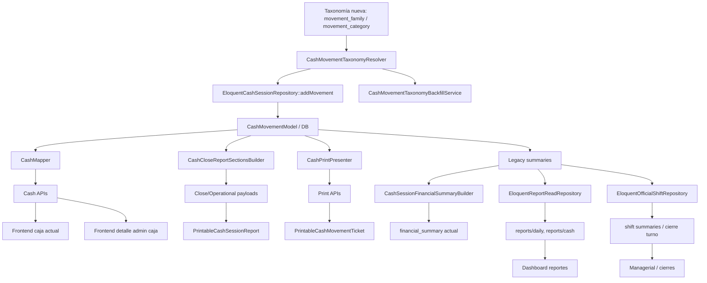

# Auditoría de integración — Sprint 1 taxonomía financiera (Backend)

**Fecha:** 2026-07-10
**Alcance:** estado real de adopción de `movement_family` y `movement_category` después del Sprint 1
**Fuentes oficiales:**

- `FINANCIAL_ARCHITECTURE_MASTER.md`
- `FINANCIAL_IMPLEMENTATION_BLUEPRINT.md`
- `backend/SPRINT_1_TAXONOMIA_FINANCIERA_IMPLEMENTATION_REPORT.md`

## 1. Resumen ejecutivo

El Sprint 1 quedó integrado correctamente en el núcleo de persistencia y en los flujos que crean `cash_movements`, pero la adopción todavía es **parcial** en el resto del sistema.

Conclusión técnica:

- la taxonomía nueva ya existe en base de datos, dominio, repositorio central, payloads operativos principales y tests;
- los flujos nuevos de creación de movimientos ya quedan estructurados;
- la mayor parte de los reportes, summaries y builders financieros siguen usando arquitectura legacy basada en `movement_type`, `reason`, `description` y `financial_summary` monolítico.

En otras palabras:

- **la persistencia ya migró**,
- **la clasificación ya migró**,
- **la explotación funcional de esa taxonomía todavía no migró**.

## 2. ¿Qué módulos ya usan `movement_family` y `movement_category`?

## 2.1 Persistencia y dominio

Usan la taxonomía nueva de forma nativa:

- `backend/app/Domain/Cash/Entities/CashMovement.php`
- `backend/app/Domain/Cash/ValueObjects/CashMovementFamily.php`
- `backend/app/Domain/Cash/ValueObjects/CashMovementCategory.php`
- `backend/app/Infrastructure/Persistence/Eloquent/Models/CashMovementModel.php`
- `backend/app/Infrastructure/Persistence/Eloquent/Models/CashMovementReasonModel.php`

## 2.2 Servicios de taxonomía

Integración directa:

- `backend/app/Application/Cash/Services/CashMovementTaxonomyResolver.php`
- `backend/app/Application/Cash/Services/CashMovementTaxonomyBackfillService.php`

## 2.3 Repositorio central

Integración efectiva:

- `backend/app/Infrastructure/Persistence/Eloquent/Repositories/EloquentCashSessionRepository.php`

Punto clave:

- `addMovement()` ya resuelve y persiste `movement_family` y `movement_category`.
- Esto vuelve a la taxonomía nueva el camino único para movimientos nuevos.

## 2.4 Mappers / presenters

Ya exponen taxonomía nueva:

- `backend/app/Application/Cash/Support/CashMapper.php`
- `backend/app/Application/Cash/Services/CashPrintPresenter.php`
- `backend/app/Application/Reports/Services/CashCloseReportSectionsBuilder.php`

## 2.5 Flujos de negocio ya integrados

### Cobro de comanda

- `backend/app/Application/Sale/UseCases/ChargeOrderUseCase.php`
- Usa `sourceType = SALE` y `sourceId = sale->id`
- Resultado esperado: `SALE / SALE_COLLECTION`

### Venta directa

- `backend/app/Application/Sale/UseCases/CreateDirectSaleUseCase.php`
- Usa `sourceType = SALE` y `sourceId = sale->id`
- Resultado esperado: `SALE / DIRECT_SALE_COLLECTION`

### Servicios con ingreso directo

- `backend/app/Application/Cash/Services/ServiceIncomeCashRecorder.php`
- Consumido por:
  - `CreateBraceletUseCase`
  - `CreateRoomServiceUseCase`
  - `CreateShowUseCase`
- Resultado esperado:
  - `BRACELET_COLLECTION`
  - `ROOM_SERVICE_COLLECTION`
  - `SHOW_COLLECTION`

### Pago de liquidaciones

- `backend/app/Application/StaffSettlement/UseCases/MarkSettlementPaidUseCase.php`
- Usa `sourceType = STAFF_SETTLEMENT`
- Resultado esperado:
  - `SETTLEMENT_GIRL_PAYMENT`
  - `SETTLEMENT_WAITER_PAYMENT`
  - `SETTLEMENT_CLEANING_PAYMENT`

### Movimiento manual

- `backend/app/Application/Cash/UseCases/RegisterCashMovementUseCase.php`
- Taxonomía resuelta por `cash_movement_reason_id` + fallback.

## 2.6 Endpoints que ya exponen la nueva taxonomía

- `GET /api/v1/cash/session/current`
- `GET /api/v1/admin/cash-sessions/{id}`
- `POST /api/v1/cash/movements`
- payload de impresión de movimiento vía `CashPrintPresenter`
- payload de cierre de caja en `CashCloseReportSectionsBuilder` para movimientos

## 3. ¿Qué módulos todavía usan `movement_type`, `reason`, `description` o heurísticas antiguas?

## 3.1 Summary financiero legacy

El mayor punto legacy sigue siendo:

- `backend/app/Application/Cash/Services/CashSessionFinancialSummaryBuilder.php`

Problemas actuales:

- sigue calculando manual income usando `sumManualMovements()`;
- no usa `movement_family` ni `movement_category`;
- sigue alimentando el payload `financial_summary` heredado.

## 3.2 Repositorio legacy de agregados

- `backend/app/Infrastructure/Persistence/Eloquent/Repositories/EloquentCashSessionRepository.php`

Métodos aún legacy:

- `sumManualMovements()`
- `sumMovements()`
- `sumMovementsByMethod()`

Punto crítico:

- `sumManualMovements()` todavía separa por `description not like 'Cobro comanda%'` y `description not like 'Venta directa%'`.
- Esa es la principal heurística legacy que queda viva en backend post Sprint 1.

## 3.3 Reportes legacy

### `EloquentReportReadRepository`

Sigue usando lógica antigua en al menos:

- `getDailySummary()`
- `getCashReport()`

Problemas:

- agrupa manual income por `movement_type = INCOME` + exclusiones por `description`;
- agrupa expenses por `movement_type = EXPENSE` sin aprovechar categorías estructuradas;
- no expone `movement_family` ni `movement_category` en muchos payloads de reportes.

### `EloquentOfficialShiftRepository`

También sigue con lógica legacy:

- usa `movement_type = INCOME` / `movement_type = EXPENSE`
- usa exclusiones por `description`
- produce `expected_cash` y cierres sobre agregados aún no migrados

## 3.4 Builders de control y reportes

Quedaron mezclando arquitecturas:

- `CashCloseReportSectionsBuilder`
- `CashSessionFinancialSummaryBuilder`
- `ManagerialReportAssemblerService`
- `ShiftManagerialSummaryBuilder`

Estado actual:

- algunos ya exponen movimientos con family/category,
- pero sus totales y fórmulas internas todavía no migraron a la taxonomía oficial.

## 3.5 Impresión legacy

### `PrintTicketContentBuilder`

Sigue leyendo:

- `movement_type`
- `reason_name`
- `description`

No usa todavía `movement_family` ni `movement_category` para construir el contenido visible del ticket.

## 3.6 DTOs / requests legacy

Siguen vigentes:

- `movement_type` en `RegisterCashMovementRequest`
- `financial_summary` en cash current session
- `expected_cash` legacy en builders y snapshots

Esto es correcto por compatibilidad, pero confirma coexistencia de dos arquitecturas.

## 4. ¿Qué servicios quedaron mezclando ambas arquitecturas?

Servicios con mezcla explícita:

1. `CashSessionFinancialSummaryBuilder`
- nueva taxonomía ya existe en DB, pero el builder no la usa.

2. `CashCloseReportSectionsBuilder`
- ya pasa family/category en `movements[]`,
- pero `movements_summary` sigue sumando por `movement_type`.

3. `ManagerialReportAssemblerService`
- sigue leyendo `daily['cash']['manual_expense']` y otros agregados legacy.

4. `ShiftManagerialSummaryBuilder`
- sigue usando estructuras de cierre heredadas.

5. `CashPrintPresenter`
- ya expone family/category,
- pero el consumidor downstream sigue imprimiendo por `movement_type`.

## 5. ¿Qué endpoints aún no exponen la nueva taxonomía?

## 5.1 Sí la exponen

- `GET /cash/session/current`
- `GET /admin/cash-sessions/{id}`
- `POST /cash/movements`

## 5.2 Parciales o sin exposición estructurada

- `GET /reports/cash`
- `GET /reports/daily`
- `GET /reports/managerial-daily`
- `GET /shifts/{id}/summary`
- `GET /cash/sessions/{id}` cuando se usa fuera de admin como detalle resumido

Punto clave:

- no es que todos estén rotos,
- pero todavía no exponen los nuevos ejes como contrato financiero oficial.

## 6. ¿Qué reportes siguen agrupando por lógica legacy?

## 6.1 Diario

- `EloquentReportReadRepository::getDailySummary()`

Sigue usando:

- `movement_type`
- exclusiones por `description`

## 6.2 Cash report

- `EloquentReportReadRepository::getCashReport()`

Sigue usando:

- `movement_type`
- agregación de movimientos sin taxonomía rica

## 6.3 Cierre turno / official shift repository

- `EloquentOfficialShiftRepository`

Sigue usando:

- ingresos y gastos por `movement_type`
- heurísticas por description

## 6.4 Managerial daily

- `ManagerialReportAssemblerService`

Sigue apoyándose en summaries legacy ya armados, no en `movement_summary` nuevo porque todavía no existe.

## 7. ¿Qué cálculos financieros siguen dependiendo de textos?

Principalmente:

- `sumManualMovements()` en `EloquentCashSessionRepository`
- `getDailySummary()` en `EloquentReportReadRepository`
- partes de `EloquentOfficialShiftRepository`
- contenido visual de impresión en `PrintTicketContentBuilder`

Patrones heredados visibles:

- `description not like 'Cobro comanda%'`
- `description not like 'Venta directa%'`
- detección implícita de compras/gastos por nombres de reason o textos descriptivos

## 8. ¿Qué consultas SQL deberían migrarse en Sprint 2?

## Alta prioridad

1. `EloquentCashSessionRepository::sumManualMovements()`
2. `EloquentReportReadRepository::getDailySummary()`
3. `EloquentReportReadRepository::getCashReport()`
4. `EloquentOfficialShiftRepository` agregados de caja/cierre
5. `CashCloseReportSectionsBuilder::movements_summary`

## Motivo

Esas consultas siguen tratando la taxonomía nueva como dato decorativo, no como fuente oficial.

## 9. ¿Qué impresión sigue leyendo datos legacy?

## Directamente legacy

- `backend/app/Application/Printing/Services/PrintTicketContentBuilder.php`
- `frontend/src/components/nightpos/print/PrintableCashMovementTicket.vue`
- `frontend/src/components/nightpos/print/PrintableCashSessionReport.vue`

Estado:

- backend ya expone `movement_family`/`movement_category` en algunos payloads,
- pero los templates y el contenido visible siguen mostrando:
  - `movement_type`
  - `reason_name`
  - `description`

## 10. ¿Qué dashboards todavía no aprovechan la nueva taxonomía?

## Caja operativa

- `frontend/src/pages/nightpos/cash/index.vue`

Solo aprovecha taxonomía en la tabla de movimientos. Todo el resto sigue consumiendo:

- `financial_summary`
- `total_manual_income`
- `total_manual_expense`
- `expected_cash`

## Fiscalización admin

- `frontend/src/pages/nightpos/finance/cash-sessions/[id].vue`
- `frontend/src/pages/nightpos/finance/cash-sessions/index.vue`
- `frontend/src/pages/nightpos/finance/cash-sessions/summary.vue`
- `frontend/src/pages/nightpos/finance/cash-sessions/by-cashier.vue`
- `frontend/src/pages/nightpos/finance/cash-sessions/by-shift.vue`

Solo el detalle admin ya muestra family/category en tabla de movimientos. Los resúmenes agregados siguen heredados.

## Reportes / managerial

- `frontend/src/pages/nightpos/finance/reports/index.vue`
- `frontend/src/pages/nightpos/finance/reports/managerial-daily.vue`

No consumen todavía taxonomía estructurada como summary oficial.

## 11. ¿Qué código quedó duplicado?

Duplicación semántica relevante:

1. clasificación de movimientos por reason/description
- ahora existe el resolver central,
- pero sobreviven agregados legacy que rehacen la separación manualmente.

2. múltiples puntos de ensamblado financiero
- `CashSessionFinancialSummaryBuilder`
- `CashCloseReportSectionsBuilder`
- `ManagerialReportAssemblerService`
- `EloquentReportReadRepository`
- `EloquentOfficialShiftRepository`

Todos consolidan dinero desde perspectivas distintas y aún no comparten un summary oficial unificado.

## 12. ¿Qué clases pueden eliminarse cuando termine la migración?

No inmediatamente, pero al final son candidatas:

- `CashSessionFinancialSummaryBuilder` como builder monolítico actual
- partes legacy de `CashCloseReportSectionsBuilder`
- heurísticas por description dentro de `EloquentCashSessionRepository`
- heurísticas por description dentro de `EloquentReportReadRepository`
- fragmentos financieros legacy de `EloquentOfficialShiftRepository`

## 13. ¿Qué riesgos existen si comenzamos Sprint 2 sin corregir estas dependencias?

1. **Doble verdad financiera**
- taxonomía nueva persistida,
- summaries viejos todavía dominando la UI.

2. **Reportes inconsistentes**
- current session puede mostrar datos taxonomizados,
- reportes diarios/caja siguen agrupando con heurísticas.

3. **Impresión divergente**
- los tickets pueden seguir comunicando lógica vieja aunque el movimiento ya esté clasificado correctamente.

4. **Costo creciente de migración**
- cada nuevo feature que siga usando `financial_summary` heredado aumenta deuda.

5. **Confusión funcional**
- backend ya estructuró el dinero, pero la mayor parte del sistema todavía no lo refleja.

## 14. Porcentaje estimado de adopción actual de la nueva arquitectura financiera

Estimación razonada post Sprint 1:

### Persistencia y creación de movimientos
- **90–95% adoptado**

### Payloads operativos directos de movimientos
- **60–70% adoptado**

### Frontend operativo visible
- **25–35% adoptado**

### Reportes y cierre financiero agregado
- **10–20% adoptado**

### Impresión financiera
- **10–20% adoptado**

### Estimación global consolidada
- **35–40% de adopción real**

Lectura correcta:

- el cimiento ya está puesto,
- pero la capa de explotación financiera todavía no migró.

## 15. Mapa completo de dependencias

## 16. Conclusión final

El Sprint 1 se integró correctamente en el **núcleo transaccional** de NightPOS.

No se integró todavía en el **núcleo analítico** ni en el **núcleo de presentación financiera**.

Eso significa que el sistema está en una fase saludable para avanzar a Sprint 2, pero con una condición:

**Sprint 2 debe atacar primero summaries y builders legacy, no el dashboard.**

Si se salta ese paso y se rediseña la UI primero, se va a construir una interfaz nueva sobre agregados viejos, y el sistema quedará visualmente más moderno pero financieramente igual de ambiguo.
