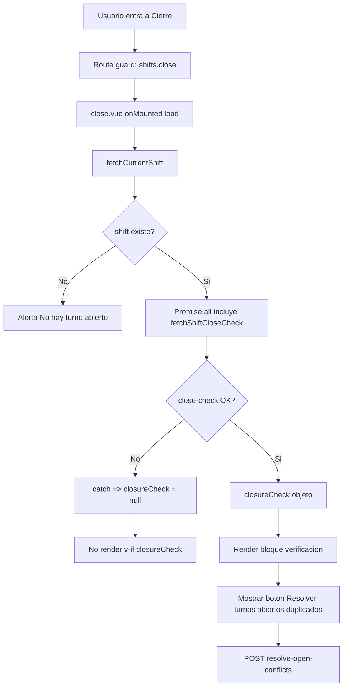

# AUDITORIA FORENSE FRONTEND - BOTON "Resolver turnos abiertos duplicados"

## Alcance
Investigacion de renderizado y dependencias del boton en la pantalla de cierre de turno:
- Condiciones exactas de UI.
- Flags/computed/composables involucrados.
- Contrato de datos esperado desde backend.
- Comportamiento cuando `closureCheck` no existe.

Archivo principal auditado:
- `frontend/src/pages/nightpos/shifts/close.vue`

## Como se renderiza realmente el boton

El boton existe dentro de este bloque:
- `template v-else` (solo si hay turno)
- dentro de `template v-if="closureCheck"`

Boton:
- texto: `Resolver turnos abiertos duplicados`
- accion: `@click="resolveShiftConflicts"`

## Condiciones necesarias para que aparezca

Condicion total de visibilidad:

1. Usuario pasa control de ruta con permiso `shifts.close`.
2. `load()` termina con `shift` existente.
3. `closureCheck` es truthy.

Si falla cualquiera de esas 3, el boton no aparece.

## Flags/computed/composables relevantes

### Estado local en close.vue
- `shift`
- `closureCheck`
- `loading`
- `resolvingShiftConflicts`
- `showResolveConflictsDialog`

### Computed de apoyo
- `hasBlockers = closureCheck?.blockers?.length > 0`
- `hasWarnings = closureCheck?.warnings?.length > 0`
- `canClose = closureCheck?.can_close !== false`

Importante:
Estos computed no controlan la existencia del boton; el gating del boton es `v-if="closureCheck"`.

### Composables y stores que influyen indirectamente
- `useFilteredShiftTabs` (visibilidad de tab Cierre por permiso `shifts.close`).
- `auth` store (`hasPermission`).
- `context` store + `http` service para headers operativos (`X-Tenant-Slug`, `X-Branch-Code`).

## Flujo exacto de carga de datos

Metodo `load()`:
1. `shift = await fetchCurrentShift()`
2. Solo si `shift?.id` existe, ejecuta Promise.all:
   - `fetchShiftSummary(shift.id)`
   - `fetchCurrentShiftSettlements().catch(() => null)`
   - `fetchShiftCloseCheck().catch(() => null)`
   - `fetchProductReconciliation(...).catch(() => null)`
3. Asigna `closureCheck = checkData`

## Punto critico: manejo de error de close-check

`fetchShiftCloseCheck()` esta envuelto con `.catch(() => null)`.

Consecuencia:
- Si el API de close-check falla por cualquier motivo (contexto, auth, 4xx, 5xx), el error se suprime.
- `closureCheck` queda en `null`.
- El bloque `v-if="closureCheck"` no renderiza.
- El boton desaparece sin error visible especifico de close-check.

Esto explica funcionalmente por que un usuario puede entrar a Cierre y aun asi no ver el boton.

## Que datos espera desde backend

Frontend espera objeto `closureCheck` con forma:
- `can_close` (boolean)
- `blockers` (array)
- `warnings` (array)
- `summary` (objeto)

Campos usados por UI:
- `closureCheck.blockers` para alertas de bloqueo
- `closureCheck.warnings` para advertencias
- `closureCheck.can_close` para `canClose`

## Casos pedidos: null / undefined / vacio

1. `closureCheck = null`
- `v-if="closureCheck"` false
- No se muestra boton ni bloque de verificacion.

2. `closureCheck = undefined`
- Igual que null: no renderiza.

3. `closureCheck = {}`
- `v-if` true
- Boton si aparece.
- `blockers/warnings` se evalua con optional chaining (sin crash).

## API consumida por la pantalla

Cliente API en `frontend/src/api/shifts.js`:
- `fetchShiftCloseCheck()` -> `GET /shifts/current/close-check`
- `resolveOpenShiftConflicts(payload)` -> `POST /shifts/resolve-open-conflicts`

## Relacion con la base real auditada

Evidencia SQL del entorno real:
- `admin.demo` posee permiso `shifts.close`.
- Existen turnos duplicados en tenant 2/branch 2.
- Hay inconsistencias de cajas abiertas referenciando turnos distintos a los OPEN actuales.

Por tanto, el problema de no ver el boton en UI no queda probado como falta de permiso administrador.

## Conclusión unica solicitada (A-F)

**Clasificacion elegida: C**

**Causa raiz de visibilidad del boton en frontend:** `closureCheck` no llega en forma usable (queda null por captura silenciosa de error), lo que impide renderizar el bloque donde vive el boton.

## Diagrama end-to-end (frontend a backend)

