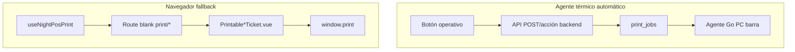

# PRINTING_SYSTEM_UX_REDESIGN_REPORT.md (Frontend)

**Tipo:** Auditoría + plan de rediseño UX  
**Fecha:** 2026-06-21  
**Estado:** P1 ✅ · P2 ✅ formatos browser alineados (2026-06-21) · P3 pendiente

---

## 0. Principio rector

No romper rutas print existentes, `useNightPosPrint`, integración API con agente, flujos de caja/liquidaciones/CBA, ni pantallas operativas actuales.

El frontend debe **orquestar** la operación (botones, feedback, fallback) mientras el **contenido térmico** lo sigue generando el backend para el agente.

---

## 1. Arquitectura actual en UI

### 1.1 Dos caminos de impresión



| Camino | Cuándo | Limitación |
|--------|--------|------------|
| Agente | Envío barra, precuenta garzón, reprint admin | Garzón en celular no imprime localmente |
| Navegador | “Imprimir barra”, “Ver precuenta”, ventas, caja | Requiere PC con diálogo OS |

### 1.2 Composable central

`src/composables/useNightPosPrint.js`

- `openPrintRoute()` — nueva pestaña con `?print=1`
- `triggerAutoPrint()` — `window.print()` tras 400ms

**14 consumidores** — mantener contrato.

### 1.3 Componentes ticket

`src/components/nightpos/print/`

| Componente | Uso |
|------------|-----|
| `PrintableTicketShell.vue` | Shell 58/80mm, toolbar, CSS print |
| `PrintableOrderTicket.vue` | Comanda barra |
| `PrintablePrecheckTicket.vue` | Precuenta |
| `PrintableSaleTicket.vue` | Ticket venta / cobro |
| `PrintableCashSessionReport.vue` | Arqueo (fuera alcance rediseño operativo) |
| `PrintableShiftClosureReport.vue` | Cierre turno |

---

## 2. Flujos UX actuales vs spec

### 2.1 Crear comanda → enviar barra

| Paso | Pantalla | Impresión |
|------|----------|-----------|
| Crear / agregar | `waiter/orders/[id].vue`, `orders/[id].vue` | ❌ Nada — **correcto spec** |
| Enviar a barra | Mismo + `OrderActionsBar` | Backend crea `ORDER_COMMAND` si auto ON + agente |
| Feedback garzón | Toast “Enviada a barra” | **Sin badge** pendiente/impreso/error |
| Feedback admin/cajera | Chip estado + reprint | ✅ `orders/[id].vue` |

**Gap UX:** garzón no ve si barra recibió el ticket.

### 2.2 Precuenta

| Pantalla | Botón | Mecanismo |
|----------|-------|-----------|
| `waiter/orders/[id].vue` | ✅ “Imprimir precuenta” | `POST …/precheck/print` → agente |
| Fallback | “Ver precuenta” | Browser `print/precheck/order/:id` |
| `cashier/orders/index.vue` | ❌ | Cajera no puede precuenta desde cola |
| `orders/[id].vue` admin | ❌ | |

**Gap spec:** precuenta solo en garzón; cajera debe pedir al garzón o abrir otra pantalla.

### 2.3 Cobro → ticket

| Pantalla | Post-cobro |
|----------|------------|
| `ChargeOrderModal.vue` | Toast éxito — **sin print** |
| `cashier/orders/index.vue` | Igual |
| `sales/index.vue` | “Reimprimir última venta” manual |
| `SaleDetailDialog.vue` | “Ver ticket” manual |

**Gap spec #3:** no hay ticket automático al cobrar (ni agente ni browser).

### 2.4 Reimpresión

| Dónde | Qué |
|-------|-----|
| `orders/[id].vue` | “Reimprimir barra” → API reprint (permiso `printing.reprint`) |
| Garzón | ❌ Sin reprint |
| Corrección ítems | ❌ Sin auto-reprint UI |
| `settings/printers/index.vue` | Historial jobs — solo lectura |

### 2.5 Configuración impresoras

`pages/nightpos/settings/printers/index.vue`

**Implementado:**

- Toggle “Imprimir al enviar a barra”
- Registro dispositivo + `device_key`
- Lista devices + jobs recientes

**Falta vs spec/plan:**

- Toggle “Imprimir ticket al cobrar”
- Ancho papel 58/80
- Editor plantillas (logo, campos, footer Ribersoft)
- Reprint desde historial job

---

## 3. Comparativa visual spec vs componentes

### 3.1 Comanda barra (`PrintableOrderTicket.vue`)

| Spec | Actual Vue |
|------|------------|
| Sin precios | ❌ Columna **Total** + TOTAL orden |
| Solo producción | ❌ Muestra `sale_mode`, estado comanda |
| Mesa/Barra/Pieza tipado | ❌ “Mesa / Ambiente” genérico |
| # grande | Subtitle shell = order_number 16px; mesa normal |
| Chicas `María x4` | Parcial — combos OK; “Manilla:” en acompañante |
| Observaciones | ✅ Notas ítem y orden |
| Footer Ribersoft | ❌ “NightPOS — comanda barra” fijo |

**Agente PHP** también incluye TOTAL — alinear ambos en Fase A.

### 3.2 Precuenta (`PrintablePrecheckTicket.vue`)

| Spec | Actual |
|------|--------|
| Elegante, total claro | ✅ Banner no fiscal |
| Gracias por su visita | ❌ |
| Sin QR/NIT | ✅ |
| Notas | Verificar paridad con backend (backend omite notas) |

### 3.3 Ticket cobro (`PrintableSaleTicket.vue`)

Existe para **browser** con pagos mixtos, allocations, chicas.

**No conectado** a cobro automático ni a `SALE_RECEIPT` agente.

Spec pide encabezado **PAGADO** + método destacado — revisar al implementar builder backend y reflejar en Vue fallback.

### 3.4 Factura

No hay pantalla factura fiscal V1 — mantener separado cuando exista FE.

---

## 4. API frontend (`src/api/`)

| Módulo | Funciones print |
|--------|-----------------|
| `printDevices.js` | settings, devices, jobs, reprint status |
| `orders.js` | `printOrderPrecheck(id)` |

**A agregar (post-backend):**

- Nada crítico si `SALE_RECEIPT` es 100% backend post-charge
- Opcional: `fetchSalePrintStatus(saleId)` espejo de order print status
- Settings: campos plantilla + marketing footer

---

## 5. Permisos UI

| Permiso | Uso |
|---------|-----|
| `settings.printers` | Ver impresoras |
| `settings.printers.manage` | Registrar device |
| `printing.reprint` | Reimprimir comanda |
| `orders.access` | Rutas print order/precheck |

Sin cambios de permisos requeridos para V1 del rediseño.

---

## 6. Experiencia objetivo (spec §12)

```
Crear comanda → productos → chicas → combos
     → Enviar barra → [auto print barra limpia]
     → Cliente pide cuenta → [Imprimir precuenta]
     → Cajera cobra → [auto SALE_RECEIPT]
     → Factura si aplica (V2)
```

### Cambios UX mínimos propuestos

| # | Cambio | Archivos |
|---|--------|----------|
| 1 | Badge print status en garzón (como admin) | `waiter/orders/[id].vue` |
| 2 | Precuenta en cola cajera | `cashier/orders/index.vue` |
| 3 | Post-cobro: toast + chip “Ticket en cola / Error impresión” | `ChargeOrderModal.vue`, `cashier/orders` |
| 4 | No abrir browser auto salvo fallback explícito | Mantener agente first |
| 5 | Settings: toggle auto ticket cobro | `settings/printers/index.vue` |
| 6 | Settings: plantillas + Ribersoft | Nueva sección en misma página |
| 7 | Alinear tickets Vue con layout agente | `Printable*.vue` |

---

## 7. Componentes reutilizables

| Reutilizar | Extender |
|------------|----------|
| `PrintableTicketShell` | Tipografía “hero” mesa/# |
| `useNightPosPrint` | Sin cambio API |
| `useOrderHelpers` — girls, money | `formatLocationLabel(order)` nuevo |
| `ChargeOrderModal` | Hook post-success notification |
| `OrderActionsBar` | Precuenta para roles con permiso |
| `settings/printers/index.vue` | Tabs plantillas + marketing |

**Evitar:** nuevo composable print paralelo; duplicar lógica de contenido en Vue si agente es primario.

---

## 8. Agente desconectado — UX

Comportamiento deseado (ya parcialmente OK en backend):

| Escenario | UX |
|-----------|-----|
| Envío barra, agente off | Toast warning; opción “Ver comanda” browser |
| Precuenta, agente off | ✅ Ya existe fallback “Ver precuenta” |
| Cobro, agente off | Toast “Cobro registrado; ticket no impreso” — **implementar** |
| Nunca bloquear cobro | ✅ |

SSE `print_job.failed` — suscribir en `orders/[id].vue` y futuro badge garzón.

---

## 9. Plan frontend por fases (alineado backend)

### Fase A — Layout tickets browser + paridad visual

- `PrintableOrderTicket`: quitar precios, estado, tipar ubicación, IDs grandes
- Footer configurable (placeholder hasta API settings)

### Fase B — Cobro auto

- Toast/chip tras `chargeOrder()` success
- Settings toggle `auto_print_sale_receipt`
- Opcional botón “Ver ticket” inmediato en modal (fallback)

### Fase C — Garzón + cajera

- Print status badge garzón
- Precuenta en cashier queue
- Reprint garzón (si negocio lo permite)

### Fase D — Settings plantillas

- Form flags: logo, dirección, chicas, mensaje final, 58/80mm
- Marketing Ribersoft preview

---

## 10. Validación manual (checklist spec)

- [ ] Comanda barra sin precios (agente + browser)
- [ ] Solo al enviar barra
- [ ] Corrección → reimpresión etiquetada
- [ ] Precuenta garzón (+ cajera si Fase C)
- [ ] Ticket cobro auto
- [ ] Factura separada (N/A V1)
- [ ] Habitación / pieza / barra / mesa labels
- [ ] Combo + acompañante legible
- [ ] Agente conectado / desconectado
- [ ] `npm run build` sin errores

---

## 11. Documentación relacionada

| Archivo | Contenido |
|---------|-----------|
| `PRINTABLE_TICKETS_V1_REPORT.md` | Browser V1-97 |
| `LOCAL_PRINTING_AGENT_AUDIT.md` | Diseño agente (parcialmente desactualizado) |
| `PRINTING_P2_OPERATIONAL_FORMATS_REPORT.md` | ✅ P2 browser alineado + precuenta cajera |
| `CASH_MOVEMENT_AND_CLOSURE_PRINT_FIX_REPORT.md` | ✅ Movimientos caja + cierres UX |
| `backend/PRINTING_P2_OPERATIONAL_FORMATS_REPORT.md` | Backend formatos + reimpresión |

---

## 12. Conclusión

P2 operativo completado (2026-06-21):

1. ~~Comanda barra con precios~~ → Vue alineado sin precios/total
2. ~~Sin ticket auto al cobrar~~ → P1 + aviso UI
3. ~~Sin reimpresión por corrección~~ → P2 backend + formato REIMPRESIÓN
4. ~~Ubicación siempre “Mesa”~~ → `resolvePrintLocationLabel`
5. Precuenta cajera en cola y detalle comanda
6. ~~Movimientos caja + cierres (agente + browser)~~ → ✅ 2026-06-21
7. Admin impresoras: cola, test-print, guía agente Go EXE → ✅ 2026-06-25
8. **Pendiente P3:** plantillas y Ribersoft configurable
9. Badge estado impresión garzón — mejora opcional post-P3
