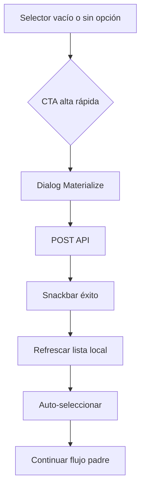

# Quick Actions — Fase A (Frontend)

**Fecha:** 2026-06-02  
**Referencia:** `SYSTEM_QUICK_ACTIONS_AUDIT.md`

## Objetivo

Eliminar bloqueos operativos con **diálogos Materialize pequeños** (no páginas nuevas): snackbar, loading, validación mínima, selección automática tras crear.

## Patrón común de diálogos

Todos comparten:

- `v-model` boolean (`modelValue` / `update:modelValue`)
- `persistent` + `max-width` 400–480
- Formulario `VForm` + `refForm.validate()`
- `useNightPosNotify` + `getApiErrorMessage`
- Evento `@created` o `@opened` con entidad guardada
- Reset al abrir (`watch(modelValue)`)

| Componente | Ruta archivo | API |
|------------|--------------|-----|
| `QuickGirlCreateDialog` | `src/components/nightpos/staff/QuickGirlCreateDialog.vue` | `quickCreateGirl` |
| `QuickRoomCreateDialog` | `src/components/nightpos/rooms/QuickRoomCreateDialog.vue` | `createRoom` |
| `QuickOpenCashDialog` | `src/components/nightpos/cash/QuickOpenCashDialog.vue` | `openCashSession` |
| `QuickCategoryCreateDialog` | `src/components/nightpos/catalog/QuickCategoryCreateDialog.vue` | `createCategory` |

## Composable compartido

- `src/composables/useOperationalGirls.js`
  - `loadOperationalGirlsForSelect()` — prioriza `GET /staff/girls`, fallback admin users
  - `appendGirlToSelectList(items, girl)` — añade y evita duplicados

- `useGirlIncomeStaffOptions.js` — reutiliza `loadOperationalGirlsForSelect` para manillas/shows/piezas

## Integraciones por QA

### QA-01 — Comandas CON_ACOMPANANTE

| | |
|--|--|
| **Antes** | `AssignGirlModal`: ID manual o lista vacía |
| **Ahora** | Autocomplete + «+ Nueva chica» → `QuickGirlCreateDialog` → `@created` selecciona chica → `@staff-updated` en detalle comanda |
| **Archivos** | `components/nightpos/orders/AssignGirlModal.vue`, `pages/nightpos/orders/[id].vue` |

### QA-02 — Manillas

| | |
|--|--|
| **Archivo** | `pages/nightpos/services/bracelets/create.vue` |
| **CTA** | `VSelect` append-item + botón texto «+ Nueva chica» |

### QA-03 — Shows

| | |
|--|--|
| **Archivo** | `pages/nightpos/services/shows/create.vue` |
| **Mismo comportamiento** | Que manillas |

### QA-04 — Pieza sin habitación

| | |
|--|--|
| **Antes** | Alert sin habitaciones; usuario iba a módulo Habitaciones |
| **Ahora** | `QuickRoomCreateDialog` (código, nombre, tipo, duración, precio) → `reloadAvailableRooms` → `form.room_id` auto |
| **Archivo** | `pages/nightpos/services/room-services/create.vue` |
| **Permiso UI** | `can('rooms.create')` para mostrar CTA |

### QA-05 — Cobrar sin caja abierta

| | |
|--|--|
| **Antes** | Hint + confirm deshabilitado; ir a Caja |
| **Ahora** | `ChargeOrderModal`: botón «Abrir caja ahora» → `QuickOpenCashDialog` → `@opened` → padre pone `cashSessionOpen = true` |
| **Archivos** | `components/nightpos/orders/ChargeOrderModal.vue`, `pages/nightpos/orders/[id].vue` |

### QA-06 — Categoría desde producto

| | |
|--|--|
| **Antes** | `VSelect` categorías vacío; crear en otra pantalla |
| **Ahora** | `ProductFormFields` emit `new-category` + `QuickCategoryCreateDialog` en `products/create.vue` |
| **Post-guardar** | `reloadCategories()` + `form.category_id = category.id` |

## Flujo usuario (resumen)

## Validación manual (`pnpm run dev`)

1. **Comanda** → ítem CON_ACOMPANANTE → asignar chica → «+ Nueva chica» → crear → aparece seleccionada.
2. **Servicios → Manilla** → misma prueba.
3. **Servicios → Show** → misma prueba.
4. **Servicios → Registrar pieza** → sin habitaciones → «+ Nueva habitación» → crear → habitación en select y precios precargados.
5. **Comanda → Cobrar** con caja cerrada → «Abrir caja ahora» → fondo inicial → cobro habilitado.
6. **Productos → Nuevo** → «+ Nueva categoría» → guardar → categoría seleccionada en formulario.

Revisar consola del navegador sin errores 4xx/5xx inesperados.

## Archivos tocados (Fase A)

- `src/composables/useOperationalGirls.js` (nuevo)
- `src/composables/useGirlIncomeStaffOptions.js`
- `src/components/nightpos/forms/ProductFormFields.vue`
- `src/pages/nightpos/products/create.vue`
- `src/pages/nightpos/orders/[id].vue`
- `src/components/nightpos/orders/AssignGirlModal.vue`
- `src/components/nightpos/orders/ChargeOrderModal.vue`
- `src/pages/nightpos/services/bracelets/create.vue`
- `src/pages/nightpos/services/shows/create.vue`
- `src/pages/nightpos/services/room-services/create.vue`
- Diálogos: `QuickGirlCreateDialog`, `QuickRoomCreateDialog`, `QuickOpenCashDialog`, `QuickCategoryCreateDialog`

## Documentación relacionada

- `QUICK_GIRL_CREATE_REPORT.md` — API chica (previo a extensión Fase A)
- `SYSTEM_QUICK_ACTIONS_AUDIT.md` — auditoría completa y Fases B/C
