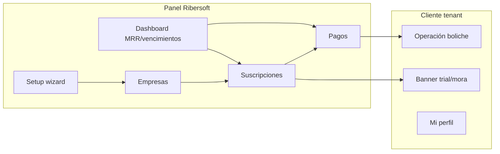

# SAAS-2 — AUDITORÍA COMERCIAL FRONTEND

**Fecha:** 2026-06-25  
**Estado:** Auditoría — **sin implementación**  
**Contexto:** SAAS P0 (perfil, checklist wizard) + SAAS-1 (planes UI, dashboard básico) completados.  
**Objetivo:** Definir qué pantallas y UX faltan para que Ribersoft opere NightPOS como SaaS vendible.

---

## Resumen ejecutivo

El frontend **Plataforma SaaS** cubre bien el **onboarding técnico** y el **catálogo de planes**, pero la capa **comercial** (suscripciones, cobros, vencimientos, partners, soporte) **no existe en UI**. El menú dice "Planes / Suscripciones" pero solo hay planes.

Los tenants operativos **no ven** avisos de trial, vencimiento o suspensión. La suspensión solo es editable por superadmin sin feedback al cliente.

---

## 1. Qué ya existe (real, no placeholder)

| Área | Ruta / componente | Estado |
|------|-------------------|--------|
| Dashboard SaaS | `/nightpos/platform/dashboard` | Real — 5 cards + top planes |
| Planes CRUD | `/nightpos/platform/plans` | Real — límites en diálogo |
| Empresas CRUD | `/nightpos/platform/tenants/*` | Real — plan + fechas suscripción |
| Setup wizard | `/nightpos/platform/setup` | Real — checklist P0 post-alta |
| Sucursales admin | `/nightpos/platform/branches/*` | Real |
| Mi perfil | `/nightpos/account/profile` | Real — P0 |
| Selector contexto | `PlatformContextSelector.vue` | Real — superadmin opera como tenant |

**API clients:** `api/platform.js`, `api/plans.js`, `api/tenants.js`

**Nav activo:** `navigation/vertical/nightpos-r4.js` — sección "Plataforma SaaS" (`requiresSuperAdmin: true`)

---

## 2. Qué falta (comercial)

| Área | UI | API client | Prioridad |
|------|----|------------|-----------|
| Suscripciones | No | No | SAAS-2 V1 |
| Pagos / cobros manuales | No | No | SAAS-2 V1 |
| Vencimientos / calendario | No | No | SAAS-2 V1 |
| Datos comerciales cliente (NIT, contacto) | Parcial (solo nombre) | No | SAAS-2 V1 |
| Historial cambio plan | No | No | SAAS-2 V1 |
| MRR / ingresos dashboard | No | Parcial backend | SAAS-2 V1 |
| Suspensión/reactivación guiada | Solo campo status | No acción dedicada | SAAS-2 V1 |
| Partners | No | No | SAAS-3 |
| Instalaciones técnicas | No | No | SAAS-3 |
| Tickets soporte | No | No | SAAS-3 |
| Configuración SaaS global | Placeholder | No | SAAS-3 |
| Usuarios globales Ribersoft | No | No | Post-P0 backlog |
| Facturación / pasarela | Demo Materialize only | No | SAAS-4 |

**Placeholder explícito:** `pages/nightpos/platform/settings/index.vue` — `NightPosModulePlaceholder` ("Parámetros globales — pendiente API").

**Dead code:** `navigation/vertical/platform.js` — no importado.

---

## 3. Planes SaaS — auditoría UI

### Pantalla actual (`platform/plans/index.vue`)

**Muestra:** nombre, código, precios mensual/anual, activo, count tenants, acciones CRUD + duplicar + límites.

**Límites (diálogo):** branches, users, cashiers, waiters, products, rooms — `-1` ilimitado.

**No muestra:**
- Ingresos generados por plan
- Tenants en trial vs pagos
- Comparativa MRR por plan

### Respuestas UX (alineadas backend)

| Pregunta | UI actual |
|----------|-----------|
| ¿Límites visibles? | Solo en diálogo por plan |
| ¿Warnings al superar? | Solo en detalle tenant (`plan_usage`) — texto "solo informativo" |
| ¿Bloqueo al crear sucursal/usuario? | No |
| ¿Trial? | No |
| ¿Renovación? | Fechas manuales en edit tenant |

### Mejoras propuestas SAAS-2 V1

- Columna "MRR plan" en tabla planes (cuando exista API)
- Badge tenants near limit en listado empresas
- Separar nav **"Planes"** vs **"Suscripciones"** (hoy label engañoso)

---

## 4. Empresas / tenants — auditoría UI

### Formulario (`TenantFormFields.vue`)

| Campo | Create | Edit | Setup |
|-------|--------|------|-------|
| Nombre, slug, status | ✓ | ✓ | ✓ |
| Plan (select) | ✓ | ✓ | ✓ (default FREE) |
| subscription_starts_at | ✓ | ✓ | ✗ |
| subscription_ends_at | ✓ | ✓ | ✗ |

**Faltan campos comerciales:** NIT, razón social, contacto, WhatsApp, dirección, rubro, notas internas, responsable Ribersoft, origen lead.

### Detalle tenant (`tenants/[id]/index.vue`)

**Muestra:** slug, status, plan, uso vs límites (`OK`/`WARNING`/`LIMIT_REACHED`).

**No muestra:** fechas suscripción, pagos, deuda, historial plan, partner, instalación.

### Listado (`tenants/index.vue`)

Columnas: empresa, slug, estado, plan. **Sin:** vencimiento, MRR, días mora, partner.

### Propuesta SAAS-2 V1

Nueva pestaña o sección en detalle tenant:

- **Comercial** — perfil NIT/contacto
- **Suscripción** — status, trial, próximo cobro
- **Pagos** — tabla pagos registrados + botón "Registrar pago"
- **Historial** — cambios de plan

Acciones rápidas: Suspender · Reactivar · Renovar 30 días.

---

## 5. Dashboard SaaS — métricas actuales vs objetivo

### Hoy (`platform/dashboard.vue`)

| Card | Fuente |
|------|--------|
| Empresas activas | `active_tenants` |
| Suspendidas | `suspended_tenants` |
| Vencidas | `expired_tenants` |
| Trial | `trial_tenants` ⚠️ heurística backend incorrecta |
| Total | `total_tenants` |
| Planes más usados | `top_plans[]` |

### Objetivo SAAS-2 V1 (nuevas cards/widgets)

| Widget | Descripción |
|--------|-------------|
| MRR estimado | Suma suscripciones activas |
| Ingresos mes | Pagos confirmados mes actual |
| Próximos vencimientos | Lista 30 días |
| Pagos vencidos (past_due) | Count + link |
| Trial por vencer | 7 días |
| Recursos plataforma | Total sucursales/usuarios/productos |

### Objetivo SAAS-3+

Churn, ARR, partners top, tickets abiertos, gráficos tendencia.

---

## 6. Enforcement UX — suspensión / vencimiento

### Hoy

| Escenario | UX tenant | UX superadmin |
|-----------|-----------|---------------|
| Tenant suspended | Login error genérico 422 | Puede editar status; dashboard count |
| Subscription expired | Mismo mensaje que inactive | Card "vencidas" |
| Superadmin opera tenant suspendido | — | Sin advertencia al "Operar" |
| Límite plan alcanzado | Nada | Detalle tenant informativo |

### Propuesto SAAS-2 V1

| Componente | Comportamiento |
|------------|----------------|
| `SubscriptionStatusBanner.vue` | Banner tenant admin: trial 7d, past_due, grace |
| `/account/suspended` o modal login | Mensaje claro + contacto Ribersoft |
| Router guard opcional | Si API devuelve `subscription_status: suspended` en `/auth/me` |
| HTTP interceptor | Código 422 tenant unavailable → redirect pantalla contacto |
| Superadmin "Operar" | Confirm dialog si tenant suspended/past_due |

**No bloquear:** superadmin bypass; rutas plataforma siempre accesibles.

---

## 7. Menú SaaS propuesto

### Actual vs propuesto

| Actual | Propuesto SAAS-2 V1 | Fase |
|--------|---------------------|------|
| Dashboard SaaS | Dashboard SaaS (ampliado) | V1 |
| Setup empresa | Setup empresa | — |
| Empresas | Empresas | — |
| Sucursales | Sucursales | — |
| Planes / Suscripciones | **Planes** (catálogo) | V1 rename |
| — | **Suscripciones** | V1 nuevo |
| — | **Pagos** | V1 nuevo |
| — | **Vencimientos** | V1 nuevo |
| Configuración SaaS (placeholder) | Configuración | V1.1 |
| — | Partners | V1.1 |
| — | Instalaciones | V1.1 |
| — | Soporte | V1.1 |
| — | Usuarios globales | Post-P0 |
| — | Auditoría plataforma | V1.1 |
| Mi perfil (user menu) | Mi perfil | P0 ✓ |

**Tabs horizontales** (`PLATFORM_SECTION_TABS`): añadir Suscripciones, Pagos, Vencimientos; incluir Setup en tabs o mantener solo sidebar.

---

## 8. Pantallas a crear (por fase)

### SAAS-2 V1

| Pantalla | Ruta sugerida | Función |
|----------|---------------|---------|
| Suscripciones listado | `/nightpos/platform/subscriptions` | Filtros status, vencimiento |
| Detalle suscripción | `/nightpos/platform/subscriptions/:tenantId` | Editar plan, fechas, status |
| Pagos | `/nightpos/platform/payments` | Listado + registrar pago |
| Vencimientos | `/nightpos/platform/due-dates` | Calendario/lista 30-60 días |
| Perfil comercial | Tab en tenant detail o `/tenants/:id/commercial` | NIT, contacto, notas |
| Estado suspendido | `/suspended` o modal | Mensaje cliente |

### SAAS-3 V1.1

| Pantalla | Ruta |
|----------|------|
| Partners listado/create | `/nightpos/platform/partners` |
| Comisiones partner | `/nightpos/platform/partners/:id/commissions` |
| Instalaciones | `/nightpos/platform/installations` |
| Tickets soporte | `/nightpos/platform/support` |
| Config SaaS real | Reemplazar placeholder settings |

### SAAS-4 V2

Billing automático, pasarela checkout, portal cliente self-service pago.

---

## 9. API clients a crear (frontend)

| Archivo | Endpoints |
|---------|-----------|
| `api/subscriptions.js` | CRUD suscripciones, renew, suspend, reactivate |
| `api/platformPayments.js` | List/create payments |
| `api/commercialProfiles.js` | GET/PUT perfil comercial |
| `api/partners.js` | SAAS-3 |
| `api/supportTickets.js` | SAAS-3 |

Ampliar `api/platform.js` — dashboard enriquecido.

---

## 10. Permisos frontend (CASL / meta.permission)

Hoy plataforma usa principalmente:

- `admin.tenants.list`
- `admin.tenants.create`
- `platform.setup`

**Propuesto** (cuando backend seedee):

```js
platform.subscriptions.view
platform.billing.view
platform.billing.manage
platform.tenant.suspend
// etc.
```

Mientras solo exista superadmin: `requiresSuperAdmin: true` en nav items nuevos (mismo patrón actual).

---

## 11. Onboarding comercial vs técnico

### Flujo actual (P0)

Setup wizard → empresa + sucursal + admin + bootstrap + checklist técnico.

### Gap comercial

Wizard **no pide:** NIT, contacto, trial duration, precio acordado, partner referidor.

### Propuesta SAAS-2 V1 (opcional paso 5 o ampliar paso 1)

- Datos comerciales mínimos (contacto + WhatsApp)
- Plan + trial 14 días auto
- Origen lead (select)

Checklist post-wizard ampliado:

- ✓ Suscripción trial creada
- ✓ Próximo vencimiento visible
- ☐ Primer pago registrado

---

## 12. Notificaciones SaaS — UX

| Evento | V1 UI | V1.1 | V2 |
|--------|-------|------|-----|
| Trial por vencer | Banner tenant + card dashboard Ribersoft | Email | WhatsApp |
| Past due | Banner rojo + lista vencimientos | Email | |
| Suspensión | Pantalla dedicada | Email | |
| Límite WARNING | Banner admin tenant | — | |
| Nuevo pago registrado | Toast superadmin | — | |

Reutilizar `useNightPosNotify` + componente banner global en layout operativo.

---

## 13. Riesgos UX

| Riesgo | Mitigación |
|--------|------------|
| Label "Planes/Suscripciones" confunde | Renombrar nav en V1 |
| Suspender sin aviso al cliente | Banner + grace period |
| Demo Materialize billing confunde devs | Documentar que no es NightPOS |
| Superadmin opera tenant moroso sin verlo | Badge status en context selector |
| Formulario tenant sobrecargado | Tabs Comercial / Operación / Suscripción |

---

## 14. Flujo comercial completo (vista Ribersoft UI)



---

## 15. Qué implementar primero vs después

| Primero (SAAS-2 V1 UI) | Después |
|------------------------|---------|
| Pantalla Suscripciones | Partners |
| Registrar pago | Pasarela |
| Vencimientos | Gráficos churn |
| Perfil comercial en tenant | Tickets |
| Dashboard MRR cards | Config SaaS global |
| Banner subscription status | Email templates |
| Renombrar nav Planes | Portal cliente |
| Pantalla suspended | Self-service upgrade |

---

## 16. Compatibilidad

| Regla | Acción UI |
|-------|-----------|
| No romper operación boliche | Banners no bloquean caja salvo SUSPENDED |
| No romper setup P0 | Wizard sigue; campos comerciales opcionales al inicio |
| No romper planes SAAS-1 | Pantalla planes se mantiene |
| No romper perfil P0 | Mi perfil intacto |
| Demo routes Materialize | No conectar billing demo |

---

## 17. Referencias

| Archivo | Rol |
|---------|-----|
| `pages/nightpos/platform/dashboard.vue` | Dashboard actual |
| `pages/nightpos/platform/plans/index.vue` | Planes CRUD |
| `pages/nightpos/platform/tenants/*` | Empresas |
| `pages/nightpos/platform/setup.vue` | Wizard + checklist P0 |
| `components/nightpos/forms/TenantFormFields.vue` | Campos tenant |
| `navigation/vertical/nightpos-r4.js` | Menú plataforma |
| `backend/SAAS_2_COMMERCIAL_AUDIT.md` | Contraparte backend |

---

*Documento de auditoría. Sin cambios de código. Implementar SAAS-2 V1 backend antes o en paralelo con pantallas Suscripciones/Pagos.*
