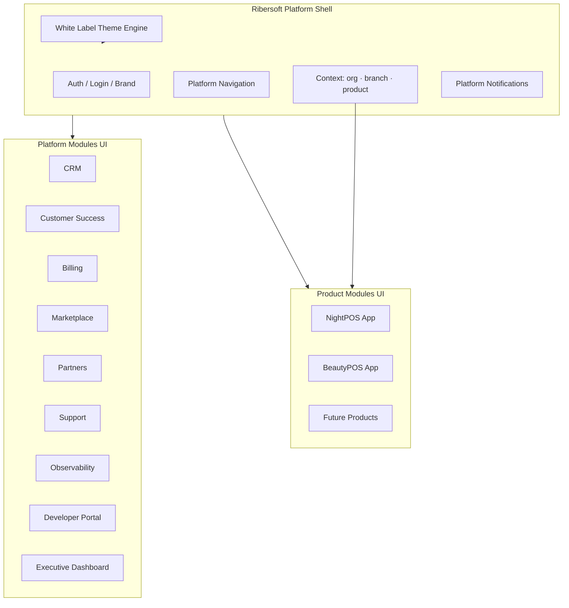
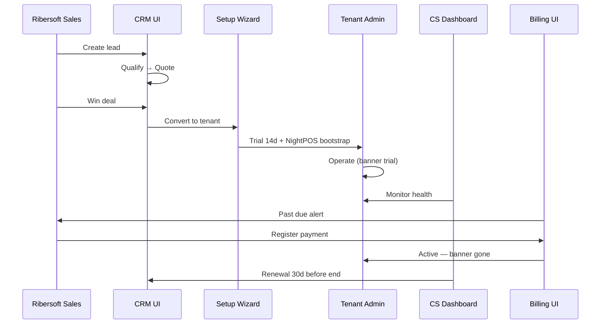

# SAAS-5 — RIBERSOFT PLATFORM — AUDITORÍA Y PLAN MAESTRO (FRONTEND)

**Fecha:** 2026-06-25  
**Estado:** Diseño empresarial + **SAAS-1.5 Control Center UI implementada** (V1)  
**Alcance:** Experiencia de plataforma multi-producto para 10+ años  
**Producto ancla:** NightPOS (shell operativo existente se preserva)

---

## 0. Cambio de paradigma UI

| Antes | Después |
|-------|---------|
| App = NightPOS con sección "Plataforma SaaS" | App = **Ribersoft Platform Shell** + **Product Apps** embebidas |
| Nav `nightpos-r4.js` mezcla operación + platform | Nav **Platform** vs **Product** separados |
| Branding fijo NightPOS | White label por tenant/reseller |
| Login único | Login + selector producto (futuro multi-producto) |

**Principio:** El POS de boliche **no se rediseña**. Se envuelve en un shell que puede mostrar otros productos en el futuro.

---

## 1. Arquitectura frontend objetivo



### Stack actual (mantener)

- Vue 3 + Vite + Pinia + Vuetify
- File-based routing (`pages/`)
- CASL permissions
- `services/http.js` API client

### Evolución propuesta

| Capa | Hoy | SAAS-5 |
|------|-----|--------|
| Routes | `/nightpos/*` | `/platform/*` + `/app/{product}/*` |
| Nav | `nightpos-r4.js` | `platform-nav.js` + `product-registry.js` |
| Layout | NightPos layouts | `PlatformLayout` + `ProductLayout` |
| Theme | Vuetify theme único | `BrandThemeProvider` |
| API | `@/api/platform.js` | `@/api/platform/{module}.js` |

**Compatibilidad:** Rutas `/nightpos/*` **alias permanentes** → `/app/nightpos/*` (redirect invisible).

---

## 2. Shell de aplicación

### 2.1 Modos de sesión

| Modo | Usuario | UI |
|------|---------|-----|
| **Platform mode** | Ribersoft staff | Solo nav plataforma |
| **Product mode** | Tenant user | Nav producto (NightPOS caja, garzón, …) |
| **Hybrid mode** | Superadmin impersonating | Platform bar + product nav |
| **Partner portal** | Partner/reseller | Nav partner reducido (futuro) |

### 2.2 Context bar (global)

Componente `RibersoftContextBar.vue`:

- Empresa (tenant)
- Sucursal (branch) — si producto lo requiere
- **Producto activo** (NightPOS ▾) — SAAS-5
- Health badge (CS) — opcional
- Subscription status chip (trial/past_due)

Reutiliza `PlatformContextSelector.vue` + extiende.

### 2.3 Login / brand

| Elemento | Fuente |
|----------|--------|
| Logo | `wl_brand_profiles` |
| Colores | theme pack |
| Título | "NightPOS" vs "BeautyPOS" vs reseller name |
| Fondo | white label config |

Flujo login existente se mantiene; añadir resolución brand por host (`window.location.host`).

---

## 3. Bounded contexts → pantallas

Cada módulo platform = sección nav + pages + API client + store Pinia opcional.

---

### 3.1 CRM Comercial

#### Menú

```
Comercial
├── Pipeline
├── Leads
├── Contactos
├── Cuentas
├── Cotizaciones
└── Actividades
```

#### Pantallas propuestas

| Pantalla | Ruta | Función |
|----------|------|---------|
| Pipeline Kanban | `/platform/crm/pipeline` | Drag stages |
| Lead list/detail | `/platform/crm/leads` | CRUD + score |
| Lead detail | `/platform/crm/leads/:id` | Timeline actividades |
| Contact list | `/platform/crm/contacts` | Personas |
| Account list | `/platform/crm/accounts` | Empresas pre-tenant |
| Account detail | `/platform/crm/accounts/:id` | Link tenant si existe |
| Quote builder | `/platform/crm/quotes/create` | Líneas plan+add-ons |
| Quote detail | `/platform/crm/quotes/:id` | PDF preview, send |
| Convert wizard | `/platform/crm/deals/:id/convert` | → Setup existente |

#### Componentes clave

- `CrmPipelineBoard.vue`
- `QuoteLineEditor.vue`
- `ActivityTimeline.vue`
- `ConvertToTenantDialog.vue` — reutiliza wizard P0

---

### 3.2 Customer Success

#### Menú

```
Customer Success
├── Health Dashboard
├── En riesgo
├── Onboarding
├── Capacitaciones
└── Renovaciones
```

#### Pantallas

| Pantalla | Ruta |
|----------|------|
| CS Dashboard | `/platform/cs/dashboard` |
| At-risk list | `/platform/cs/at-risk` |
| Tenant health detail | `/platform/cs/tenants/:id` |
| Onboarding tracker | `/platform/cs/onboarding` |
| Renewal calendar | `/platform/cs/renewals` |
| Playbooks | `/platform/cs/playbooks` |

#### Componentes

- `HealthScoreGauge.vue` (0–100)
- `UsageSparkline.vue` (orders, logins)
- `OnboardingChecklistCs.vue` — extiende checklist P0

#### UX tenant (in-app banner)

- `SubscriptionHealthBanner.vue` en layout operativo NightPOS
- Trial: azul "X días restantes"
- Past due: rojo + contacto Ribersoft
- At risk CS: amarillo "¿Necesita ayuda?"

---

### 3.3 Billing Enterprise

#### Menú

```
Finanzas
├── Suscripciones
├── Facturas
├── Pagos
├── Vencimientos
├── Add-ons
└── Reportes MRR
```

#### Pantallas

| Pantalla | Ruta | Fase |
|----------|------|------|
| Subscriptions list | `/platform/billing/subscriptions` | SAAS-2 |
| Subscription detail | `/platform/billing/subscriptions/:id` | SAAS-2 |
| Register payment | `/platform/billing/payments/create` | SAAS-2 |
| Payments list | `/platform/billing/payments` | SAAS-2 |
| Due dates | `/platform/billing/due-dates` | SAAS-2 |
| Invoices list | `/platform/billing/invoices` | SAAS-5 |
| Invoice detail/PDF | `/platform/billing/invoices/:id` | SAAS-5 |
| Upgrade/downgrade | `/platform/billing/subscriptions/:id/change-plan` | SAAS-5 |
| MRR report | `/platform/billing/reports/mrr` | SAAS-5 |
| Churn report | `/platform/billing/reports/churn` | SAAS-5 |

#### Reutilizar

- `TenantFormFields.vue` — fechas suscripción → mover a subscription detail
- Cards dashboard SAAS-2 → evolucionar a executive widgets

---

### 3.4 Marketplace

#### Menú

```
Marketplace
├── Catálogo módulos
├── Instalados por tenant
└── Feature flags
```

#### Pantallas

| Pantalla | Ruta |
|----------|------|
| Module catalog | `/platform/marketplace/modules` |
| Module detail | `/platform/marketplace/modules/:slug` |
| Tenant modules | `/platform/tenants/:id/modules` |
| Feature flags admin | `/platform/marketplace/feature-flags` |

#### UX NightPOS tenant admin

Sección **"Módulos"** en settings:

- Habitaciones ✓ (licensed)
- Shows ✓
- Liquidaciones avanzadas ☐ (upsell)

---

### 3.5 White Label

#### Menú (platform admin / reseller)

```
White Label
├── Marcas
├── Dominios
├── Temas
└── Plantillas email
```

#### Pantallas

| Pantalla | Ruta |
|----------|------|
| Brand list | `/platform/white-label/brands` |
| Brand editor | `/platform/white-label/brands/:id` |
| Theme editor | `/platform/white-label/themes/:id` |
| Domain mappings | `/platform/white-label/domains` |
| Live preview | `/platform/white-label/preview` |

#### Componentes

- `BrandLogoUploader.vue`
- `ThemeColorPicker.vue` — CSS vars Vuetify
- `EmailTemplateEditor.vue` — rich text

#### Tenant/reseller experience

- Login page branded
- Email notifications branded (V2)
- Optional: hide "Powered by Ribersoft"

---

### 3.6 Partners

#### Menú

```
Partners
├── Directorio
├── Referidos
├── Comisiones
├── Pagos
└── Portal partner (V2)
```

#### Pantallas

| Pantalla | Ruta |
|----------|------|
| Partner list | `/platform/partners` |
| Partner detail | `/platform/partners/:id` |
| Commission ledger | `/platform/partners/:id/commissions` |
| Payout batch | `/platform/partners/payouts` |
| Referral link generator | `/platform/partners/referrals` |

#### Partner portal (futuro — subdominio)

`/partner/dashboard` — leads, comisiones, materiales venta

---

### 3.7 Soporte

#### Menú

```
Soporte
├── Tickets
├── Base conocimiento
├── SLA
└── Remote (V2)
```

#### Pantallas

| Pantalla | Ruta |
|----------|------|
| Ticket inbox | `/platform/support/tickets` |
| Ticket detail | `/platform/support/tickets/:id` |
| KB admin | `/platform/support/kb` |
| KB public | `/help` o `/kb` (tenant-facing) |
| Tenant tickets | `/app/nightpos/support` (tenant view) |

#### Componentes

- `TicketThread.vue`
- `SlaBadge.vue`
- `KbArticleEditor.vue`

---

### 3.8 Observabilidad

#### Menú

```
Observabilidad
├── Uso por tenant
├── Errores
├── Impresión / Agent
├── SSE / Realtime
└── Alertas
```

#### Pantallas

| Pantalla | Ruta |
|----------|------|
| Usage explorer | `/platform/obs/usage` |
| Tenant usage detail | `/platform/obs/tenants/:id` |
| Error log | `/platform/obs/errors` |
| Print stats | `/platform/obs/printing` |
| SSE monitor | `/platform/obs/sse` |
| Alerts config | `/platform/obs/alerts` |

#### Widgets reutilizables en tenant detail

- Mini charts: orders/day, active users, print failures

---

### 3.9 API Pública / Developer Portal

#### Menú

```
Developers
├── Mis aplicaciones
├── API Keys
├── Webhooks
├── Logs entrega
└── Documentación
```

#### Pantallas

| Pantalla | Ruta |
|----------|------|
| Apps list | `/platform/developers/apps` |
| App detail | `/platform/developers/apps/:id` |
| Webhook config | `/platform/developers/webhooks` |
| Delivery log | `/platform/developers/webhooks/deliveries` |
| API docs | `/platform/developers/docs` (Swagger/Redoc embed) |

**Nota:** Separar de demo Materialize (`pages/pages/authentication`, account-settings billing demo).

---

### 3.10 Dashboard Ejecutivo

#### Pantalla única rica

`/platform/executive` — reemplaza/evoluciona `/platform/dashboard`

| Sección | Widgets |
|---------|---------|
| Revenue | MRR, ARR, MoM growth |
| Customers | Active, trial, past due, churn |
| Sales | Pipeline value, win rate |
| Products | Adoption NightPOS vs future |
| Partners | Top referrers |
| Operations | Instalaciones pendientes, tickets |
| Forecast | 90-day revenue projection |

#### Visualización

- Chart.js / ApexCharts (ya en template Materialize)
- Export CSV/PDF
- Date range global

---

## 4. Menú Ribersoft Platform propuesto (completo)

```
Ribersoft Platform
├── Ejecutivo          → /platform/executive
├── Dashboard          → /platform/dashboard (alias legacy)
├── Comercial (CRM)    → /platform/crm/*
├── Customer Success   → /platform/cs/*
├── Finanzas           → /platform/billing/*
├── Empresas           → /platform/tenants/* (existente, migrar ruta)
├── Sucursales         → /platform/branches/*
├── Planes             → /platform/plans/*
├── Marketplace        → /platform/marketplace/*
├── Partners           → /platform/partners/*
├── Instalaciones      → /platform/installations/*
├── Soporte            → /platform/support/*
├── Observabilidad     → /platform/obs/*
├── Developers         → /platform/developers/*
├── White Label        → /platform/white-label/*
├── Usuarios globales  → /platform/users/*
├── Auditoría          → /platform/audit/*
├── Configuración      → /platform/settings
├── Setup rápido       → /platform/setup
└── Mi perfil          → /account/profile (P0 ✓)

Productos (selector)
├── NightPOS           → /nightpos/* (alias /app/nightpos/*)
├── BeautyPOS          → /app/beautypos/* (futuro)
└── …
```

---

## 5. Design system y white label

### 5.1 Theme tokens

```js
// Conceptual — BrandThemeProvider
{
  primary, secondary, accent,
  logoUrl, faviconUrl,
  appName, productName,
  loginBackgroundUrl,
  emailHeaderColor,
}
```

### 5.2 Carga

1. `GET /public/brand/resolve?host=`
2. Aplicar antes de mount Vue
3. Cache en sessionStorage

### 5.3 Componentes platform-shared

Nueva carpeta `src/platform/`:

```
platform/
├── layouts/PlatformLayout.vue
├── components/
├── composables/usePlatformPermissions.js
├── composables/useBrandTheme.js
├── navigation/platform-nav.js
└── api/ (clients por módulo)
```

Product NightPOS permanece en `src/pages/nightpos/` sin mover hasta fase alias.

---

## 6. Permisos y guards frontend

### Guards actuales

`plugins/1.router/guards.js` — auth + CASL permission

### Extensiones SAAS-5

| Guard | Regla |
|-------|-------|
| `requiresPlatformStaff` | Ribersoft global user |
| `requiresProductEntitlement` | tenant tiene product slug |
| `requiresSubscriptionActive` | no suspended (tenant users) |
| `requiresPlatformPermission` | `platform.crm.view`, etc. |

### Rutas platform

```js
definePage({
  meta: {
    layout: 'platform',
    permission: 'platform.billing.view',
    requiresPlatformStaff: true,
  },
})
```

**Superadmin:** mantiene bypass CASL actual.

---

## 7. Estado actual vs objetivo (gap analysis)

| Área | Hoy | SAAS-5 target |
|------|-----|---------------|
| Platform dashboard | 5 cards básicos | Executive dashboard |
| CRM | No | Pipeline completo |
| CS | No | Health + onboarding |
| Billing UI | Fechas en tenant form | Billing module |
| Marketplace | Permisos ≈ modules | License UI |
| White label | No | Brand editor |
| Partners | No | Full portal |
| Support | No | Tickets + KB |
| Observability | No | Usage dashboards |
| Developer | No | Portal + docs |
| Product shell | NightPOS only | Multi-product registry |
| Settings platform | Placeholder | Config real |
| Demo Materialize pages | Muchas | **No conectar** — confusión riesgo |

---

## 8. Roadmap frontend (alineado backend)

### Fase SAAS-2 (año 1)

| UI | Prioridad |
|----|-----------|
| Suscripciones list/detail | P0 |
| Pagos register/list | P0 |
| Vencimientos | P0 |
| Perfil comercial tab tenant | P1 |
| Dashboard MRR cards | P1 |
| Subscription banner tenant | P1 |
| Suspended page | P1 |
| Renombrar nav Planes/Suscripciones | P0 |

### Fase SAAS-3 (año 1–2)

Partners UI, instalaciones, tickets básicos, platform notifications.

### Fase SAAS-4 (año 2)

Webhook config UI, pasarela checkout admin, enforcement limit warnings.

### Fase SAAS-5a–e (años 2–4)

CRM pipeline, CS dashboard, billing invoices, marketplace, executive dashboard, `platform/` folder extraction.

### Fase SAAS-5f–i (años 4–7)

Product selector shell, white label editor, developer portal, observability UI, partner portal.

---

## 9. Dependencias frontend

| Depende de | Bloquea |
|------------|---------|
| Backend SAAS-2 APIs | Billing UI |
| Backend products registry | Product selector |
| Backend CRM APIs | CRM screens |
| Brand API | White label |
| Executive metrics API | Dashboard ejecutivo |

**Desarrollo paralelo posible:** Shell layout + nav structure con mocks antes de API.

---

## 10. Riesgos UX / técnicos

| Riesgo | Mitigación |
|--------|------------|
| Nav overload 15+ items | Agrupar; sidebar colapsable; favoritos |
| Confusión Platform vs NightPOS | Visual distinction (layout/color) |
| Demo Materialize pages | Mark deprecated; exclude from NightPOS nav |
| White label breaks Vuetify | Token-based theming only |
| Multi-product routing break bookmarks | Permanent redirects `/nightpos` |
| Performance executive dashboard | Lazy load widgets; pagination |
| i18n | Planificar `vue-i18n` antes SAAS-5f (multi-country) |

---

## 11. Compatibilidad NightPOS frontend

| Compromiso | Detalle |
|------------|---------|
| Páginas operativas | `/nightpos/cashier`, `/waiter`, etc. **sin cambios** |
| PWA caja/garzón | Intacto |
| UserProfile → Mi perfil | P0 ✓ |
| Setup wizard checklist | P0 ✓; CRM convert reutiliza |
| `nightpos-r4.js` operativo | Permanece; platform nav se extrae |
| CASL permissions operativos | Sin cambio slugs |
| Context store | Extender con `activeProduct` default `nightpos` |
| Build | Single SPA fase 1–5; micro-frontends solo si escala extrema (año 7+) |

---

## 12. Flujo comercial completo (UX)



---

## 13. API clients propuestos (frontend)

```
src/platform/api/
├── crm.js
├── cs.js
├── billing.js
├── marketplace.js
├── whiteLabel.js
├── partners.js
├── support.js
├── observability.js
├── developers.js
├── executive.js
└── index.js

src/api/                    # legacy aliases
├── platform.js             # → executive + dashboard
├── plans.js
├── tenants.js
└── account.js              # P0 ✓
```

---

## 14. Respuestas directas (checklist)

| # | Pregunta | Respuesta |
|---|----------|-----------|
| 1 | ¿Qué ya existe? | Platform dashboard, tenants, plans, branches, setup, perfil, context selector |
| 2 | ¿Qué falta? | 10 módulos SAAS-5 + shell multi-producto + white label |
| 3 | ¿Qué primero? | Billing UI (SAAS-2) + subscription banners |
| 4 | ¿Qué después? | CRM → CS → Executive → Marketplace |
| 5 | ¿Pantallas? | ~60–80 platform pages a plazo 5 años; ~15 en SAAS-2/3 |
| 6 | ¿Permisos UI? | `platform.*` meta.permission + platform layout |
| 7 | ¿Riesgos? | Nav complexity, demo confusion, routing |
| 8 | ¿NightPOS? | Alias routes; zero change operational pages |
| 9 | ¿Design system? | BrandThemeProvider sobre Vuetify |
| 10 | ¿10 años? | Monolith SPA → optional module federation año 7+ |

---

## 15. Referencias

| Documento | Relación |
|-----------|----------|
| `backend/SAAS_5_RIBERSOFT_PLATFORM_AUDIT.md` | Contraparte backend |
| `frontend/SAAS_2_COMMERCIAL_AUDIT.md` | Próximo paso UI |
| `frontend/SAAS_P0_*` | Perfil, checklist |
| `navigation/vertical/nightpos-r4.js` | Nav actual |

---

*Documento de arquitectura empresarial frontend. Sin código. El shell Ribersoft envuelve NightPOS; no lo reemplaza.*
