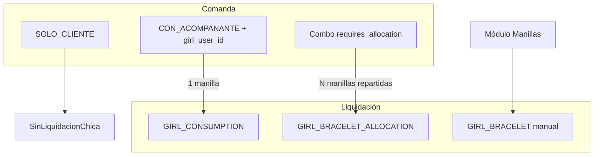

# Auditoría operativa — Mesas, consumo con acompañante y manillas (Frontend)

**Fecha:** 2026-06-16  
**Estado:** Auditoría completada — **sin implementación**  
**Par backend:** `backend/WAITER_TABLES_COMPANION_BRACELET_AUDIT.md`

---

## Resumen ejecutivo

| Tema | Estado UI | Acción propuesta |
|------|-----------|------------------|
| **Mis mesas** | Home garzón = KPIs + «Nueva comanda» con texto libre | Grid LIBRE/OCUPADA + tap abrir/continuar |
| **Chica en comanda** | Solo modo «Con acompañante»; **sin nombre** en ítems simples | Mostrar «Acompañante: {nombre}» en 6+ superficies |
| **Manilla = acompañante** | Mezcla «Manillas» (módulo), «Consumos acompañante» (liquidación), «Distribución» (combo) | Glosario único; ocultar manillas manuales del flujo garzón/cajera |

---

## PARTE 1 — Mesas / «Mis mesas» del garzón

### 1. Estado actual UX garzón

#### Pantalla principal (`waiter/index.vue`)

Hoy **no es «Mis mesas»**. Muestra:

- KPI «Nueva comanda» → `waiter/orders/new`
- KPIs Abiertas / En barra / Pendientes cobro → listas filtradas
- Bloque «Recientes» con `WaiterOrderCard`

No hay grid de mesas ni estados LIBRE/OCUPADA.

#### Nueva comanda (`waiter/orders/new.vue`)

Flujo actual (contrario a regla deseada):

1. Botones de **ambiente** (`fetchWaiterServiceAreas`) — salón genérico, no mesa numerada
2. Campo texto **«Mesa o ambiente»** — garzón escribe libremente
3. Botón «Abrir comanda»

**El garzón sí escribe mesa hoy** — va en contra del objetivo operativo.

#### Listas y detalle

| Ruta | Muestra mesa como | Estados |
|------|-------------------|---------|
| `waiter/orders/index.vue` | `table_label` en card | OPEN, SENT_TO_BAR, etc. (scopes) |
| `waiter/orders/[id].vue` | Título = `table_label` | Chip status operativo (no LIBRE/OCUPADA) |
| `WaiterOrderCard.vue` | `table_label` + total + status comanda | No ítems, no mesa física |

#### Admin configuración (`settings/service-areas/index.vue`)

- CRUD **ambientes** (VIP, Barra), no mesas 1-N
- Subtítulo: *«Opcional en comandas — puede usarse junto con etiqueta libre.»*
- **No hay UI** asignar garzón ↔ salón ↔ mesas

### 2. Qué falta para «Mis mesas»

| Requisito UX | Existe | Falta |
|--------------|--------|-------|
| Mesas numeradas por salón | ❌ | Modelo + admin CRUD |
| Asignación garzón pre-turno | ❌ | UI admin + API |
| Grid LIBRE / OCUPADA | ❌ | `waiter/my-tables` o equivalente |
| Tap libre → crear comanda | Parcial | Hoy form manual; debe ser automático sin teclado |
| Tap ocupada → abrir comanda | ❌ | Resolver `order_id` por mesa |
| Cobrar → mesa libre | Indirecto | SSE/P0 ya refresca listas; falta grid mesas |
| Sin limpieza / estados complejos | ✅ | No se mezcla con módulo cleaning en waiter |

### 3. Propuesta flujo garzón (diseño)

```
/waiter                    →  MIS MESAS (default)
  [Mesa 1  LIBRE   ]       tap → POST open → /waiter/orders/:id?add=1
  [Mesa 2  OCUPADA ]       tap → /waiter/orders/:id
  [Mesa 3  LIBRE   ]
  ...

Bottom nav:  Mesas | Comandas | (perfil)
```

- Eliminar o relegar `waiter/orders/new` (solo fallback admin)
- `WaiterBottomNav`: tab «Inicio» = mesas, no KPI dashboard actual
- Badge OCUPADA: total comanda o ícono discreto
- SSE P0 ya en waiter: grid se refresca al cobrar otra estación

### 4. Componentes a crear (propuesta)

| Componente | Rol |
|------------|-----|
| `WaiterTablesGrid.vue` | Grid táctil mesas |
| `WaiterTableTile.vue` | Celda LIBRE/OCUPADA |
| `useWaiterTables.js` | Fetch + tap handler + SSE reload |
| Admin: `ServiceTablesSettings.vue` | Mesas por salón |
| Admin: `WaiterAssignmentsSettings.vue` | Garzón ↔ mesas/salón |

### 5. Cambios mínimos frontend si Fase B backend lista

1. Nueva ruta `waiter/tables` o reemplazar `waiter/index.vue`
2. API client `fetchWaiterMyTables()`, `openWaiterTable(tableId)`
3. Redirigir post-login garzón a mesas (ya hay `resolveHomeRoute` — ajustar)
4. Mantener `waiter/orders/*` como vista secundaria «Todas mis comandas»

---

## PARTE 2 — CON ACOMPAÑANTE simple no muestra chica

### 1. ¿Frontend recibe `girl_name`?

| Superficie | `girl_user_id` | `girl_name` | Muestra acompañante |
|------------|----------------|-------------|---------------------|
| `OrderItemsTable.vue` (admin/cajera) | ✅ edición | ❌ | Solo chip «Con acompañante» |
| `waiter/orders/[id].vue` | ✅ en payload | ❌ | Solo `saleModeLabel` → «Con acompañante» |
| `orders/[id].vue` | ✅ | ❌ | Usa `OrderItemsTable` |
| `WaiterOrderCard.vue` | — | — | No muestra ítems |
| `cashier/orders/index.vue` | — | — | Solo lista mesa/total |
| `PrintableOrderTicket.vue` | ✅ | ❌ | «Chica asignada» **sin nombre** |
| `PrintablePrecheckTicket.vue` | parcial | ❌ | Solo combos con allocations |
| Combo allocations | ✅ | ✅ | `formatAllocationSummary` → «María ×3» |

**Conclusión:** no se pierde en frontend — **nunca llega `girl_name`** del backend para ítems simples. Solo falta backend + render.

### 2. Dónde falta mostrar (matriz de corrección)

Regla visual objetivo:

```
Paceña
Con acompañante
Acompañante: María
```

| Archivo | Cambio propuesto |
|---------|------------------|
| `OrderItemsTable.vue` | Bajo chip modo, línea `Acompañante: {{ item.girl_name \|\| 'Sin asignar' }}` si `CON_ACOMPANANTE && !requires_allocation` |
| `waiter/orders/[id].vue` | En `VListItem`, bloque similar bajo subtitle |
| `PrintableOrderTicket.vue` | Reemplazar «Chica asignada» por `Acompañante: {{ girl_name }}` |
| `PrintablePrecheckTicket.vue` | Igual + mostrar para simple (hoy solo combo) |
| `PrintableSaleTicket.vue` | Revisar paridad |
| `OrderAddProductDialog.vue` | Preview al seleccionar chica (ya tiene selector; confirmar en resumen pre-submit) |

Helper sugerido: `formatCompanionDisplay(item)` en `useOrderHelpers.js`:

```javascript
// Propuesta — no implementado
export function formatCompanionDisplay(item) {
  if (item.sale_mode !== 'CON_ACOMPANANTE' || item.requires_allocation)
    return null
  if (!item.girl_user_id)
    return 'Sin acompañante asignado'
  return item.girl_name ?? `Chica #${item.girl_user_id}`
}
```

### 3. Combos (referencia — ya OK)

```
Combo 6 Cervezas
Manillas: 6/6
María ×3
Laura ×2
```

Implementado en `OrderItemsTable` y waiter detail vía `formatAllocationSummary`. **No tocar CBA.**

### 4. Respuestas checklist Parte 2

| # | Pregunta | Respuesta |
|---|----------|-----------|
| 1 | ¿Backend devuelve girl_name? | **No** (ítem simple) |
| 2 | ¿Frontend lo recibe? | **No** |
| 3 | ¿Se pierde en mapper? | **Sí (backend)** |
| 4 | ¿Solo falta mostrarlo? | Backend + ~5 componentes UI/tickets |
| 5 | ¿Falta en tickets/precuenta? | **Sí** — texto genérico o nada |

---

## PARTE 3 — Manilla = consumo con acompañante (UI)

### 1. Lenguaje actual en frontend (inconsistente)

| Ubicación | Texto actual | Concepto real |
|-----------|--------------|---------------|
| Product picker / ítems | «Con acompañante» | CON_ACOMPANANTE simple |
| Combo UI | «Manillas», «Repartir N manillas» | allocation units |
| `settlements/index.vue` | «Consumos acompañante» (CON_ACOMPANANTE) | GIRL_CONSUMPTION |
| `settlements/index.vue` | «Manillas» — «Registro manual» | GIRL_BRACELET legacy |
| `settlements/[id].vue` | `GIRL_CONSUMPTION` → «Consumo con acompañante» | OK |
| `settlements/[id].vue` | `GIRL_BRACELET` → «Manilla» | Manual legacy |
| Nav `useServiceSectionTabs.js` | Tab «Manillas» → `/services/bracelets` | Módulo manual |
| `shift-console` | Link manillas + contadores | Mixto |
| Reports | «Manillas combo por chica» | GIRL_BRACELET_ALLOCATION |

### 2. Regla UI propuesta (operación)

**Para garzón y cajera en comanda:**

| Tipo producto | Línea 1 | Línea 2 | Línea 3 |
|---------------|---------|---------|---------|
| SOLO_CLIENTE | Producto | Solo cliente | — |
| CON_ACOMPANANTE | Producto | Con acompañante | Manilla: María |
| COMBO | Producto | 6 manillas (6/6) | María ×3, Laura ×2… |

Usar **«Manilla: {nombre}»** para simple (1 unidad = 1 acompañante).  
Evitar en UI operativa: `GIRL_CONSUMPTION`, `girl_user_id`, «Chica asignada».

**En liquidación (solo lectura finanzas):**

| Backend type | Label propuesto |
|--------------|-----------------|
| GIRL_CONSUMPTION | `{Producto} — 1 manilla — {María}` |
| GIRL_BRACELET_ALLOCATION | `{Producto} — {n} manillas — {María} ×{units}` |
| GIRL_BRACELET | `Manilla manual — {María}` |

### 3. Módulo «Servicios → Manillas»

**Estado:** `services/bracelets/index.vue`, permiso `bracelets.access`, en nav principal (`nightpos-r4.js`).

| Opción | Pros | Contras |
|--------|------|---------|
| **A. Ocultar de nav garzón/cajera** | Reduce confusión | Cajera senior puede usarlo hoy |
| **B. Mover a Ajustes → Avanzado** | Claro que es excepcional | Requiere permiso admin |
| **C. Renombrar «Manillas manuales»** | Mantiene acceso | Sigue visible |
| **Recomendado: B + C** | Alineado con regla operativa | Solo `tenant_owner` / superadmin por defecto |

**No eliminar** pantallas ni API — solo navegación y copy.

### 4. Relación conceptual (diagrama)



---

## Riesgos (frontend)

| # | Riesgo | Mitigación |
|---|--------|------------|
| F1 | Rediseño home garzón desorienta usuarios acostumbrados a KPI | Rollout con toggle «Vista mesas / Vista clásica» temporal |
| F2 | Mostrar nombre sin backend | Resolver IDs en cliente = lento/inconsistente — **esperar Fase A backend** |
| F3 | Ocultar manillas manuales | Documentar en admin; permiso explícito |
| F4 | Copy «Manilla» en simple confunde con módulo Manillas | Prefijo «Manilla:» solo en línea de ítem, no en menú |
| F5 | Tickets impresos sin nombre | Operación barra no sabe chica — incluir en Fase A |

---

## Plan de implementación por fases (frontend)

### Fase A — Acompañante visible (depende backend `girl_name`)

1. Helper `formatCompanionDisplay`
2. `OrderItemsTable`, waiter detail, tickets/precheck
3. QA: garzón elige María → cajera ve «Acompañante: María» sin F5 (SSE P0)

**Esfuerzo:** ~0.5-1 día tras backend.

### Fase B — Mis mesas MVP

1. `WaiterTablesGrid` + API integration
2. Reemplazar entry `waiter/index`
3. Deprecar flujo texto libre en `new.vue` (redirect o admin-only)
4. SSE reload grid

**Esfuerzo:** ~2-3 días tras APIs backend.

### Fase C — Admin mesas y asignaciones

1. Settings: mesas por salón
2. Settings: asignar garzones (turno o plantilla)
3. Validación UX: sin mesas asignadas → mensaje claro

### Fase D — Lenguaje unificado

1. Glosario en copy (`useProductSaleModeLabels`, settlements labels)
2. Nav: mover Manillas a ajustes
3. Liquidaciones: descripción enriquecida (si backend añade campos)

### Fase E — Pulido

1. Animación tap mesa
2. Indicador OCUPADA con total en tile
3. Accesibilidad táctil (min 48px)

---

## NO hacer (recordatorio)

- ❌ No programar en esta auditoría
- ❌ No migraciones
- ❌ No tocar SSE / CBA / liquidaciones core
- ❌ No eliminar módulo manillas backend

---

## Referencias de código frontend

- `waiter/index.vue`, `waiter/orders/new.vue`, `waiter/orders/[id].vue`
- `WaiterOrderCard.vue`, `WaiterBottomNav.vue`
- `OrderItemsTable.vue`, `useOrderHelpers.js` (`formatAllocationSummary`)
- `PrintableOrderTicket.vue`, `PrintablePrecheckTicket.vue`
- `settings/service-areas/index.vue`
- `services/bracelets/*`, `useServiceSectionTabs.js`
- `settlements/index.vue`, `settlements/[id].vue` (`sourceLabel`)
